# TAMASRAZIM — ANIMATION-FIRST

  

  <a href="https://tamasrazim.github.io/#about"><strong>↗ OPEN THE ORIGINAL LIVE ID CARD</strong></a>
  &nbsp; · &nbsp;
  <a href="./identity-card/index.html">HTML</a>
  &nbsp; · &nbsp;
  <a href="./identity-card/site.css">CSS</a>
  &nbsp; · &nbsp;
  <a href="./identity-card/motion-core.js">MOTION CORE</a>
  &nbsp; · &nbsp;
  <a href="./identity-card/card-interactions.js">INTERACTIONS</a>

  
  
  

---

> **Not a plain-text wall anymore.** The animated hero now follows the original ID card design: registered-identity header, constellation field, name, TAMASRAZIM handle, active-status marker, and a moving scan light. Click it to open the interactive HTML card, which retains the original CSS and pointer-motion implementation.

## The identity-card source

| File | Role |
| --- | --- |
| `identity-card/index.html` | Standalone card markup |
| `identity-card/site.css` | Visual layers, layout, and styling |
| `identity-card/motion-core.js` | Motion timing and coordination |
| `identity-card/card-interactions.js` | Pointer and interaction behavior |
| `assets/animated-identity.svg` | Animated README hero artwork |

## Motion principles

- **Animation first:** movement is part of the visual identity.
- **Original card stays the destination:** the hero links to the live experience.
- **No false claims:** the reference checklist below is documentation, not a claim that every check has passed.
- **Reduced motion matters:** the live card should respect user motion preferences.
- **README limitation:** GitHub does not execute HTML/JavaScript in Markdown. SVG animation support can vary by renderer; if it appears still, open the SVG directly or use the live card link.

## 10,000-line engineering reference

The entries below are numbered review prompts for the identity-card codebase. They are intentionally specific to animation, visual fidelity, interactions, accessibility, runtime stability, and QA—not claims that every feature exists.
### 00001 · Motion engine: frame timing

Review the **frame timing** behavior in the motion engine layer of the identity card.

- Inspect the existing source before changing behavior.
- Verify visual fidelity, interaction consistency, and graceful fallback where applicable.
- Record reproducible evidence; do not treat this checklist entry as a passed test.
- Preserve the identity-card scope and avoid unrelated site changes.

### 00002 · Motion engine: animation scheduling

Review the **animation scheduling** behavior in the motion engine layer of the identity card.

- Inspect the existing source before changing behavior.
- Verify visual fidelity, interaction consistency, and graceful fallback where applicable.
- Record reproducible evidence; do not treat this checklist entry as a passed test.
- Preserve the identity-card scope and avoid unrelated site changes.

### 00003 · Motion engine: easing curves

Review the **easing curves** behavior in the motion engine layer of the identity card.

- Inspect the existing source before changing behavior.
- Verify visual fidelity, interaction consistency, and graceful fallback where applicable.
- Record reproducible evidence; do not treat this checklist entry as a passed test.
- Preserve the identity-card scope and avoid unrelated site changes.

### 00004 · Motion engine: orbit rotation

Review the **orbit rotation** behavior in the motion engine layer of the identity card.

- Inspect the existing source before changing behavior.
- Verify visual fidelity, interaction consistency, and graceful fallback where applicable.
- Record reproducible evidence; do not treat this checklist entry as a passed test.
- Preserve the identity-card scope and avoid unrelated site changes.

### 00005 · Motion engine: particle drift

Review the **particle drift** behavior in the motion engine layer of the identity card.

- Inspect the existing source before changing behavior.
- Verify visual fidelity, interaction consistency, and graceful fallback where applicable.
- Record reproducible evidence; do not treat this checklist entry as a passed test.
- Preserve the identity-card scope and avoid unrelated site changes.

### 00006 · Motion engine: light-trail sweep

Review the **light-trail sweep** behavior in the motion engine layer of the identity card.

- Inspect the existing source before changing behavior.
- Verify visual fidelity, interaction consistency, and graceful fallback where applicable.
- Record reproducible evidence; do not treat this checklist entry as a passed test.
- Preserve the identity-card scope and avoid unrelated site changes.

### 00007 · Motion engine: layer synchronization

Review the **layer synchronization** behavior in the motion engine layer of the identity card.

- Inspect the existing source before changing behavior.
- Verify visual fidelity, interaction consistency, and graceful fallback where applicable.
- Record reproducible evidence; do not treat this checklist entry as a passed test.
- Preserve the identity-card scope and avoid unrelated site changes.

### 00008 · Motion engine: idle state

Review the **idle state** behavior in the motion engine layer of the identity card.

- Inspect the existing source before changing behavior.
- Verify visual fidelity, interaction consistency, and graceful fallback where applicable.
- Record reproducible evidence; do not treat this checklist entry as a passed test.
- Preserve the identity-card scope and avoid unrelated site changes.

### 00009 · Motion engine: hover response

Review the **hover response** behavior in the motion engine layer of the identity card.

- Inspect the existing source before changing behavior.
- Verify visual fidelity, interaction consistency, and graceful fallback where applicable.
- Record reproducible evidence; do not treat this checklist entry as a passed test.
- Preserve the identity-card scope and avoid unrelated site changes.

### 00010 · Motion engine: exit transition

Review the **exit transition** behavior in the motion engine layer of the identity card.

- Inspect the existing source before changing behavior.
- Verify visual fidelity, interaction consistency, and graceful fallback where applicable.
- Record reproducible evidence; do not treat this checklist entry as a passed test.
- Preserve the identity-card scope and avoid unrelated site changes.

### 00011 · Motion engine: visibility pause

Review the **visibility pause** behavior in the motion engine layer of the identity card.

- Inspect the existing source before changing behavior.
- Verify visual fidelity, interaction consistency, and graceful fallback where applicable.
- Record reproducible evidence; do not treat this checklist entry as a passed test.
- Preserve the identity-card scope and avoid unrelated site changes.

### 00012 · Motion engine: viewport entry

Review the **viewport entry** behavior in the motion engine layer of the identity card.

- Inspect the existing source before changing behavior.
- Verify visual fidelity, interaction consistency, and graceful fallback where applicable.
- Record reproducible evidence; do not treat this checklist entry as a passed test.
- Preserve the identity-card scope and avoid unrelated site changes.

### 00013 · Motion engine: animation cancellation

Review the **animation cancellation** behavior in the motion engine layer of the identity card.

- Inspect the existing source before changing behavior.
- Verify visual fidelity, interaction consistency, and graceful fallback where applicable.
- Record reproducible evidence; do not treat this checklist entry as a passed test.
- Preserve the identity-card scope and avoid unrelated site changes.

### 00014 · Motion engine: reduced-motion fallback

Review the **reduced-motion fallback** behavior in the motion engine layer of the identity card.

- Inspect the existing source before changing behavior.
- Verify visual fidelity, interaction consistency, and graceful fallback where applicable.
- Record reproducible evidence; do not treat this checklist entry as a passed test.
- Preserve the identity-card scope and avoid unrelated site changes.

### 00015 · Motion engine: frame pacing

Review the **frame pacing** behavior in the motion engine layer of the identity card.

- Inspect the existing source before changing behavior.
- Verify visual fidelity, interaction consistency, and graceful fallback where applicable.
- Record reproducible evidence; do not treat this checklist entry as a passed test.
- Preserve the identity-card scope and avoid unrelated site changes.

### 00016 · Motion engine: motion cleanup

Review the **motion cleanup** behavior in the motion engine layer of the identity card.

- Inspect the existing source before changing behavior.
- Verify visual fidelity, interaction consistency, and graceful fallback where applicable.
- Record reproducible evidence; do not treat this checklist entry as a passed test.
- Preserve the identity-card scope and avoid unrelated site changes.

### 00017 · Motion engine: timing drift

Review the **timing drift** behavior in the motion engine layer of the identity card.

- Inspect the existing source before changing behavior.
- Verify visual fidelity, interaction consistency, and graceful fallback where applicable.
- Record reproducible evidence; do not treat this checklist entry as a passed test.
- Preserve the identity-card scope and avoid unrelated site changes.

### 00018 · Motion engine: state transitions

Review the **state transitions** behavior in the motion engine layer of the identity card.

- Inspect the existing source before changing behavior.
- Verify visual fidelity, interaction consistency, and graceful fallback where applicable.
- Record reproducible evidence; do not treat this checklist entry as a passed test.
- Preserve the identity-card scope and avoid unrelated site changes.

### 00019 · Motion engine: performance sampling

Review the **performance sampling** behavior in the motion engine layer of the identity card.

- Inspect the existing source before changing behavior.
- Verify visual fidelity, interaction consistency, and graceful fallback where applicable.
- Record reproducible evidence; do not treat this checklist entry as a passed test.
- Preserve the identity-card scope and avoid unrelated site changes.

### 00020 · Motion engine: frame timing

Review the **frame timing** behavior in the motion engine layer of the identity card.

- Inspect the existing source before changing behavior.
- Verify visual fidelity, interaction consistency, and graceful fallback where applicable.
- Record reproducible evidence; do not treat this checklist entry as a passed test.
- Preserve the identity-card scope and avoid unrelated site changes.

### 00021 · Visual identity: type scale

Review the **type scale** behavior in the visual identity layer of the identity card.

- Inspect the existing source before changing behavior.
- Verify visual fidelity, interaction consistency, and graceful fallback where applicable.
- Record reproducible evidence; do not treat this checklist entry as a passed test.
- Preserve the identity-card scope and avoid unrelated site changes.

### 00022 · Visual identity: letter spacing

Review the **letter spacing** behavior in the visual identity layer of the identity card.

- Inspect the existing source before changing behavior.
- Verify visual fidelity, interaction consistency, and graceful fallback where applicable.
- Record reproducible evidence; do not treat this checklist entry as a passed test.
- Preserve the identity-card scope and avoid unrelated site changes.

### 00023 · Visual identity: contrast

Review the **contrast** behavior in the visual identity layer of the identity card.

- Inspect the existing source before changing behavior.
- Verify visual fidelity, interaction consistency, and graceful fallback where applicable.
- Record reproducible evidence; do not treat this checklist entry as a passed test.
- Preserve the identity-card scope and avoid unrelated site changes.

### 00024 · Visual identity: surface lighting

Review the **surface lighting** behavior in the visual identity layer of the identity card.

- Inspect the existing source before changing behavior.
- Verify visual fidelity, interaction consistency, and graceful fallback where applicable.
- Record reproducible evidence; do not treat this checklist entry as a passed test.
- Preserve the identity-card scope and avoid unrelated site changes.

### 00025 · Visual identity: gradient balance

Review the **gradient balance** behavior in the visual identity layer of the identity card.

- Inspect the existing source before changing behavior.
- Verify visual fidelity, interaction consistency, and graceful fallback where applicable.
- Record reproducible evidence; do not treat this checklist entry as a passed test.
- Preserve the identity-card scope and avoid unrelated site changes.

### 00026 · Visual identity: orbit composition

Review the **orbit composition** behavior in the visual identity layer of the identity card.

- Inspect the existing source before changing behavior.
- Verify visual fidelity, interaction consistency, and graceful fallback where applicable.
- Record reproducible evidence; do not treat this checklist entry as a passed test.
- Preserve the identity-card scope and avoid unrelated site changes.

### 00027 · Visual identity: grid overlay

Review the **grid overlay** behavior in the visual identity layer of the identity card.

- Inspect the existing source before changing behavior.
- Verify visual fidelity, interaction consistency, and graceful fallback where applicable.
- Record reproducible evidence; do not treat this checklist entry as a passed test.
- Preserve the identity-card scope and avoid unrelated site changes.

### 00028 · Visual identity: glow intensity

Review the **glow intensity** behavior in the visual identity layer of the identity card.

- Inspect the existing source before changing behavior.
- Verify visual fidelity, interaction consistency, and graceful fallback where applicable.
- Record reproducible evidence; do not treat this checklist entry as a passed test.
- Preserve the identity-card scope and avoid unrelated site changes.

### 00029 · Visual identity: edge treatment

Review the **edge treatment** behavior in the visual identity layer of the identity card.

- Inspect the existing source before changing behavior.
- Verify visual fidelity, interaction consistency, and graceful fallback where applicable.
- Record reproducible evidence; do not treat this checklist entry as a passed test.
- Preserve the identity-card scope and avoid unrelated site changes.

### 00030 · Visual identity: layer depth

Review the **layer depth** behavior in the visual identity layer of the identity card.

- Inspect the existing source before changing behavior.
- Verify visual fidelity, interaction consistency, and graceful fallback where applicable.
- Record reproducible evidence; do not treat this checklist entry as a passed test.
- Preserve the identity-card scope and avoid unrelated site changes.

### 00031 · Visual identity: spacing rhythm

Review the **spacing rhythm** behavior in the visual identity layer of the identity card.

- Inspect the existing source before changing behavior.
- Verify visual fidelity, interaction consistency, and graceful fallback where applicable.
- Record reproducible evidence; do not treat this checklist entry as a passed test.
- Preserve the identity-card scope and avoid unrelated site changes.

### 00032 · Visual identity: responsive composition

Review the **responsive composition** behavior in the visual identity layer of the identity card.

- Inspect the existing source before changing behavior.
- Verify visual fidelity, interaction consistency, and graceful fallback where applicable.
- Record reproducible evidence; do not treat this checklist entry as a passed test.
- Preserve the identity-card scope and avoid unrelated site changes.

### 00033 · Visual identity: card silhouette

Review the **card silhouette** behavior in the visual identity layer of the identity card.

- Inspect the existing source before changing behavior.
- Verify visual fidelity, interaction consistency, and graceful fallback where applicable.
- Record reproducible evidence; do not treat this checklist entry as a passed test.
- Preserve the identity-card scope and avoid unrelated site changes.

### 00034 · Visual identity: accent restraint

Review the **accent restraint** behavior in the visual identity layer of the identity card.

- Inspect the existing source before changing behavior.
- Verify visual fidelity, interaction consistency, and graceful fallback where applicable.
- Record reproducible evidence; do not treat this checklist entry as a passed test.
- Preserve the identity-card scope and avoid unrelated site changes.

### 00035 · Visual identity: visual hierarchy

Review the **visual hierarchy** behavior in the visual identity layer of the identity card.

- Inspect the existing source before changing behavior.
- Verify visual fidelity, interaction consistency, and graceful fallback where applicable.
- Record reproducible evidence; do not treat this checklist entry as a passed test.
- Preserve the identity-card scope and avoid unrelated site changes.

### 00036 · Visual identity: text rendering

Review the **text rendering** behavior in the visual identity layer of the identity card.

- Inspect the existing source before changing behavior.
- Verify visual fidelity, interaction consistency, and graceful fallback where applicable.
- Record reproducible evidence; do not treat this checklist entry as a passed test.
- Preserve the identity-card scope and avoid unrelated site changes.

### 00037 · Visual identity: motion continuity

Review the **motion continuity** behavior in the visual identity layer of the identity card.

- Inspect the existing source before changing behavior.
- Verify visual fidelity, interaction consistency, and graceful fallback where applicable.
- Record reproducible evidence; do not treat this checklist entry as a passed test.
- Preserve the identity-card scope and avoid unrelated site changes.

### 00038 · Visual identity: visual regression

Review the **visual regression** behavior in the visual identity layer of the identity card.

- Inspect the existing source before changing behavior.
- Verify visual fidelity, interaction consistency, and graceful fallback where applicable.
- Record reproducible evidence; do not treat this checklist entry as a passed test.
- Preserve the identity-card scope and avoid unrelated site changes.

### 00039 · Visual identity: wordmark legibility

Review the **wordmark legibility** behavior in the visual identity layer of the identity card.

- Inspect the existing source before changing behavior.
- Verify visual fidelity, interaction consistency, and graceful fallback where applicable.
- Record reproducible evidence; do not treat this checklist entry as a passed test.
- Preserve the identity-card scope and avoid unrelated site changes.

### 00040 · Visual identity: type scale

Review the **type scale** behavior in the visual identity layer of the identity card.

- Inspect the existing source before changing behavior.
- Verify visual fidelity, interaction consistency, and graceful fallback where applicable.
- Record reproducible evidence; do not treat this checklist entry as a passed test.
- Preserve the identity-card scope and avoid unrelated site changes.

### 00041 · Pointer interaction: keyboard focus

Review the **keyboard focus** behavior in the pointer interaction layer of the identity card.

- Inspect the existing source before changing behavior.
- Verify visual fidelity, interaction consistency, and graceful fallback where applicable.
- Record reproducible evidence; do not treat this checklist entry as a passed test.
- Preserve the identity-card scope and avoid unrelated site changes.

### 00042 · Pointer interaction: hover intent

Review the **hover intent** behavior in the pointer interaction layer of the identity card.

- Inspect the existing source before changing behavior.
- Verify visual fidelity, interaction consistency, and graceful fallback where applicable.
- Record reproducible evidence; do not treat this checklist entry as a passed test.
- Preserve the identity-card scope and avoid unrelated site changes.

### 00043 · Pointer interaction: click targets

Review the **click targets** behavior in the pointer interaction layer of the identity card.

- Inspect the existing source before changing behavior.
- Verify visual fidelity, interaction consistency, and graceful fallback where applicable.
- Record reproducible evidence; do not treat this checklist entry as a passed test.
- Preserve the identity-card scope and avoid unrelated site changes.

### 00044 · Pointer interaction: pointer cancellation

Review the **pointer cancellation** behavior in the pointer interaction layer of the identity card.

- Inspect the existing source before changing behavior.
- Verify visual fidelity, interaction consistency, and graceful fallback where applicable.
- Record reproducible evidence; do not treat this checklist entry as a passed test.
- Preserve the identity-card scope and avoid unrelated site changes.

### 00045 · Pointer interaction: input normalization

Review the **input normalization** behavior in the pointer interaction layer of the identity card.

- Inspect the existing source before changing behavior.
- Verify visual fidelity, interaction consistency, and graceful fallback where applicable.
- Record reproducible evidence; do not treat this checklist entry as a passed test.
- Preserve the identity-card scope and avoid unrelated site changes.

### 00046 · Pointer interaction: event cleanup

Review the **event cleanup** behavior in the pointer interaction layer of the identity card.

- Inspect the existing source before changing behavior.
- Verify visual fidelity, interaction consistency, and graceful fallback where applicable.
- Record reproducible evidence; do not treat this checklist entry as a passed test.
- Preserve the identity-card scope and avoid unrelated site changes.

### 00047 · Pointer interaction: gesture boundaries

Review the **gesture boundaries** behavior in the pointer interaction layer of the identity card.

- Inspect the existing source before changing behavior.
- Verify visual fidelity, interaction consistency, and graceful fallback where applicable.
- Record reproducible evidence; do not treat this checklist entry as a passed test.
- Preserve the identity-card scope and avoid unrelated site changes.

### 00048 · Pointer interaction: focus restoration

Review the **focus restoration** behavior in the pointer interaction layer of the identity card.

- Inspect the existing source before changing behavior.
- Verify visual fidelity, interaction consistency, and graceful fallback where applicable.
- Record reproducible evidence; do not treat this checklist entry as a passed test.
- Preserve the identity-card scope and avoid unrelated site changes.

### 00049 · Pointer interaction: navigation behavior

Review the **navigation behavior** behavior in the pointer interaction layer of the identity card.

- Inspect the existing source before changing behavior.
- Verify visual fidelity, interaction consistency, and graceful fallback where applicable.
- Record reproducible evidence; do not treat this checklist entry as a passed test.
- Preserve the identity-card scope and avoid unrelated site changes.

### 00050 · Pointer interaction: hit-area sizing

Review the **hit-area sizing** behavior in the pointer interaction layer of the identity card.

- Inspect the existing source before changing behavior.
- Verify visual fidelity, interaction consistency, and graceful fallback where applicable.
- Record reproducible evidence; do not treat this checklist entry as a passed test.
- Preserve the identity-card scope and avoid unrelated site changes.

### 00051 · Pointer interaction: interaction state

Review the **interaction state** behavior in the pointer interaction layer of the identity card.

- Inspect the existing source before changing behavior.
- Verify visual fidelity, interaction consistency, and graceful fallback where applicable.
- Record reproducible evidence; do not treat this checklist entry as a passed test.
- Preserve the identity-card scope and avoid unrelated site changes.

### 00052 · Pointer interaction: touch precision

Review the **touch precision** behavior in the pointer interaction layer of the identity card.

- Inspect the existing source before changing behavior.
- Verify visual fidelity, interaction consistency, and graceful fallback where applicable.
- Record reproducible evidence; do not treat this checklist entry as a passed test.
- Preserve the identity-card scope and avoid unrelated site changes.

### 00053 · Pointer interaction: keyboard activation

Review the **keyboard activation** behavior in the pointer interaction layer of the identity card.

- Inspect the existing source before changing behavior.
- Verify visual fidelity, interaction consistency, and graceful fallback where applicable.
- Record reproducible evidence; do not treat this checklist entry as a passed test.
- Preserve the identity-card scope and avoid unrelated site changes.

### 00054 · Pointer interaction: pointer leave

Review the **pointer leave** behavior in the pointer interaction layer of the identity card.

- Inspect the existing source before changing behavior.
- Verify visual fidelity, interaction consistency, and graceful fallback where applicable.
- Record reproducible evidence; do not treat this checklist entry as a passed test.
- Preserve the identity-card scope and avoid unrelated site changes.

### 00055 · Pointer interaction: device capability

Review the **device capability** behavior in the pointer interaction layer of the identity card.

- Inspect the existing source before changing behavior.
- Verify visual fidelity, interaction consistency, and graceful fallback where applicable.
- Record reproducible evidence; do not treat this checklist entry as a passed test.
- Preserve the identity-card scope and avoid unrelated site changes.

### 00056 · Pointer interaction: input fallback

Review the **input fallback** behavior in the pointer interaction layer of the identity card.

- Inspect the existing source before changing behavior.
- Verify visual fidelity, interaction consistency, and graceful fallback where applicable.
- Record reproducible evidence; do not treat this checklist entry as a passed test.
- Preserve the identity-card scope and avoid unrelated site changes.

### 00057 · Pointer interaction: interaction regression

Review the **interaction regression** behavior in the pointer interaction layer of the identity card.

- Inspect the existing source before changing behavior.
- Verify visual fidelity, interaction consistency, and graceful fallback where applicable.
- Record reproducible evidence; do not treat this checklist entry as a passed test.
- Preserve the identity-card scope and avoid unrelated site changes.

### 00058 · Pointer interaction: pointer tracking

Review the **pointer tracking** behavior in the pointer interaction layer of the identity card.

- Inspect the existing source before changing behavior.
- Verify visual fidelity, interaction consistency, and graceful fallback where applicable.
- Record reproducible evidence; do not treat this checklist entry as a passed test.
- Preserve the identity-card scope and avoid unrelated site changes.

### 00059 · Pointer interaction: touch input

Review the **touch input** behavior in the pointer interaction layer of the identity card.

- Inspect the existing source before changing behavior.
- Verify visual fidelity, interaction consistency, and graceful fallback where applicable.
- Record reproducible evidence; do not treat this checklist entry as a passed test.
- Preserve the identity-card scope and avoid unrelated site changes.

### 00060 · Pointer interaction: keyboard focus

Review the **keyboard focus** behavior in the pointer interaction layer of the identity card.

- Inspect the existing source before changing behavior.
- Verify visual fidelity, interaction consistency, and graceful fallback where applicable.
- Record reproducible evidence; do not treat this checklist entry as a passed test.
- Preserve the identity-card scope and avoid unrelated site changes.

### 00061 · Accessibility: contrast checks

Review the **contrast checks** behavior in the accessibility layer of the identity card.

- Inspect the existing source before changing behavior.
- Verify visual fidelity, interaction consistency, and graceful fallback where applicable.
- Record reproducible evidence; do not treat this checklist entry as a passed test.
- Preserve the identity-card scope and avoid unrelated site changes.

### 00062 · Accessibility: screen-reader labels

Review the **screen-reader labels** behavior in the accessibility layer of the identity card.

- Inspect the existing source before changing behavior.
- Verify visual fidelity, interaction consistency, and graceful fallback where applicable.
- Record reproducible evidence; do not treat this checklist entry as a passed test.
- Preserve the identity-card scope and avoid unrelated site changes.

### 00063 · Accessibility: keyboard traversal

Review the **keyboard traversal** behavior in the accessibility layer of the identity card.

- Inspect the existing source before changing behavior.
- Verify visual fidelity, interaction consistency, and graceful fallback where applicable.
- Record reproducible evidence; do not treat this checklist entry as a passed test.
- Preserve the identity-card scope and avoid unrelated site changes.

### 00064 · Accessibility: text scaling

Review the **text scaling** behavior in the accessibility layer of the identity card.

- Inspect the existing source before changing behavior.
- Verify visual fidelity, interaction consistency, and graceful fallback where applicable.
- Record reproducible evidence; do not treat this checklist entry as a passed test.
- Preserve the identity-card scope and avoid unrelated site changes.

### 00065 · Accessibility: touch targets

Review the **touch targets** behavior in the accessibility layer of the identity card.

- Inspect the existing source before changing behavior.
- Verify visual fidelity, interaction consistency, and graceful fallback where applicable.
- Record reproducible evidence; do not treat this checklist entry as a passed test.
- Preserve the identity-card scope and avoid unrelated site changes.

### 00066 · Accessibility: alt text

Review the **alt text** behavior in the accessibility layer of the identity card.

- Inspect the existing source before changing behavior.
- Verify visual fidelity, interaction consistency, and graceful fallback where applicable.
- Record reproducible evidence; do not treat this checklist entry as a passed test.
- Preserve the identity-card scope and avoid unrelated site changes.

### 00067 · Accessibility: non-color cues

Review the **non-color cues** behavior in the accessibility layer of the identity card.

- Inspect the existing source before changing behavior.
- Verify visual fidelity, interaction consistency, and graceful fallback where applicable.
- Record reproducible evidence; do not treat this checklist entry as a passed test.
- Preserve the identity-card scope and avoid unrelated site changes.

### 00068 · Accessibility: logical order

Review the **logical order** behavior in the accessibility layer of the identity card.

- Inspect the existing source before changing behavior.
- Verify visual fidelity, interaction consistency, and graceful fallback where applicable.
- Record reproducible evidence; do not treat this checklist entry as a passed test.
- Preserve the identity-card scope and avoid unrelated site changes.

### 00069 · Accessibility: accessible links

Review the **accessible links** behavior in the accessibility layer of the identity card.

- Inspect the existing source before changing behavior.
- Verify visual fidelity, interaction consistency, and graceful fallback where applicable.
- Record reproducible evidence; do not treat this checklist entry as a passed test.
- Preserve the identity-card scope and avoid unrelated site changes.

### 00070 · Accessibility: zoom behavior

Review the **zoom behavior** behavior in the accessibility layer of the identity card.

- Inspect the existing source before changing behavior.
- Verify visual fidelity, interaction consistency, and graceful fallback where applicable.
- Record reproducible evidence; do not treat this checklist entry as a passed test.
- Preserve the identity-card scope and avoid unrelated site changes.

### 00071 · Accessibility: high-contrast mode

Review the **high-contrast mode** behavior in the accessibility layer of the identity card.

- Inspect the existing source before changing behavior.
- Verify visual fidelity, interaction consistency, and graceful fallback where applicable.
- Record reproducible evidence; do not treat this checklist entry as a passed test.
- Preserve the identity-card scope and avoid unrelated site changes.

### 00072 · Accessibility: motion sensitivity

Review the **motion sensitivity** behavior in the accessibility layer of the identity card.

- Inspect the existing source before changing behavior.
- Verify visual fidelity, interaction consistency, and graceful fallback where applicable.
- Record reproducible evidence; do not treat this checklist entry as a passed test.
- Preserve the identity-card scope and avoid unrelated site changes.

### 00073 · Accessibility: error feedback

Review the **error feedback** behavior in the accessibility layer of the identity card.

- Inspect the existing source before changing behavior.
- Verify visual fidelity, interaction consistency, and graceful fallback where applicable.
- Record reproducible evidence; do not treat this checklist entry as a passed test.
- Preserve the identity-card scope and avoid unrelated site changes.

### 00074 · Accessibility: accessible names

Review the **accessible names** behavior in the accessibility layer of the identity card.

- Inspect the existing source before changing behavior.
- Verify visual fidelity, interaction consistency, and graceful fallback where applicable.
- Record reproducible evidence; do not treat this checklist entry as a passed test.
- Preserve the identity-card scope and avoid unrelated site changes.

### 00075 · Accessibility: manual audit

Review the **manual audit** behavior in the accessibility layer of the identity card.

- Inspect the existing source before changing behavior.
- Verify visual fidelity, interaction consistency, and graceful fallback where applicable.
- Record reproducible evidence; do not treat this checklist entry as a passed test.
- Preserve the identity-card scope and avoid unrelated site changes.

### 00076 · Accessibility: assistive technology check

Review the **assistive technology check** behavior in the accessibility layer of the identity card.

- Inspect the existing source before changing behavior.
- Verify visual fidelity, interaction consistency, and graceful fallback where applicable.
- Record reproducible evidence; do not treat this checklist entry as a passed test.
- Preserve the identity-card scope and avoid unrelated site changes.

### 00077 · Accessibility: reduced motion

Review the **reduced motion** behavior in the accessibility layer of the identity card.

- Inspect the existing source before changing behavior.
- Verify visual fidelity, interaction consistency, and graceful fallback where applicable.
- Record reproducible evidence; do not treat this checklist entry as a passed test.
- Preserve the identity-card scope and avoid unrelated site changes.

### 00078 · Accessibility: semantic headings

Review the **semantic headings** behavior in the accessibility layer of the identity card.

- Inspect the existing source before changing behavior.
- Verify visual fidelity, interaction consistency, and graceful fallback where applicable.
- Record reproducible evidence; do not treat this checklist entry as a passed test.
- Preserve the identity-card scope and avoid unrelated site changes.

### 00079 · Accessibility: focus visibility

Review the **focus visibility** behavior in the accessibility layer of the identity card.

- Inspect the existing source before changing behavior.
- Verify visual fidelity, interaction consistency, and graceful fallback where applicable.
- Record reproducible evidence; do not treat this checklist entry as a passed test.
- Preserve the identity-card scope and avoid unrelated site changes.

### 00080 · Accessibility: contrast checks

Review the **contrast checks** behavior in the accessibility layer of the identity card.

- Inspect the existing source before changing behavior.
- Verify visual fidelity, interaction consistency, and graceful fallback where applicable.
- Record reproducible evidence; do not treat this checklist entry as a passed test.
- Preserve the identity-card scope and avoid unrelated site changes.

### 00081 · Responsive behavior: fluid spacing

Review the **fluid spacing** behavior in the responsive behavior layer of the identity card.

- Inspect the existing source before changing behavior.
- Verify visual fidelity, interaction consistency, and graceful fallback where applicable.
- Record reproducible evidence; do not treat this checklist entry as a passed test.
- Preserve the identity-card scope and avoid unrelated site changes.

### 00082 · Responsive behavior: text wrapping

Review the **text wrapping** behavior in the responsive behavior layer of the identity card.

- Inspect the existing source before changing behavior.
- Verify visual fidelity, interaction consistency, and graceful fallback where applicable.
- Record reproducible evidence; do not treat this checklist entry as a passed test.
- Preserve the identity-card scope and avoid unrelated site changes.

### 00083 · Responsive behavior: card scaling

Review the **card scaling** behavior in the responsive behavior layer of the identity card.

- Inspect the existing source before changing behavior.
- Verify visual fidelity, interaction consistency, and graceful fallback where applicable.
- Record reproducible evidence; do not treat this checklist entry as a passed test.
- Preserve the identity-card scope and avoid unrelated site changes.

### 00084 · Responsive behavior: safe-area spacing

Review the **safe-area spacing** behavior in the responsive behavior layer of the identity card.

- Inspect the existing source before changing behavior.
- Verify visual fidelity, interaction consistency, and graceful fallback where applicable.
- Record reproducible evidence; do not treat this checklist entry as a passed test.
- Preserve the identity-card scope and avoid unrelated site changes.

### 00085 · Responsive behavior: overflow control

Review the **overflow control** behavior in the responsive behavior layer of the identity card.

- Inspect the existing source before changing behavior.
- Verify visual fidelity, interaction consistency, and graceful fallback where applicable.
- Record reproducible evidence; do not treat this checklist entry as a passed test.
- Preserve the identity-card scope and avoid unrelated site changes.

### 00086 · Responsive behavior: viewport resize

Review the **viewport resize** behavior in the responsive behavior layer of the identity card.

- Inspect the existing source before changing behavior.
- Verify visual fidelity, interaction consistency, and graceful fallback where applicable.
- Record reproducible evidence; do not treat this checklist entry as a passed test.
- Preserve the identity-card scope and avoid unrelated site changes.

### 00087 · Responsive behavior: image sizing

Review the **image sizing** behavior in the responsive behavior layer of the identity card.

- Inspect the existing source before changing behavior.
- Verify visual fidelity, interaction consistency, and graceful fallback where applicable.
- Record reproducible evidence; do not treat this checklist entry as a passed test.
- Preserve the identity-card scope and avoid unrelated site changes.

### 00088 · Responsive behavior: breakpoint logic

Review the **breakpoint logic** behavior in the responsive behavior layer of the identity card.

- Inspect the existing source before changing behavior.
- Verify visual fidelity, interaction consistency, and graceful fallback where applicable.
- Record reproducible evidence; do not treat this checklist entry as a passed test.
- Preserve the identity-card scope and avoid unrelated site changes.

### 00089 · Responsive behavior: zoom resilience

Review the **zoom resilience** behavior in the responsive behavior layer of the identity card.

- Inspect the existing source before changing behavior.
- Verify visual fidelity, interaction consistency, and graceful fallback where applicable.
- Record reproducible evidence; do not treat this checklist entry as a passed test.
- Preserve the identity-card scope and avoid unrelated site changes.

### 00090 · Responsive behavior: small-screen focus

Review the **small-screen focus** behavior in the responsive behavior layer of the identity card.

- Inspect the existing source before changing behavior.
- Verify visual fidelity, interaction consistency, and graceful fallback where applicable.
- Record reproducible evidence; do not treat this checklist entry as a passed test.
- Preserve the identity-card scope and avoid unrelated site changes.

### 00091 · Responsive behavior: touch-first layout

Review the **touch-first layout** behavior in the responsive behavior layer of the identity card.

- Inspect the existing source before changing behavior.
- Verify visual fidelity, interaction consistency, and graceful fallback where applicable.
- Record reproducible evidence; do not treat this checklist entry as a passed test.
- Preserve the identity-card scope and avoid unrelated site changes.

### 00092 · Responsive behavior: container sizing

Review the **container sizing** behavior in the responsive behavior layer of the identity card.

- Inspect the existing source before changing behavior.
- Verify visual fidelity, interaction consistency, and graceful fallback where applicable.
- Record reproducible evidence; do not treat this checklist entry as a passed test.
- Preserve the identity-card scope and avoid unrelated site changes.

### 00093 · Responsive behavior: grid adaptation

Review the **grid adaptation** behavior in the responsive behavior layer of the identity card.

- Inspect the existing source before changing behavior.
- Verify visual fidelity, interaction consistency, and graceful fallback where applicable.
- Record reproducible evidence; do not treat this checklist entry as a passed test.
- Preserve the identity-card scope and avoid unrelated site changes.

### 00094 · Responsive behavior: responsive motion

Review the **responsive motion** behavior in the responsive behavior layer of the identity card.

- Inspect the existing source before changing behavior.
- Verify visual fidelity, interaction consistency, and graceful fallback where applicable.
- Record reproducible evidence; do not treat this checklist entry as a passed test.
- Preserve the identity-card scope and avoid unrelated site changes.

### 00095 · Responsive behavior: layout regression

Review the **layout regression** behavior in the responsive behavior layer of the identity card.

- Inspect the existing source before changing behavior.
- Verify visual fidelity, interaction consistency, and graceful fallback where applicable.
- Record reproducible evidence; do not treat this checklist entry as a passed test.
- Preserve the identity-card scope and avoid unrelated site changes.

### 00096 · Responsive behavior: narrow viewport

Review the **narrow viewport** behavior in the responsive behavior layer of the identity card.

- Inspect the existing source before changing behavior.
- Verify visual fidelity, interaction consistency, and graceful fallback where applicable.
- Record reproducible evidence; do not treat this checklist entry as a passed test.
- Preserve the identity-card scope and avoid unrelated site changes.

### 00097 · Responsive behavior: wide viewport

Review the **wide viewport** behavior in the responsive behavior layer of the identity card.

- Inspect the existing source before changing behavior.
- Verify visual fidelity, interaction consistency, and graceful fallback where applicable.
- Record reproducible evidence; do not treat this checklist entry as a passed test.
- Preserve the identity-card scope and avoid unrelated site changes.

### 00098 · Responsive behavior: portrait layout

Review the **portrait layout** behavior in the responsive behavior layer of the identity card.

- Inspect the existing source before changing behavior.
- Verify visual fidelity, interaction consistency, and graceful fallback where applicable.
- Record reproducible evidence; do not treat this checklist entry as a passed test.
- Preserve the identity-card scope and avoid unrelated site changes.

### 00099 · Responsive behavior: landscape layout

Review the **landscape layout** behavior in the responsive behavior layer of the identity card.

- Inspect the existing source before changing behavior.
- Verify visual fidelity, interaction consistency, and graceful fallback where applicable.
- Record reproducible evidence; do not treat this checklist entry as a passed test.
- Preserve the identity-card scope and avoid unrelated site changes.

### 00100 · Responsive behavior: fluid spacing

Review the **fluid spacing** behavior in the responsive behavior layer of the identity card.

- Inspect the existing source before changing behavior.
- Verify visual fidelity, interaction consistency, and graceful fallback where applicable.
- Record reproducible evidence; do not treat this checklist entry as a passed test.
- Preserve the identity-card scope and avoid unrelated site changes.

### 00101 · Runtime quality: lifecycle teardown

Review the **lifecycle teardown** behavior in the runtime quality layer of the identity card.

- Inspect the existing source before changing behavior.
- Verify visual fidelity, interaction consistency, and graceful fallback where applicable.
- Record reproducible evidence; do not treat this checklist entry as a passed test.
- Preserve the identity-card scope and avoid unrelated site changes.

### 00102 · Runtime quality: browser support

Review the **browser support** behavior in the runtime quality layer of the identity card.

- Inspect the existing source before changing behavior.
- Verify visual fidelity, interaction consistency, and graceful fallback where applicable.
- Record reproducible evidence; do not treat this checklist entry as a passed test.
- Preserve the identity-card scope and avoid unrelated site changes.

### 00103 · Runtime quality: feature detection

Review the **feature detection** behavior in the runtime quality layer of the identity card.

- Inspect the existing source before changing behavior.
- Verify visual fidelity, interaction consistency, and graceful fallback where applicable.
- Record reproducible evidence; do not treat this checklist entry as a passed test.
- Preserve the identity-card scope and avoid unrelated site changes.

### 00104 · Runtime quality: safe defaults

Review the **safe defaults** behavior in the runtime quality layer of the identity card.

- Inspect the existing source before changing behavior.
- Verify visual fidelity, interaction consistency, and graceful fallback where applicable.
- Record reproducible evidence; do not treat this checklist entry as a passed test.
- Preserve the identity-card scope and avoid unrelated site changes.

### 00105 · Runtime quality: dependency review

Review the **dependency review** behavior in the runtime quality layer of the identity card.

- Inspect the existing source before changing behavior.
- Verify visual fidelity, interaction consistency, and graceful fallback where applicable.
- Record reproducible evidence; do not treat this checklist entry as a passed test.
- Preserve the identity-card scope and avoid unrelated site changes.

### 00106 · Runtime quality: offline behavior

Review the **offline behavior** behavior in the runtime quality layer of the identity card.

- Inspect the existing source before changing behavior.
- Verify visual fidelity, interaction consistency, and graceful fallback where applicable.
- Record reproducible evidence; do not treat this checklist entry as a passed test.
- Preserve the identity-card scope and avoid unrelated site changes.

### 00107 · Runtime quality: cache behavior

Review the **cache behavior** behavior in the runtime quality layer of the identity card.

- Inspect the existing source before changing behavior.
- Verify visual fidelity, interaction consistency, and graceful fallback where applicable.
- Record reproducible evidence; do not treat this checklist entry as a passed test.
- Preserve the identity-card scope and avoid unrelated site changes.

### 00108 · Runtime quality: memory budget

Review the **memory budget** behavior in the runtime quality layer of the identity card.

- Inspect the existing source before changing behavior.
- Verify visual fidelity, interaction consistency, and graceful fallback where applicable.
- Record reproducible evidence; do not treat this checklist entry as a passed test.
- Preserve the identity-card scope and avoid unrelated site changes.

### 00109 · Runtime quality: CPU budget

Review the **CPU budget** behavior in the runtime quality layer of the identity card.

- Inspect the existing source before changing behavior.
- Verify visual fidelity, interaction consistency, and graceful fallback where applicable.
- Record reproducible evidence; do not treat this checklist entry as a passed test.
- Preserve the identity-card scope and avoid unrelated site changes.

### 00110 · Runtime quality: network budget

Review the **network budget** behavior in the runtime quality layer of the identity card.

- Inspect the existing source before changing behavior.
- Verify visual fidelity, interaction consistency, and graceful fallback where applicable.
- Record reproducible evidence; do not treat this checklist entry as a passed test.
- Preserve the identity-card scope and avoid unrelated site changes.

### 00111 · Runtime quality: console check

Review the **console check** behavior in the runtime quality layer of the identity card.

- Inspect the existing source before changing behavior.
- Verify visual fidelity, interaction consistency, and graceful fallback where applicable.
- Record reproducible evidence; do not treat this checklist entry as a passed test.
- Preserve the identity-card scope and avoid unrelated site changes.

### 00112 · Runtime quality: runtime validation

Review the **runtime validation** behavior in the runtime quality layer of the identity card.

- Inspect the existing source before changing behavior.
- Verify visual fidelity, interaction consistency, and graceful fallback where applicable.
- Record reproducible evidence; do not treat this checklist entry as a passed test.
- Preserve the identity-card scope and avoid unrelated site changes.

### 00113 · Runtime quality: failure recovery

Review the **failure recovery** behavior in the runtime quality layer of the identity card.

- Inspect the existing source before changing behavior.
- Verify visual fidelity, interaction consistency, and graceful fallback where applicable.
- Record reproducible evidence; do not treat this checklist entry as a passed test.
- Preserve the identity-card scope and avoid unrelated site changes.

### 00114 · Runtime quality: release verification

Review the **release verification** behavior in the runtime quality layer of the identity card.

- Inspect the existing source before changing behavior.
- Verify visual fidelity, interaction consistency, and graceful fallback where applicable.
- Record reproducible evidence; do not treat this checklist entry as a passed test.
- Preserve the identity-card scope and avoid unrelated site changes.

### 00115 · Runtime quality: DOM readiness

Review the **DOM readiness** behavior in the runtime quality layer of the identity card.

- Inspect the existing source before changing behavior.
- Verify visual fidelity, interaction consistency, and graceful fallback where applicable.
- Record reproducible evidence; do not treat this checklist entry as a passed test.
- Preserve the identity-card scope and avoid unrelated site changes.

### 00116 · Runtime quality: initialization

Review the **initialization** behavior in the runtime quality layer of the identity card.

- Inspect the existing source before changing behavior.
- Verify visual fidelity, interaction consistency, and graceful fallback where applicable.
- Record reproducible evidence; do not treat this checklist entry as a passed test.
- Preserve the identity-card scope and avoid unrelated site changes.

### 00117 · Runtime quality: asset fallback

Review the **asset fallback** behavior in the runtime quality layer of the identity card.

- Inspect the existing source before changing behavior.
- Verify visual fidelity, interaction consistency, and graceful fallback where applicable.
- Record reproducible evidence; do not treat this checklist entry as a passed test.
- Preserve the identity-card scope and avoid unrelated site changes.

### 00118 · Runtime quality: error isolation

Review the **error isolation** behavior in the runtime quality layer of the identity card.

- Inspect the existing source before changing behavior.
- Verify visual fidelity, interaction consistency, and graceful fallback where applicable.
- Record reproducible evidence; do not treat this checklist entry as a passed test.
- Preserve the identity-card scope and avoid unrelated site changes.

### 00119 · Runtime quality: state ownership

Review the **state ownership** behavior in the runtime quality layer of the identity card.

- Inspect the existing source before changing behavior.
- Verify visual fidelity, interaction consistency, and graceful fallback where applicable.
- Record reproducible evidence; do not treat this checklist entry as a passed test.
- Preserve the identity-card scope and avoid unrelated site changes.

### 00120 · Runtime quality: lifecycle teardown

Review the **lifecycle teardown** behavior in the runtime quality layer of the identity card.

- Inspect the existing source before changing behavior.
- Verify visual fidelity, interaction consistency, and graceful fallback where applicable.
- Record reproducible evidence; do not treat this checklist entry as a passed test.
- Preserve the identity-card scope and avoid unrelated site changes.

### 00121 · Documentation and QA: pointer test

Review the **pointer test** behavior in the documentation and qa layer of the identity card.

- Inspect the existing source before changing behavior.
- Verify visual fidelity, interaction consistency, and graceful fallback where applicable.
- Record reproducible evidence; do not treat this checklist entry as a passed test.
- Preserve the identity-card scope and avoid unrelated site changes.

### 00122 · Documentation and QA: keyboard test

Review the **keyboard test** behavior in the documentation and qa layer of the identity card.

- Inspect the existing source before changing behavior.
- Verify visual fidelity, interaction consistency, and graceful fallback where applicable.
- Record reproducible evidence; do not treat this checklist entry as a passed test.
- Preserve the identity-card scope and avoid unrelated site changes.

### 00123 · Documentation and QA: touch test

Review the **touch test** behavior in the documentation and qa layer of the identity card.

- Inspect the existing source before changing behavior.
- Verify visual fidelity, interaction consistency, and graceful fallback where applicable.
- Record reproducible evidence; do not treat this checklist entry as a passed test.
- Preserve the identity-card scope and avoid unrelated site changes.

### 00124 · Documentation and QA: reduced-motion test

Review the **reduced-motion test** behavior in the documentation and qa layer of the identity card.

- Inspect the existing source before changing behavior.
- Verify visual fidelity, interaction consistency, and graceful fallback where applicable.
- Record reproducible evidence; do not treat this checklist entry as a passed test.
- Preserve the identity-card scope and avoid unrelated site changes.

### 00125 · Documentation and QA: responsive test

Review the **responsive test** behavior in the documentation and qa layer of the identity card.

- Inspect the existing source before changing behavior.
- Verify visual fidelity, interaction consistency, and graceful fallback where applicable.
- Record reproducible evidence; do not treat this checklist entry as a passed test.
- Preserve the identity-card scope and avoid unrelated site changes.

### 00126 · Documentation and QA: asset check

Review the **asset check** behavior in the documentation and qa layer of the identity card.

- Inspect the existing source before changing behavior.
- Verify visual fidelity, interaction consistency, and graceful fallback where applicable.
- Record reproducible evidence; do not treat this checklist entry as a passed test.
- Preserve the identity-card scope and avoid unrelated site changes.

### 00127 · Documentation and QA: console review

Review the **console review** behavior in the documentation and qa layer of the identity card.

- Inspect the existing source before changing behavior.
- Verify visual fidelity, interaction consistency, and graceful fallback where applicable.
- Record reproducible evidence; do not treat this checklist entry as a passed test.
- Preserve the identity-card scope and avoid unrelated site changes.

### 00128 · Documentation and QA: network review

Review the **network review** behavior in the documentation and qa layer of the identity card.

- Inspect the existing source before changing behavior.
- Verify visual fidelity, interaction consistency, and graceful fallback where applicable.
- Record reproducible evidence; do not treat this checklist entry as a passed test.
- Preserve the identity-card scope and avoid unrelated site changes.

### 00129 · Documentation and QA: accessibility pass

Review the **accessibility pass** behavior in the documentation and qa layer of the identity card.

- Inspect the existing source before changing behavior.
- Verify visual fidelity, interaction consistency, and graceful fallback where applicable.
- Record reproducible evidence; do not treat this checklist entry as a passed test.
- Preserve the identity-card scope and avoid unrelated site changes.

### 00130 · Documentation and QA: browser matrix

Review the **browser matrix** behavior in the documentation and qa layer of the identity card.

- Inspect the existing source before changing behavior.
- Verify visual fidelity, interaction consistency, and graceful fallback where applicable.
- Record reproducible evidence; do not treat this checklist entry as a passed test.
- Preserve the identity-card scope and avoid unrelated site changes.

### 00131 · Documentation and QA: regression report

Review the **regression report** behavior in the documentation and qa layer of the identity card.

- Inspect the existing source before changing behavior.
- Verify visual fidelity, interaction consistency, and graceful fallback where applicable.
- Record reproducible evidence; do not treat this checklist entry as a passed test.
- Preserve the identity-card scope and avoid unrelated site changes.

### 00132 · Documentation and QA: fix verification

Review the **fix verification** behavior in the documentation and qa layer of the identity card.

- Inspect the existing source before changing behavior.
- Verify visual fidelity, interaction consistency, and graceful fallback where applicable.
- Record reproducible evidence; do not treat this checklist entry as a passed test.
- Preserve the identity-card scope and avoid unrelated site changes.

### 00133 · Documentation and QA: commit review

Review the **commit review** behavior in the documentation and qa layer of the identity card.

- Inspect the existing source before changing behavior.
- Verify visual fidelity, interaction consistency, and graceful fallback where applicable.
- Record reproducible evidence; do not treat this checklist entry as a passed test.
- Preserve the identity-card scope and avoid unrelated site changes.

### 00134 · Documentation and QA: reproduction steps

Review the **reproduction steps** behavior in the documentation and qa layer of the identity card.

- Inspect the existing source before changing behavior.
- Verify visual fidelity, interaction consistency, and graceful fallback where applicable.
- Record reproducible evidence; do not treat this checklist entry as a passed test.
- Preserve the identity-card scope and avoid unrelated site changes.

### 00135 · Documentation and QA: expected behavior

Review the **expected behavior** behavior in the documentation and qa layer of the identity card.

- Inspect the existing source before changing behavior.
- Verify visual fidelity, interaction consistency, and graceful fallback where applicable.
- Record reproducible evidence; do not treat this checklist entry as a passed test.
- Preserve the identity-card scope and avoid unrelated site changes.

### 00136 · Documentation and QA: source inspection

Review the **source inspection** behavior in the documentation and qa layer of the identity card.

- Inspect the existing source before changing behavior.
- Verify visual fidelity, interaction consistency, and graceful fallback where applicable.
- Record reproducible evidence; do not treat this checklist entry as a passed test.
- Preserve the identity-card scope and avoid unrelated site changes.

### 00137 · Documentation and QA: test evidence

Review the **test evidence** behavior in the documentation and qa layer of the identity card.

- Inspect the existing source before changing behavior.
- Verify visual fidelity, interaction consistency, and graceful fallback where applicable.
- Record reproducible evidence; do not treat this checklist entry as a passed test.
- Preserve the identity-card scope and avoid unrelated site changes.

### 00138 · Documentation and QA: smoke test

Review the **smoke test** behavior in the documentation and qa layer of the identity card.

- Inspect the existing source before changing behavior.
- Verify visual fidelity, interaction consistency, and graceful fallback where applicable.
- Record reproducible evidence; do not treat this checklist entry as a passed test.
- Preserve the identity-card scope and avoid unrelated site changes.

### 00139 · Documentation and QA: motion test

Review the **motion test** behavior in the documentation and qa layer of the identity card.

- Inspect the existing source before changing behavior.
- Verify visual fidelity, interaction consistency, and graceful fallback where applicable.
- Record reproducible evidence; do not treat this checklist entry as a passed test.
- Preserve the identity-card scope and avoid unrelated site changes.

### 00140 · Documentation and QA: pointer test

Review the **pointer test** behavior in the documentation and qa layer of the identity card.

- Inspect the existing source before changing behavior.
- Verify visual fidelity, interaction consistency, and graceful fallback where applicable.
- Record reproducible evidence; do not treat this checklist entry as a passed test.
- Preserve the identity-card scope and avoid unrelated site changes.

### 00141 · Motion engine: idle state

Review the **idle state** behavior in the motion engine layer of the identity card.

- Inspect the existing source before changing behavior.
- Verify visual fidelity, interaction consistency, and graceful fallback where applicable.
- Record reproducible evidence; do not treat this checklist entry as a passed test.
- Preserve the identity-card scope and avoid unrelated site changes.

### 00142 · Motion engine: hover response

Review the **hover response** behavior in the motion engine layer of the identity card.

- Inspect the existing source before changing behavior.
- Verify visual fidelity, interaction consistency, and graceful fallback where applicable.
- Record reproducible evidence; do not treat this checklist entry as a passed test.
- Preserve the identity-card scope and avoid unrelated site changes.

### 00143 · Motion engine: exit transition

Review the **exit transition** behavior in the motion engine layer of the identity card.

- Inspect the existing source before changing behavior.
- Verify visual fidelity, interaction consistency, and graceful fallback where applicable.
- Record reproducible evidence; do not treat this checklist entry as a passed test.
- Preserve the identity-card scope and avoid unrelated site changes.

### 00144 · Motion engine: visibility pause

Review the **visibility pause** behavior in the motion engine layer of the identity card.

- Inspect the existing source before changing behavior.
- Verify visual fidelity, interaction consistency, and graceful fallback where applicable.
- Record reproducible evidence; do not treat this checklist entry as a passed test.
- Preserve the identity-card scope and avoid unrelated site changes.

### 00145 · Motion engine: viewport entry

Review the **viewport entry** behavior in the motion engine layer of the identity card.

- Inspect the existing source before changing behavior.
- Verify visual fidelity, interaction consistency, and graceful fallback where applicable.
- Record reproducible evidence; do not treat this checklist entry as a passed test.
- Preserve the identity-card scope and avoid unrelated site changes.

### 00146 · Motion engine: animation cancellation

Review the **animation cancellation** behavior in the motion engine layer of the identity card.

- Inspect the existing source before changing behavior.
- Verify visual fidelity, interaction consistency, and graceful fallback where applicable.
- Record reproducible evidence; do not treat this checklist entry as a passed test.
- Preserve the identity-card scope and avoid unrelated site changes.

### 00147 · Motion engine: reduced-motion fallback

Review the **reduced-motion fallback** behavior in the motion engine layer of the identity card.

- Inspect the existing source before changing behavior.
- Verify visual fidelity, interaction consistency, and graceful fallback where applicable.
- Record reproducible evidence; do not treat this checklist entry as a passed test.
- Preserve the identity-card scope and avoid unrelated site changes.

### 00148 · Motion engine: frame pacing

Review the **frame pacing** behavior in the motion engine layer of the identity card.

- Inspect the existing source before changing behavior.
- Verify visual fidelity, interaction consistency, and graceful fallback where applicable.
- Record reproducible evidence; do not treat this checklist entry as a passed test.
- Preserve the identity-card scope and avoid unrelated site changes.

### 00149 · Motion engine: motion cleanup

Review the **motion cleanup** behavior in the motion engine layer of the identity card.

- Inspect the existing source before changing behavior.
- Verify visual fidelity, interaction consistency, and graceful fallback where applicable.
- Record reproducible evidence; do not treat this checklist entry as a passed test.
- Preserve the identity-card scope and avoid unrelated site changes.

### 00150 · Motion engine: timing drift

Review the **timing drift** behavior in the motion engine layer of the identity card.

- Inspect the existing source before changing behavior.
- Verify visual fidelity, interaction consistency, and graceful fallback where applicable.
- Record reproducible evidence; do not treat this checklist entry as a passed test.
- Preserve the identity-card scope and avoid unrelated site changes.

### 00151 · Motion engine: state transitions

Review the **state transitions** behavior in the motion engine layer of the identity card.

- Inspect the existing source before changing behavior.
- Verify visual fidelity, interaction consistency, and graceful fallback where applicable.
- Record reproducible evidence; do not treat this checklist entry as a passed test.
- Preserve the identity-card scope and avoid unrelated site changes.

### 00152 · Motion engine: performance sampling

Review the **performance sampling** behavior in the motion engine layer of the identity card.

- Inspect the existing source before changing behavior.
- Verify visual fidelity, interaction consistency, and graceful fallback where applicable.
- Record reproducible evidence; do not treat this checklist entry as a passed test.
- Preserve the identity-card scope and avoid unrelated site changes.

### 00153 · Motion engine: frame timing

Review the **frame timing** behavior in the motion engine layer of the identity card.

- Inspect the existing source before changing behavior.
- Verify visual fidelity, interaction consistency, and graceful fallback where applicable.
- Record reproducible evidence; do not treat this checklist entry as a passed test.
- Preserve the identity-card scope and avoid unrelated site changes.

### 00154 · Motion engine: animation scheduling

Review the **animation scheduling** behavior in the motion engine layer of the identity card.

- Inspect the existing source before changing behavior.
- Verify visual fidelity, interaction consistency, and graceful fallback where applicable.
- Record reproducible evidence; do not treat this checklist entry as a passed test.
- Preserve the identity-card scope and avoid unrelated site changes.

### 00155 · Motion engine: easing curves

Review the **easing curves** behavior in the motion engine layer of the identity card.

- Inspect the existing source before changing behavior.
- Verify visual fidelity, interaction consistency, and graceful fallback where applicable.
- Record reproducible evidence; do not treat this checklist entry as a passed test.
- Preserve the identity-card scope and avoid unrelated site changes.

### 00156 · Motion engine: orbit rotation

Review the **orbit rotation** behavior in the motion engine layer of the identity card.

- Inspect the existing source before changing behavior.
- Verify visual fidelity, interaction consistency, and graceful fallback where applicable.
- Record reproducible evidence; do not treat this checklist entry as a passed test.
- Preserve the identity-card scope and avoid unrelated site changes.

### 00157 · Motion engine: particle drift

Review the **particle drift** behavior in the motion engine layer of the identity card.

- Inspect the existing source before changing behavior.
- Verify visual fidelity, interaction consistency, and graceful fallback where applicable.
- Record reproducible evidence; do not treat this checklist entry as a passed test.
- Preserve the identity-card scope and avoid unrelated site changes.

### 00158 · Motion engine: light-trail sweep

Review the **light-trail sweep** behavior in the motion engine layer of the identity card.

- Inspect the existing source before changing behavior.
- Verify visual fidelity, interaction consistency, and graceful fallback where applicable.
- Record reproducible evidence; do not treat this checklist entry as a passed test.
- Preserve the identity-card scope and avoid unrelated site changes.

### 00159 · Motion engine: layer synchronization

Review the **layer synchronization** behavior in the motion engine layer of the identity card.

- Inspect the existing source before changing behavior.
- Verify visual fidelity, interaction consistency, and graceful fallback where applicable.
- Record reproducible evidence; do not treat this checklist entry as a passed test.
- Preserve the identity-card scope and avoid unrelated site changes.

### 00160 · Motion engine: idle state

Review the **idle state** behavior in the motion engine layer of the identity card.

- Inspect the existing source before changing behavior.
- Verify visual fidelity, interaction consistency, and graceful fallback where applicable.
- Record reproducible evidence; do not treat this checklist entry as a passed test.
- Preserve the identity-card scope and avoid unrelated site changes.

### 00161 · Visual identity: glow intensity

Review the **glow intensity** behavior in the visual identity layer of the identity card.

- Inspect the existing source before changing behavior.
- Verify visual fidelity, interaction consistency, and graceful fallback where applicable.
- Record reproducible evidence; do not treat this checklist entry as a passed test.
- Preserve the identity-card scope and avoid unrelated site changes.

### 00162 · Visual identity: edge treatment

Review the **edge treatment** behavior in the visual identity layer of the identity card.

- Inspect the existing source before changing behavior.
- Verify visual fidelity, interaction consistency, and graceful fallback where applicable.
- Record reproducible evidence; do not treat this checklist entry as a passed test.
- Preserve the identity-card scope and avoid unrelated site changes.

### 00163 · Visual identity: layer depth

Review the **layer depth** behavior in the visual identity layer of the identity card.

- Inspect the existing source before changing behavior.
- Verify visual fidelity, interaction consistency, and graceful fallback where applicable.
- Record reproducible evidence; do not treat this checklist entry as a passed test.
- Preserve the identity-card scope and avoid unrelated site changes.

### 00164 · Visual identity: spacing rhythm

Review the **spacing rhythm** behavior in the visual identity layer of the identity card.

- Inspect the existing source before changing behavior.
- Verify visual fidelity, interaction consistency, and graceful fallback where applicable.
- Record reproducible evidence; do not treat this checklist entry as a passed test.
- Preserve the identity-card scope and avoid unrelated site changes.

### 00165 · Visual identity: responsive composition

Review the **responsive composition** behavior in the visual identity layer of the identity card.

- Inspect the existing source before changing behavior.
- Verify visual fidelity, interaction consistency, and graceful fallback where applicable.
- Record reproducible evidence; do not treat this checklist entry as a passed test.
- Preserve the identity-card scope and avoid unrelated site changes.

### 00166 · Visual identity: card silhouette

Review the **card silhouette** behavior in the visual identity layer of the identity card.

- Inspect the existing source before changing behavior.
- Verify visual fidelity, interaction consistency, and graceful fallback where applicable.
- Record reproducible evidence; do not treat this checklist entry as a passed test.
- Preserve the identity-card scope and avoid unrelated site changes.

### 00167 · Visual identity: accent restraint

Review the **accent restraint** behavior in the visual identity layer of the identity card.

- Inspect the existing source before changing behavior.
- Verify visual fidelity, interaction consistency, and graceful fallback where applicable.
- Record reproducible evidence; do not treat this checklist entry as a passed test.
- Preserve the identity-card scope and avoid unrelated site changes.

### 00168 · Visual identity: visual hierarchy

Review the **visual hierarchy** behavior in the visual identity layer of the identity card.

- Inspect the existing source before changing behavior.
- Verify visual fidelity, interaction consistency, and graceful fallback where applicable.
- Record reproducible evidence; do not treat this checklist entry as a passed test.
- Preserve the identity-card scope and avoid unrelated site changes.

### 00169 · Visual identity: text rendering

Review the **text rendering** behavior in the visual identity layer of the identity card.

- Inspect the existing source before changing behavior.
- Verify visual fidelity, interaction consistency, and graceful fallback where applicable.
- Record reproducible evidence; do not treat this checklist entry as a passed test.
- Preserve the identity-card scope and avoid unrelated site changes.

### 00170 · Visual identity: motion continuity

Review the **motion continuity** behavior in the visual identity layer of the identity card.

- Inspect the existing source before changing behavior.
- Verify visual fidelity, interaction consistency, and graceful fallback where applicable.
- Record reproducible evidence; do not treat this checklist entry as a passed test.
- Preserve the identity-card scope and avoid unrelated site changes.

### 00171 · Visual identity: visual regression

Review the **visual regression** behavior in the visual identity layer of the identity card.

- Inspect the existing source before changing behavior.
- Verify visual fidelity, interaction consistency, and graceful fallback where applicable.
- Record reproducible evidence; do not treat this checklist entry as a passed test.
- Preserve the identity-card scope and avoid unrelated site changes.

### 00172 · Visual identity: wordmark legibility

Review the **wordmark legibility** behavior in the visual identity layer of the identity card.

- Inspect the existing source before changing behavior.
- Verify visual fidelity, interaction consistency, and graceful fallback where applicable.
- Record reproducible evidence; do not treat this checklist entry as a passed test.
- Preserve the identity-card scope and avoid unrelated site changes.

### 00173 · Visual identity: type scale

Review the **type scale** behavior in the visual identity layer of the identity card.

- Inspect the existing source before changing behavior.
- Verify visual fidelity, interaction consistency, and graceful fallback where applicable.
- Record reproducible evidence; do not treat this checklist entry as a passed test.
- Preserve the identity-card scope and avoid unrelated site changes.

### 00174 · Visual identity: letter spacing

Review the **letter spacing** behavior in the visual identity layer of the identity card.

- Inspect the existing source before changing behavior.
- Verify visual fidelity, interaction consistency, and graceful fallback where applicable.
- Record reproducible evidence; do not treat this checklist entry as a passed test.
- Preserve the identity-card scope and avoid unrelated site changes.

### 00175 · Visual identity: contrast

Review the **contrast** behavior in the visual identity layer of the identity card.

- Inspect the existing source before changing behavior.
- Verify visual fidelity, interaction consistency, and graceful fallback where applicable.
- Record reproducible evidence; do not treat this checklist entry as a passed test.
- Preserve the identity-card scope and avoid unrelated site changes.

### 00176 · Visual identity: surface lighting

Review the **surface lighting** behavior in the visual identity layer of the identity card.

- Inspect the existing source before changing behavior.
- Verify visual fidelity, interaction consistency, and graceful fallback where applicable.
- Record reproducible evidence; do not treat this checklist entry as a passed test.
- Preserve the identity-card scope and avoid unrelated site changes.

### 00177 · Visual identity: gradient balance

Review the **gradient balance** behavior in the visual identity layer of the identity card.

- Inspect the existing source before changing behavior.
- Verify visual fidelity, interaction consistency, and graceful fallback where applicable.
- Record reproducible evidence; do not treat this checklist entry as a passed test.
- Preserve the identity-card scope and avoid unrelated site changes.

### 00178 · Visual identity: orbit composition

Review the **orbit composition** behavior in the visual identity layer of the identity card.

- Inspect the existing source before changing behavior.
- Verify visual fidelity, interaction consistency, and graceful fallback where applicable.
- Record reproducible evidence; do not treat this checklist entry as a passed test.
- Preserve the identity-card scope and avoid unrelated site changes.

### 00179 · Visual identity: grid overlay

Review the **grid overlay** behavior in the visual identity layer of the identity card.

- Inspect the existing source before changing behavior.
- Verify visual fidelity, interaction consistency, and graceful fallback where applicable.
- Record reproducible evidence; do not treat this checklist entry as a passed test.
- Preserve the identity-card scope and avoid unrelated site changes.

### 00180 · Visual identity: glow intensity

Review the **glow intensity** behavior in the visual identity layer of the identity card.

- Inspect the existing source before changing behavior.
- Verify visual fidelity, interaction consistency, and graceful fallback where applicable.
- Record reproducible evidence; do not treat this checklist entry as a passed test.
- Preserve the identity-card scope and avoid unrelated site changes.

### 00181 · Pointer interaction: focus restoration

Review the **focus restoration** behavior in the pointer interaction layer of the identity card.

- Inspect the existing source before changing behavior.
- Verify visual fidelity, interaction consistency, and graceful fallback where applicable.
- Record reproducible evidence; do not treat this checklist entry as a passed test.
- Preserve the identity-card scope and avoid unrelated site changes.

### 00182 · Pointer interaction: navigation behavior

Review the **navigation behavior** behavior in the pointer interaction layer of the identity card.

- Inspect the existing source before changing behavior.
- Verify visual fidelity, interaction consistency, and graceful fallback where applicable.
- Record reproducible evidence; do not treat this checklist entry as a passed test.
- Preserve the identity-card scope and avoid unrelated site changes.

### 00183 · Pointer interaction: hit-area sizing

Review the **hit-area sizing** behavior in the pointer interaction layer of the identity card.

- Inspect the existing source before changing behavior.
- Verify visual fidelity, interaction consistency, and graceful fallback where applicable.
- Record reproducible evidence; do not treat this checklist entry as a passed test.
- Preserve the identity-card scope and avoid unrelated site changes.

### 00184 · Pointer interaction: interaction state

Review the **interaction state** behavior in the pointer interaction layer of the identity card.

- Inspect the existing source before changing behavior.
- Verify visual fidelity, interaction consistency, and graceful fallback where applicable.
- Record reproducible evidence; do not treat this checklist entry as a passed test.
- Preserve the identity-card scope and avoid unrelated site changes.

### 00185 · Pointer interaction: touch precision

Review the **touch precision** behavior in the pointer interaction layer of the identity card.

- Inspect the existing source before changing behavior.
- Verify visual fidelity, interaction consistency, and graceful fallback where applicable.
- Record reproducible evidence; do not treat this checklist entry as a passed test.
- Preserve the identity-card scope and avoid unrelated site changes.

### 00186 · Pointer interaction: keyboard activation

Review the **keyboard activation** behavior in the pointer interaction layer of the identity card.

- Inspect the existing source before changing behavior.
- Verify visual fidelity, interaction consistency, and graceful fallback where applicable.
- Record reproducible evidence; do not treat this checklist entry as a passed test.
- Preserve the identity-card scope and avoid unrelated site changes.

### 00187 · Pointer interaction: pointer leave

Review the **pointer leave** behavior in the pointer interaction layer of the identity card.

- Inspect the existing source before changing behavior.
- Verify visual fidelity, interaction consistency, and graceful fallback where applicable.
- Record reproducible evidence; do not treat this checklist entry as a passed test.
- Preserve the identity-card scope and avoid unrelated site changes.

### 00188 · Pointer interaction: device capability

Review the **device capability** behavior in the pointer interaction layer of the identity card.

- Inspect the existing source before changing behavior.
- Verify visual fidelity, interaction consistency, and graceful fallback where applicable.
- Record reproducible evidence; do not treat this checklist entry as a passed test.
- Preserve the identity-card scope and avoid unrelated site changes.

### 00189 · Pointer interaction: input fallback

Review the **input fallback** behavior in the pointer interaction layer of the identity card.

- Inspect the existing source before changing behavior.
- Verify visual fidelity, interaction consistency, and graceful fallback where applicable.
- Record reproducible evidence; do not treat this checklist entry as a passed test.
- Preserve the identity-card scope and avoid unrelated site changes.

### 00190 · Pointer interaction: interaction regression

Review the **interaction regression** behavior in the pointer interaction layer of the identity card.

- Inspect the existing source before changing behavior.
- Verify visual fidelity, interaction consistency, and graceful fallback where applicable.
- Record reproducible evidence; do not treat this checklist entry as a passed test.
- Preserve the identity-card scope and avoid unrelated site changes.

### 00191 · Pointer interaction: pointer tracking

Review the **pointer tracking** behavior in the pointer interaction layer of the identity card.

- Inspect the existing source before changing behavior.
- Verify visual fidelity, interaction consistency, and graceful fallback where applicable.
- Record reproducible evidence; do not treat this checklist entry as a passed test.
- Preserve the identity-card scope and avoid unrelated site changes.

### 00192 · Pointer interaction: touch input

Review the **touch input** behavior in the pointer interaction layer of the identity card.

- Inspect the existing source before changing behavior.
- Verify visual fidelity, interaction consistency, and graceful fallback where applicable.
- Record reproducible evidence; do not treat this checklist entry as a passed test.
- Preserve the identity-card scope and avoid unrelated site changes.

### 00193 · Pointer interaction: keyboard focus

Review the **keyboard focus** behavior in the pointer interaction layer of the identity card.

- Inspect the existing source before changing behavior.
- Verify visual fidelity, interaction consistency, and graceful fallback where applicable.
- Record reproducible evidence; do not treat this checklist entry as a passed test.
- Preserve the identity-card scope and avoid unrelated site changes.

### 00194 · Pointer interaction: hover intent

Review the **hover intent** behavior in the pointer interaction layer of the identity card.

- Inspect the existing source before changing behavior.
- Verify visual fidelity, interaction consistency, and graceful fallback where applicable.
- Record reproducible evidence; do not treat this checklist entry as a passed test.
- Preserve the identity-card scope and avoid unrelated site changes.

### 00195 · Pointer interaction: click targets

Review the **click targets** behavior in the pointer interaction layer of the identity card.

- Inspect the existing source before changing behavior.
- Verify visual fidelity, interaction consistency, and graceful fallback where applicable.
- Record reproducible evidence; do not treat this checklist entry as a passed test.
- Preserve the identity-card scope and avoid unrelated site changes.

### 00196 · Pointer interaction: pointer cancellation

Review the **pointer cancellation** behavior in the pointer interaction layer of the identity card.

- Inspect the existing source before changing behavior.
- Verify visual fidelity, interaction consistency, and graceful fallback where applicable.
- Record reproducible evidence; do not treat this checklist entry as a passed test.
- Preserve the identity-card scope and avoid unrelated site changes.

### 00197 · Pointer interaction: input normalization

Review the **input normalization** behavior in the pointer interaction layer of the identity card.

- Inspect the existing source before changing behavior.
- Verify visual fidelity, interaction consistency, and graceful fallback where applicable.
- Record reproducible evidence; do not treat this checklist entry as a passed test.
- Preserve the identity-card scope and avoid unrelated site changes.

### 00198 · Pointer interaction: event cleanup

Review the **event cleanup** behavior in the pointer interaction layer of the identity card.

- Inspect the existing source before changing behavior.
- Verify visual fidelity, interaction consistency, and graceful fallback where applicable.
- Record reproducible evidence; do not treat this checklist entry as a passed test.
- Preserve the identity-card scope and avoid unrelated site changes.

### 00199 · Pointer interaction: gesture boundaries

Review the **gesture boundaries** behavior in the pointer interaction layer of the identity card.

- Inspect the existing source before changing behavior.
- Verify visual fidelity, interaction consistency, and graceful fallback where applicable.
- Record reproducible evidence; do not treat this checklist entry as a passed test.
- Preserve the identity-card scope and avoid unrelated site changes.

### 00200 · Pointer interaction: focus restoration

Review the **focus restoration** behavior in the pointer interaction layer of the identity card.

- Inspect the existing source before changing behavior.
- Verify visual fidelity, interaction consistency, and graceful fallback where applicable.
- Record reproducible evidence; do not treat this checklist entry as a passed test.
- Preserve the identity-card scope and avoid unrelated site changes.

### 00201 · Accessibility: logical order

Review the **logical order** behavior in the accessibility layer of the identity card.

- Inspect the existing source before changing behavior.
- Verify visual fidelity, interaction consistency, and graceful fallback where applicable.
- Record reproducible evidence; do not treat this checklist entry as a passed test.
- Preserve the identity-card scope and avoid unrelated site changes.

### 00202 · Accessibility: accessible links

Review the **accessible links** behavior in the accessibility layer of the identity card.

- Inspect the existing source before changing behavior.
- Verify visual fidelity, interaction consistency, and graceful fallback where applicable.
- Record reproducible evidence; do not treat this checklist entry as a passed test.
- Preserve the identity-card scope and avoid unrelated site changes.

### 00203 · Accessibility: zoom behavior

Review the **zoom behavior** behavior in the accessibility layer of the identity card.

- Inspect the existing source before changing behavior.
- Verify visual fidelity, interaction consistency, and graceful fallback where applicable.
- Record reproducible evidence; do not treat this checklist entry as a passed test.
- Preserve the identity-card scope and avoid unrelated site changes.

### 00204 · Accessibility: high-contrast mode

Review the **high-contrast mode** behavior in the accessibility layer of the identity card.

- Inspect the existing source before changing behavior.
- Verify visual fidelity, interaction consistency, and graceful fallback where applicable.
- Record reproducible evidence; do not treat this checklist entry as a passed test.
- Preserve the identity-card scope and avoid unrelated site changes.

### 00205 · Accessibility: motion sensitivity

Review the **motion sensitivity** behavior in the accessibility layer of the identity card.

- Inspect the existing source before changing behavior.
- Verify visual fidelity, interaction consistency, and graceful fallback where applicable.
- Record reproducible evidence; do not treat this checklist entry as a passed test.
- Preserve the identity-card scope and avoid unrelated site changes.

### 00206 · Accessibility: error feedback

Review the **error feedback** behavior in the accessibility layer of the identity card.

- Inspect the existing source before changing behavior.
- Verify visual fidelity, interaction consistency, and graceful fallback where applicable.
- Record reproducible evidence; do not treat this checklist entry as a passed test.
- Preserve the identity-card scope and avoid unrelated site changes.

### 00207 · Accessibility: accessible names

Review the **accessible names** behavior in the accessibility layer of the identity card.

- Inspect the existing source before changing behavior.
- Verify visual fidelity, interaction consistency, and graceful fallback where applicable.
- Record reproducible evidence; do not treat this checklist entry as a passed test.
- Preserve the identity-card scope and avoid unrelated site changes.

### 00208 · Accessibility: manual audit

Review the **manual audit** behavior in the accessibility layer of the identity card.

- Inspect the existing source before changing behavior.
- Verify visual fidelity, interaction consistency, and graceful fallback where applicable.
- Record reproducible evidence; do not treat this checklist entry as a passed test.
- Preserve the identity-card scope and avoid unrelated site changes.

### 00209 · Accessibility: assistive technology check

Review the **assistive technology check** behavior in the accessibility layer of the identity card.

- Inspect the existing source before changing behavior.
- Verify visual fidelity, interaction consistency, and graceful fallback where applicable.
- Record reproducible evidence; do not treat this checklist entry as a passed test.
- Preserve the identity-card scope and avoid unrelated site changes.

### 00210 · Accessibility: reduced motion

Review the **reduced motion** behavior in the accessibility layer of the identity card.

- Inspect the existing source before changing behavior.
- Verify visual fidelity, interaction consistency, and graceful fallback where applicable.
- Record reproducible evidence; do not treat this checklist entry as a passed test.
- Preserve the identity-card scope and avoid unrelated site changes.

### 00211 · Accessibility: semantic headings

Review the **semantic headings** behavior in the accessibility layer of the identity card.

- Inspect the existing source before changing behavior.
- Verify visual fidelity, interaction consistency, and graceful fallback where applicable.
- Record reproducible evidence; do not treat this checklist entry as a passed test.
- Preserve the identity-card scope and avoid unrelated site changes.

### 00212 · Accessibility: focus visibility

Review the **focus visibility** behavior in the accessibility layer of the identity card.

- Inspect the existing source before changing behavior.
- Verify visual fidelity, interaction consistency, and graceful fallback where applicable.
- Record reproducible evidence; do not treat this checklist entry as a passed test.
- Preserve the identity-card scope and avoid unrelated site changes.

### 00213 · Accessibility: contrast checks

Review the **contrast checks** behavior in the accessibility layer of the identity card.

- Inspect the existing source before changing behavior.
- Verify visual fidelity, interaction consistency, and graceful fallback where applicable.
- Record reproducible evidence; do not treat this checklist entry as a passed test.
- Preserve the identity-card scope and avoid unrelated site changes.

### 00214 · Accessibility: screen-reader labels

Review the **screen-reader labels** behavior in the accessibility layer of the identity card.

- Inspect the existing source before changing behavior.
- Verify visual fidelity, interaction consistency, and graceful fallback where applicable.
- Record reproducible evidence; do not treat this checklist entry as a passed test.
- Preserve the identity-card scope and avoid unrelated site changes.

### 00215 · Accessibility: keyboard traversal

Review the **keyboard traversal** behavior in the accessibility layer of the identity card.

- Inspect the existing source before changing behavior.
- Verify visual fidelity, interaction consistency, and graceful fallback where applicable.
- Record reproducible evidence; do not treat this checklist entry as a passed test.
- Preserve the identity-card scope and avoid unrelated site changes.

### 00216 · Accessibility: text scaling

Review the **text scaling** behavior in the accessibility layer of the identity card.

- Inspect the existing source before changing behavior.
- Verify visual fidelity, interaction consistency, and graceful fallback where applicable.
- Record reproducible evidence; do not treat this checklist entry as a passed test.
- Preserve the identity-card scope and avoid unrelated site changes.

### 00217 · Accessibility: touch targets

Review the **touch targets** behavior in the accessibility layer of the identity card.

- Inspect the existing source before changing behavior.
- Verify visual fidelity, interaction consistency, and graceful fallback where applicable.
- Record reproducible evidence; do not treat this checklist entry as a passed test.
- Preserve the identity-card scope and avoid unrelated site changes.

### 00218 · Accessibility: alt text

Review the **alt text** behavior in the accessibility layer of the identity card.

- Inspect the existing source before changing behavior.
- Verify visual fidelity, interaction consistency, and graceful fallback where applicable.
- Record reproducible evidence; do not treat this checklist entry as a passed test.
- Preserve the identity-card scope and avoid unrelated site changes.

### 00219 · Accessibility: non-color cues

Review the **non-color cues** behavior in the accessibility layer of the identity card.

- Inspect the existing source before changing behavior.
- Verify visual fidelity, interaction consistency, and graceful fallback where applicable.
- Record reproducible evidence; do not treat this checklist entry as a passed test.
- Preserve the identity-card scope and avoid unrelated site changes.

### 00220 · Accessibility: logical order

Review the **logical order** behavior in the accessibility layer of the identity card.

- Inspect the existing source before changing behavior.
- Verify visual fidelity, interaction consistency, and graceful fallback where applicable.
- Record reproducible evidence; do not treat this checklist entry as a passed test.
- Preserve the identity-card scope and avoid unrelated site changes.

### 00221 · Responsive behavior: breakpoint logic

Review the **breakpoint logic** behavior in the responsive behavior layer of the identity card.

- Inspect the existing source before changing behavior.
- Verify visual fidelity, interaction consistency, and graceful fallback where applicable.
- Record reproducible evidence; do not treat this checklist entry as a passed test.
- Preserve the identity-card scope and avoid unrelated site changes.

### 00222 · Responsive behavior: zoom resilience

Review the **zoom resilience** behavior in the responsive behavior layer of the identity card.

- Inspect the existing source before changing behavior.
- Verify visual fidelity, interaction consistency, and graceful fallback where applicable.
- Record reproducible evidence; do not treat this checklist entry as a passed test.
- Preserve the identity-card scope and avoid unrelated site changes.

### 00223 · Responsive behavior: small-screen focus

Review the **small-screen focus** behavior in the responsive behavior layer of the identity card.

- Inspect the existing source before changing behavior.
- Verify visual fidelity, interaction consistency, and graceful fallback where applicable.
- Record reproducible evidence; do not treat this checklist entry as a passed test.
- Preserve the identity-card scope and avoid unrelated site changes.

### 00224 · Responsive behavior: touch-first layout

Review the **touch-first layout** behavior in the responsive behavior layer of the identity card.

- Inspect the existing source before changing behavior.
- Verify visual fidelity, interaction consistency, and graceful fallback where applicable.
- Record reproducible evidence; do not treat this checklist entry as a passed test.
- Preserve the identity-card scope and avoid unrelated site changes.

### 00225 · Responsive behavior: container sizing

Review the **container sizing** behavior in the responsive behavior layer of the identity card.

- Inspect the existing source before changing behavior.
- Verify visual fidelity, interaction consistency, and graceful fallback where applicable.
- Record reproducible evidence; do not treat this checklist entry as a passed test.
- Preserve the identity-card scope and avoid unrelated site changes.

### 00226 · Responsive behavior: grid adaptation

Review the **grid adaptation** behavior in the responsive behavior layer of the identity card.

- Inspect the existing source before changing behavior.
- Verify visual fidelity, interaction consistency, and graceful fallback where applicable.
- Record reproducible evidence; do not treat this checklist entry as a passed test.
- Preserve the identity-card scope and avoid unrelated site changes.

### 00227 · Responsive behavior: responsive motion

Review the **responsive motion** behavior in the responsive behavior layer of the identity card.

- Inspect the existing source before changing behavior.
- Verify visual fidelity, interaction consistency, and graceful fallback where applicable.
- Record reproducible evidence; do not treat this checklist entry as a passed test.
- Preserve the identity-card scope and avoid unrelated site changes.

### 00228 · Responsive behavior: layout regression

Review the **layout regression** behavior in the responsive behavior layer of the identity card.

- Inspect the existing source before changing behavior.
- Verify visual fidelity, interaction consistency, and graceful fallback where applicable.
- Record reproducible evidence; do not treat this checklist entry as a passed test.
- Preserve the identity-card scope and avoid unrelated site changes.

### 00229 · Responsive behavior: narrow viewport

Review the **narrow viewport** behavior in the responsive behavior layer of the identity card.

- Inspect the existing source before changing behavior.
- Verify visual fidelity, interaction consistency, and graceful fallback where applicable.
- Record reproducible evidence; do not treat this checklist entry as a passed test.
- Preserve the identity-card scope and avoid unrelated site changes.

### 00230 · Responsive behavior: wide viewport

Review the **wide viewport** behavior in the responsive behavior layer of the identity card.

- Inspect the existing source before changing behavior.
- Verify visual fidelity, interaction consistency, and graceful fallback where applicable.
- Record reproducible evidence; do not treat this checklist entry as a passed test.
- Preserve the identity-card scope and avoid unrelated site changes.

### 00231 · Responsive behavior: portrait layout

Review the **portrait layout** behavior in the responsive behavior layer of the identity card.

- Inspect the existing source before changing behavior.
- Verify visual fidelity, interaction consistency, and graceful fallback where applicable.
- Record reproducible evidence; do not treat this checklist entry as a passed test.
- Preserve the identity-card scope and avoid unrelated site changes.

### 00232 · Responsive behavior: landscape layout

Review the **landscape layout** behavior in the responsive behavior layer of the identity card.

- Inspect the existing source before changing behavior.
- Verify visual fidelity, interaction consistency, and graceful fallback where applicable.
- Record reproducible evidence; do not treat this checklist entry as a passed test.
- Preserve the identity-card scope and avoid unrelated site changes.

### 00233 · Responsive behavior: fluid spacing

Review the **fluid spacing** behavior in the responsive behavior layer of the identity card.

- Inspect the existing source before changing behavior.
- Verify visual fidelity, interaction consistency, and graceful fallback where applicable.
- Record reproducible evidence; do not treat this checklist entry as a passed test.
- Preserve the identity-card scope and avoid unrelated site changes.

### 00234 · Responsive behavior: text wrapping

Review the **text wrapping** behavior in the responsive behavior layer of the identity card.

- Inspect the existing source before changing behavior.
- Verify visual fidelity, interaction consistency, and graceful fallback where applicable.
- Record reproducible evidence; do not treat this checklist entry as a passed test.
- Preserve the identity-card scope and avoid unrelated site changes.

### 00235 · Responsive behavior: card scaling

Review the **card scaling** behavior in the responsive behavior layer of the identity card.

- Inspect the existing source before changing behavior.
- Verify visual fidelity, interaction consistency, and graceful fallback where applicable.
- Record reproducible evidence; do not treat this checklist entry as a passed test.
- Preserve the identity-card scope and avoid unrelated site changes.

### 00236 · Responsive behavior: safe-area spacing

Review the **safe-area spacing** behavior in the responsive behavior layer of the identity card.

- Inspect the existing source before changing behavior.
- Verify visual fidelity, interaction consistency, and graceful fallback where applicable.
- Record reproducible evidence; do not treat this checklist entry as a passed test.
- Preserve the identity-card scope and avoid unrelated site changes.

### 00237 · Responsive behavior: overflow control

Review the **overflow control** behavior in the responsive behavior layer of the identity card.

- Inspect the existing source before changing behavior.
- Verify visual fidelity, interaction consistency, and graceful fallback where applicable.
- Record reproducible evidence; do not treat this checklist entry as a passed test.
- Preserve the identity-card scope and avoid unrelated site changes.

### 00238 · Responsive behavior: viewport resize

Review the **viewport resize** behavior in the responsive behavior layer of the identity card.

- Inspect the existing source before changing behavior.
- Verify visual fidelity, interaction consistency, and graceful fallback where applicable.
- Record reproducible evidence; do not treat this checklist entry as a passed test.
- Preserve the identity-card scope and avoid unrelated site changes.

### 00239 · Responsive behavior: image sizing

Review the **image sizing** behavior in the responsive behavior layer of the identity card.

- Inspect the existing source before changing behavior.
- Verify visual fidelity, interaction consistency, and graceful fallback where applicable.
- Record reproducible evidence; do not treat this checklist entry as a passed test.
- Preserve the identity-card scope and avoid unrelated site changes.

### 00240 · Responsive behavior: breakpoint logic

Review the **breakpoint logic** behavior in the responsive behavior layer of the identity card.

- Inspect the existing source before changing behavior.
- Verify visual fidelity, interaction consistency, and graceful fallback where applicable.
- Record reproducible evidence; do not treat this checklist entry as a passed test.
- Preserve the identity-card scope and avoid unrelated site changes.

### 00241 · Runtime quality: memory budget

Review the **memory budget** behavior in the runtime quality layer of the identity card.

- Inspect the existing source before changing behavior.
- Verify visual fidelity, interaction consistency, and graceful fallback where applicable.
- Record reproducible evidence; do not treat this checklist entry as a passed test.
- Preserve the identity-card scope and avoid unrelated site changes.

### 00242 · Runtime quality: CPU budget

Review the **CPU budget** behavior in the runtime quality layer of the identity card.

- Inspect the existing source before changing behavior.
- Verify visual fidelity, interaction consistency, and graceful fallback where applicable.
- Record reproducible evidence; do not treat this checklist entry as a passed test.
- Preserve the identity-card scope and avoid unrelated site changes.

### 00243 · Runtime quality: network budget

Review the **network budget** behavior in the runtime quality layer of the identity card.

- Inspect the existing source before changing behavior.
- Verify visual fidelity, interaction consistency, and graceful fallback where applicable.
- Record reproducible evidence; do not treat this checklist entry as a passed test.
- Preserve the identity-card scope and avoid unrelated site changes.

### 00244 · Runtime quality: console check

Review the **console check** behavior in the runtime quality layer of the identity card.

- Inspect the existing source before changing behavior.
- Verify visual fidelity, interaction consistency, and graceful fallback where applicable.
- Record reproducible evidence; do not treat this checklist entry as a passed test.
- Preserve the identity-card scope and avoid unrelated site changes.

### 00245 · Runtime quality: runtime validation

Review the **runtime validation** behavior in the runtime quality layer of the identity card.

- Inspect the existing source before changing behavior.
- Verify visual fidelity, interaction consistency, and graceful fallback where applicable.
- Record reproducible evidence; do not treat this checklist entry as a passed test.
- Preserve the identity-card scope and avoid unrelated site changes.

### 00246 · Runtime quality: failure recovery

Review the **failure recovery** behavior in the runtime quality layer of the identity card.

- Inspect the existing source before changing behavior.
- Verify visual fidelity, interaction consistency, and graceful fallback where applicable.
- Record reproducible evidence; do not treat this checklist entry as a passed test.
- Preserve the identity-card scope and avoid unrelated site changes.

### 00247 · Runtime quality: release verification

Review the **release verification** behavior in the runtime quality layer of the identity card.

- Inspect the existing source before changing behavior.
- Verify visual fidelity, interaction consistency, and graceful fallback where applicable.
- Record reproducible evidence; do not treat this checklist entry as a passed test.
- Preserve the identity-card scope and avoid unrelated site changes.

### 00248 · Runtime quality: DOM readiness

Review the **DOM readiness** behavior in the runtime quality layer of the identity card.

- Inspect the existing source before changing behavior.
- Verify visual fidelity, interaction consistency, and graceful fallback where applicable.
- Record reproducible evidence; do not treat this checklist entry as a passed test.
- Preserve the identity-card scope and avoid unrelated site changes.

### 00249 · Runtime quality: initialization

Review the **initialization** behavior in the runtime quality layer of the identity card.

- Inspect the existing source before changing behavior.
- Verify visual fidelity, interaction consistency, and graceful fallback where applicable.
- Record reproducible evidence; do not treat this checklist entry as a passed test.
- Preserve the identity-card scope and avoid unrelated site changes.

### 00250 · Runtime quality: asset fallback

Review the **asset fallback** behavior in the runtime quality layer of the identity card.

- Inspect the existing source before changing behavior.
- Verify visual fidelity, interaction consistency, and graceful fallback where applicable.
- Record reproducible evidence; do not treat this checklist entry as a passed test.
- Preserve the identity-card scope and avoid unrelated site changes.

### 00251 · Runtime quality: error isolation

Review the **error isolation** behavior in the runtime quality layer of the identity card.

- Inspect the existing source before changing behavior.
- Verify visual fidelity, interaction consistency, and graceful fallback where applicable.
- Record reproducible evidence; do not treat this checklist entry as a passed test.
- Preserve the identity-card scope and avoid unrelated site changes.

### 00252 · Runtime quality: state ownership

Review the **state ownership** behavior in the runtime quality layer of the identity card.

- Inspect the existing source before changing behavior.
- Verify visual fidelity, interaction consistency, and graceful fallback where applicable.
- Record reproducible evidence; do not treat this checklist entry as a passed test.
- Preserve the identity-card scope and avoid unrelated site changes.

### 00253 · Runtime quality: lifecycle teardown

Review the **lifecycle teardown** behavior in the runtime quality layer of the identity card.

- Inspect the existing source before changing behavior.
- Verify visual fidelity, interaction consistency, and graceful fallback where applicable.
- Record reproducible evidence; do not treat this checklist entry as a passed test.
- Preserve the identity-card scope and avoid unrelated site changes.

### 00254 · Runtime quality: browser support

Review the **browser support** behavior in the runtime quality layer of the identity card.

- Inspect the existing source before changing behavior.
- Verify visual fidelity, interaction consistency, and graceful fallback where applicable.
- Record reproducible evidence; do not treat this checklist entry as a passed test.
- Preserve the identity-card scope and avoid unrelated site changes.

### 00255 · Runtime quality: feature detection

Review the **feature detection** behavior in the runtime quality layer of the identity card.

- Inspect the existing source before changing behavior.
- Verify visual fidelity, interaction consistency, and graceful fallback where applicable.
- Record reproducible evidence; do not treat this checklist entry as a passed test.
- Preserve the identity-card scope and avoid unrelated site changes.

### 00256 · Runtime quality: safe defaults

Review the **safe defaults** behavior in the runtime quality layer of the identity card.

- Inspect the existing source before changing behavior.
- Verify visual fidelity, interaction consistency, and graceful fallback where applicable.
- Record reproducible evidence; do not treat this checklist entry as a passed test.
- Preserve the identity-card scope and avoid unrelated site changes.

### 00257 · Runtime quality: dependency review

Review the **dependency review** behavior in the runtime quality layer of the identity card.

- Inspect the existing source before changing behavior.
- Verify visual fidelity, interaction consistency, and graceful fallback where applicable.
- Record reproducible evidence; do not treat this checklist entry as a passed test.
- Preserve the identity-card scope and avoid unrelated site changes.

### 00258 · Runtime quality: offline behavior

Review the **offline behavior** behavior in the runtime quality layer of the identity card.

- Inspect the existing source before changing behavior.
- Verify visual fidelity, interaction consistency, and graceful fallback where applicable.
- Record reproducible evidence; do not treat this checklist entry as a passed test.
- Preserve the identity-card scope and avoid unrelated site changes.

### 00259 · Runtime quality: cache behavior

Review the **cache behavior** behavior in the runtime quality layer of the identity card.

- Inspect the existing source before changing behavior.
- Verify visual fidelity, interaction consistency, and graceful fallback where applicable.
- Record reproducible evidence; do not treat this checklist entry as a passed test.
- Preserve the identity-card scope and avoid unrelated site changes.

### 00260 · Runtime quality: memory budget

Review the **memory budget** behavior in the runtime quality layer of the identity card.

- Inspect the existing source before changing behavior.
- Verify visual fidelity, interaction consistency, and graceful fallback where applicable.
- Record reproducible evidence; do not treat this checklist entry as a passed test.
- Preserve the identity-card scope and avoid unrelated site changes.

### 00261 · Documentation and QA: network review

Review the **network review** behavior in the documentation and qa layer of the identity card.

- Inspect the existing source before changing behavior.
- Verify visual fidelity, interaction consistency, and graceful fallback where applicable.
- Record reproducible evidence; do not treat this checklist entry as a passed test.
- Preserve the identity-card scope and avoid unrelated site changes.

### 00262 · Documentation and QA: accessibility pass

Review the **accessibility pass** behavior in the documentation and qa layer of the identity card.

- Inspect the existing source before changing behavior.
- Verify visual fidelity, interaction consistency, and graceful fallback where applicable.
- Record reproducible evidence; do not treat this checklist entry as a passed test.
- Preserve the identity-card scope and avoid unrelated site changes.

### 00263 · Documentation and QA: browser matrix

Review the **browser matrix** behavior in the documentation and qa layer of the identity card.

- Inspect the existing source before changing behavior.
- Verify visual fidelity, interaction consistency, and graceful fallback where applicable.
- Record reproducible evidence; do not treat this checklist entry as a passed test.
- Preserve the identity-card scope and avoid unrelated site changes.

### 00264 · Documentation and QA: regression report

Review the **regression report** behavior in the documentation and qa layer of the identity card.

- Inspect the existing source before changing behavior.
- Verify visual fidelity, interaction consistency, and graceful fallback where applicable.
- Record reproducible evidence; do not treat this checklist entry as a passed test.
- Preserve the identity-card scope and avoid unrelated site changes.

### 00265 · Documentation and QA: fix verification

Review the **fix verification** behavior in the documentation and qa layer of the identity card.

- Inspect the existing source before changing behavior.
- Verify visual fidelity, interaction consistency, and graceful fallback where applicable.
- Record reproducible evidence; do not treat this checklist entry as a passed test.
- Preserve the identity-card scope and avoid unrelated site changes.

### 00266 · Documentation and QA: commit review

Review the **commit review** behavior in the documentation and qa layer of the identity card.

- Inspect the existing source before changing behavior.
- Verify visual fidelity, interaction consistency, and graceful fallback where applicable.
- Record reproducible evidence; do not treat this checklist entry as a passed test.
- Preserve the identity-card scope and avoid unrelated site changes.

### 00267 · Documentation and QA: reproduction steps

Review the **reproduction steps** behavior in the documentation and qa layer of the identity card.

- Inspect the existing source before changing behavior.
- Verify visual fidelity, interaction consistency, and graceful fallback where applicable.
- Record reproducible evidence; do not treat this checklist entry as a passed test.
- Preserve the identity-card scope and avoid unrelated site changes.

### 00268 · Documentation and QA: expected behavior

Review the **expected behavior** behavior in the documentation and qa layer of the identity card.

- Inspect the existing source before changing behavior.
- Verify visual fidelity, interaction consistency, and graceful fallback where applicable.
- Record reproducible evidence; do not treat this checklist entry as a passed test.
- Preserve the identity-card scope and avoid unrelated site changes.

### 00269 · Documentation and QA: source inspection

Review the **source inspection** behavior in the documentation and qa layer of the identity card.

- Inspect the existing source before changing behavior.
- Verify visual fidelity, interaction consistency, and graceful fallback where applicable.
- Record reproducible evidence; do not treat this checklist entry as a passed test.
- Preserve the identity-card scope and avoid unrelated site changes.

### 00270 · Documentation and QA: test evidence

Review the **test evidence** behavior in the documentation and qa layer of the identity card.

- Inspect the existing source before changing behavior.
- Verify visual fidelity, interaction consistency, and graceful fallback where applicable.
- Record reproducible evidence; do not treat this checklist entry as a passed test.
- Preserve the identity-card scope and avoid unrelated site changes.

### 00271 · Documentation and QA: smoke test

Review the **smoke test** behavior in the documentation and qa layer of the identity card.

- Inspect the existing source before changing behavior.
- Verify visual fidelity, interaction consistency, and graceful fallback where applicable.
- Record reproducible evidence; do not treat this checklist entry as a passed test.
- Preserve the identity-card scope and avoid unrelated site changes.

### 00272 · Documentation and QA: motion test

Review the **motion test** behavior in the documentation and qa layer of the identity card.

- Inspect the existing source before changing behavior.
- Verify visual fidelity, interaction consistency, and graceful fallback where applicable.
- Record reproducible evidence; do not treat this checklist entry as a passed test.
- Preserve the identity-card scope and avoid unrelated site changes.

### 00273 · Documentation and QA: pointer test

Review the **pointer test** behavior in the documentation and qa layer of the identity card.

- Inspect the existing source before changing behavior.
- Verify visual fidelity, interaction consistency, and graceful fallback where applicable.
- Record reproducible evidence; do not treat this checklist entry as a passed test.
- Preserve the identity-card scope and avoid unrelated site changes.

### 00274 · Documentation and QA: keyboard test

Review the **keyboard test** behavior in the documentation and qa layer of the identity card.

- Inspect the existing source before changing behavior.
- Verify visual fidelity, interaction consistency, and graceful fallback where applicable.
- Record reproducible evidence; do not treat this checklist entry as a passed test.
- Preserve the identity-card scope and avoid unrelated site changes.

### 00275 · Documentation and QA: touch test

Review the **touch test** behavior in the documentation and qa layer of the identity card.

- Inspect the existing source before changing behavior.
- Verify visual fidelity, interaction consistency, and graceful fallback where applicable.
- Record reproducible evidence; do not treat this checklist entry as a passed test.
- Preserve the identity-card scope and avoid unrelated site changes.

### 00276 · Documentation and QA: reduced-motion test

Review the **reduced-motion test** behavior in the documentation and qa layer of the identity card.

- Inspect the existing source before changing behavior.
- Verify visual fidelity, interaction consistency, and graceful fallback where applicable.
- Record reproducible evidence; do not treat this checklist entry as a passed test.
- Preserve the identity-card scope and avoid unrelated site changes.

### 00277 · Documentation and QA: responsive test

Review the **responsive test** behavior in the documentation and qa layer of the identity card.

- Inspect the existing source before changing behavior.
- Verify visual fidelity, interaction consistency, and graceful fallback where applicable.
- Record reproducible evidence; do not treat this checklist entry as a passed test.
- Preserve the identity-card scope and avoid unrelated site changes.

### 00278 · Documentation and QA: asset check

Review the **asset check** behavior in the documentation and qa layer of the identity card.

- Inspect the existing source before changing behavior.
- Verify visual fidelity, interaction consistency, and graceful fallback where applicable.
- Record reproducible evidence; do not treat this checklist entry as a passed test.
- Preserve the identity-card scope and avoid unrelated site changes.

### 00279 · Documentation and QA: console review

Review the **console review** behavior in the documentation and qa layer of the identity card.

- Inspect the existing source before changing behavior.
- Verify visual fidelity, interaction consistency, and graceful fallback where applicable.
- Record reproducible evidence; do not treat this checklist entry as a passed test.
- Preserve the identity-card scope and avoid unrelated site changes.

### 00280 · Documentation and QA: network review

Review the **network review** behavior in the documentation and qa layer of the identity card.

- Inspect the existing source before changing behavior.
- Verify visual fidelity, interaction consistency, and graceful fallback where applicable.
- Record reproducible evidence; do not treat this checklist entry as a passed test.
- Preserve the identity-card scope and avoid unrelated site changes.

### 00281 · Motion engine: frame pacing

Review the **frame pacing** behavior in the motion engine layer of the identity card.

- Inspect the existing source before changing behavior.
- Verify visual fidelity, interaction consistency, and graceful fallback where applicable.
- Record reproducible evidence; do not treat this checklist entry as a passed test.
- Preserve the identity-card scope and avoid unrelated site changes.

### 00282 · Motion engine: motion cleanup

Review the **motion cleanup** behavior in the motion engine layer of the identity card.

- Inspect the existing source before changing behavior.
- Verify visual fidelity, interaction consistency, and graceful fallback where applicable.
- Record reproducible evidence; do not treat this checklist entry as a passed test.
- Preserve the identity-card scope and avoid unrelated site changes.

### 00283 · Motion engine: timing drift

Review the **timing drift** behavior in the motion engine layer of the identity card.

- Inspect the existing source before changing behavior.
- Verify visual fidelity, interaction consistency, and graceful fallback where applicable.
- Record reproducible evidence; do not treat this checklist entry as a passed test.
- Preserve the identity-card scope and avoid unrelated site changes.

### 00284 · Motion engine: state transitions

Review the **state transitions** behavior in the motion engine layer of the identity card.

- Inspect the existing source before changing behavior.
- Verify visual fidelity, interaction consistency, and graceful fallback where applicable.
- Record reproducible evidence; do not treat this checklist entry as a passed test.
- Preserve the identity-card scope and avoid unrelated site changes.

### 00285 · Motion engine: performance sampling

Review the **performance sampling** behavior in the motion engine layer of the identity card.

- Inspect the existing source before changing behavior.
- Verify visual fidelity, interaction consistency, and graceful fallback where applicable.
- Record reproducible evidence; do not treat this checklist entry as a passed test.
- Preserve the identity-card scope and avoid unrelated site changes.

### 00286 · Motion engine: frame timing

Review the **frame timing** behavior in the motion engine layer of the identity card.

- Inspect the existing source before changing behavior.
- Verify visual fidelity, interaction consistency, and graceful fallback where applicable.
- Record reproducible evidence; do not treat this checklist entry as a passed test.
- Preserve the identity-card scope and avoid unrelated site changes.

### 00287 · Motion engine: animation scheduling

Review the **animation scheduling** behavior in the motion engine layer of the identity card.

- Inspect the existing source before changing behavior.
- Verify visual fidelity, interaction consistency, and graceful fallback where applicable.
- Record reproducible evidence; do not treat this checklist entry as a passed test.
- Preserve the identity-card scope and avoid unrelated site changes.

### 00288 · Motion engine: easing curves

Review the **easing curves** behavior in the motion engine layer of the identity card.

- Inspect the existing source before changing behavior.
- Verify visual fidelity, interaction consistency, and graceful fallback where applicable.
- Record reproducible evidence; do not treat this checklist entry as a passed test.
- Preserve the identity-card scope and avoid unrelated site changes.

### 00289 · Motion engine: orbit rotation

Review the **orbit rotation** behavior in the motion engine layer of the identity card.

- Inspect the existing source before changing behavior.
- Verify visual fidelity, interaction consistency, and graceful fallback where applicable.
- Record reproducible evidence; do not treat this checklist entry as a passed test.
- Preserve the identity-card scope and avoid unrelated site changes.

### 00290 · Motion engine: particle drift

Review the **particle drift** behavior in the motion engine layer of the identity card.

- Inspect the existing source before changing behavior.
- Verify visual fidelity, interaction consistency, and graceful fallback where applicable.
- Record reproducible evidence; do not treat this checklist entry as a passed test.
- Preserve the identity-card scope and avoid unrelated site changes.

### 00291 · Motion engine: light-trail sweep

Review the **light-trail sweep** behavior in the motion engine layer of the identity card.

- Inspect the existing source before changing behavior.
- Verify visual fidelity, interaction consistency, and graceful fallback where applicable.
- Record reproducible evidence; do not treat this checklist entry as a passed test.
- Preserve the identity-card scope and avoid unrelated site changes.

### 00292 · Motion engine: layer synchronization

Review the **layer synchronization** behavior in the motion engine layer of the identity card.

- Inspect the existing source before changing behavior.
- Verify visual fidelity, interaction consistency, and graceful fallback where applicable.
- Record reproducible evidence; do not treat this checklist entry as a passed test.
- Preserve the identity-card scope and avoid unrelated site changes.

### 00293 · Motion engine: idle state

Review the **idle state** behavior in the motion engine layer of the identity card.

- Inspect the existing source before changing behavior.
- Verify visual fidelity, interaction consistency, and graceful fallback where applicable.
- Record reproducible evidence; do not treat this checklist entry as a passed test.
- Preserve the identity-card scope and avoid unrelated site changes.

### 00294 · Motion engine: hover response

Review the **hover response** behavior in the motion engine layer of the identity card.

- Inspect the existing source before changing behavior.
- Verify visual fidelity, interaction consistency, and graceful fallback where applicable.
- Record reproducible evidence; do not treat this checklist entry as a passed test.
- Preserve the identity-card scope and avoid unrelated site changes.

### 00295 · Motion engine: exit transition

Review the **exit transition** behavior in the motion engine layer of the identity card.

- Inspect the existing source before changing behavior.
- Verify visual fidelity, interaction consistency, and graceful fallback where applicable.
- Record reproducible evidence; do not treat this checklist entry as a passed test.
- Preserve the identity-card scope and avoid unrelated site changes.

### 00296 · Motion engine: visibility pause

Review the **visibility pause** behavior in the motion engine layer of the identity card.

- Inspect the existing source before changing behavior.
- Verify visual fidelity, interaction consistency, and graceful fallback where applicable.
- Record reproducible evidence; do not treat this checklist entry as a passed test.
- Preserve the identity-card scope and avoid unrelated site changes.

### 00297 · Motion engine: viewport entry

Review the **viewport entry** behavior in the motion engine layer of the identity card.

- Inspect the existing source before changing behavior.
- Verify visual fidelity, interaction consistency, and graceful fallback where applicable.
- Record reproducible evidence; do not treat this checklist entry as a passed test.
- Preserve the identity-card scope and avoid unrelated site changes.

### 00298 · Motion engine: animation cancellation

Review the **animation cancellation** behavior in the motion engine layer of the identity card.

- Inspect the existing source before changing behavior.
- Verify visual fidelity, interaction consistency, and graceful fallback where applicable.
- Record reproducible evidence; do not treat this checklist entry as a passed test.
- Preserve the identity-card scope and avoid unrelated site changes.

### 00299 · Motion engine: reduced-motion fallback

Review the **reduced-motion fallback** behavior in the motion engine layer of the identity card.

- Inspect the existing source before changing behavior.
- Verify visual fidelity, interaction consistency, and graceful fallback where applicable.
- Record reproducible evidence; do not treat this checklist entry as a passed test.
- Preserve the identity-card scope and avoid unrelated site changes.

### 00300 · Motion engine: frame pacing

Review the **frame pacing** behavior in the motion engine layer of the identity card.

- Inspect the existing source before changing behavior.
- Verify visual fidelity, interaction consistency, and graceful fallback where applicable.
- Record reproducible evidence; do not treat this checklist entry as a passed test.
- Preserve the identity-card scope and avoid unrelated site changes.

### 00301 · Visual identity: visual hierarchy

Review the **visual hierarchy** behavior in the visual identity layer of the identity card.

- Inspect the existing source before changing behavior.
- Verify visual fidelity, interaction consistency, and graceful fallback where applicable.
- Record reproducible evidence; do not treat this checklist entry as a passed test.
- Preserve the identity-card scope and avoid unrelated site changes.

### 00302 · Visual identity: text rendering

Review the **text rendering** behavior in the visual identity layer of the identity card.

- Inspect the existing source before changing behavior.
- Verify visual fidelity, interaction consistency, and graceful fallback where applicable.
- Record reproducible evidence; do not treat this checklist entry as a passed test.
- Preserve the identity-card scope and avoid unrelated site changes.

### 00303 · Visual identity: motion continuity

Review the **motion continuity** behavior in the visual identity layer of the identity card.

- Inspect the existing source before changing behavior.
- Verify visual fidelity, interaction consistency, and graceful fallback where applicable.
- Record reproducible evidence; do not treat this checklist entry as a passed test.
- Preserve the identity-card scope and avoid unrelated site changes.

### 00304 · Visual identity: visual regression

Review the **visual regression** behavior in the visual identity layer of the identity card.

- Inspect the existing source before changing behavior.
- Verify visual fidelity, interaction consistency, and graceful fallback where applicable.
- Record reproducible evidence; do not treat this checklist entry as a passed test.
- Preserve the identity-card scope and avoid unrelated site changes.

### 00305 · Visual identity: wordmark legibility

Review the **wordmark legibility** behavior in the visual identity layer of the identity card.

- Inspect the existing source before changing behavior.
- Verify visual fidelity, interaction consistency, and graceful fallback where applicable.
- Record reproducible evidence; do not treat this checklist entry as a passed test.
- Preserve the identity-card scope and avoid unrelated site changes.

### 00306 · Visual identity: type scale

Review the **type scale** behavior in the visual identity layer of the identity card.

- Inspect the existing source before changing behavior.
- Verify visual fidelity, interaction consistency, and graceful fallback where applicable.
- Record reproducible evidence; do not treat this checklist entry as a passed test.
- Preserve the identity-card scope and avoid unrelated site changes.

### 00307 · Visual identity: letter spacing

Review the **letter spacing** behavior in the visual identity layer of the identity card.

- Inspect the existing source before changing behavior.
- Verify visual fidelity, interaction consistency, and graceful fallback where applicable.
- Record reproducible evidence; do not treat this checklist entry as a passed test.
- Preserve the identity-card scope and avoid unrelated site changes.

### 00308 · Visual identity: contrast

Review the **contrast** behavior in the visual identity layer of the identity card.

- Inspect the existing source before changing behavior.
- Verify visual fidelity, interaction consistency, and graceful fallback where applicable.
- Record reproducible evidence; do not treat this checklist entry as a passed test.
- Preserve the identity-card scope and avoid unrelated site changes.

### 00309 · Visual identity: surface lighting

Review the **surface lighting** behavior in the visual identity layer of the identity card.

- Inspect the existing source before changing behavior.
- Verify visual fidelity, interaction consistency, and graceful fallback where applicable.
- Record reproducible evidence; do not treat this checklist entry as a passed test.
- Preserve the identity-card scope and avoid unrelated site changes.

### 00310 · Visual identity: gradient balance

Review the **gradient balance** behavior in the visual identity layer of the identity card.

- Inspect the existing source before changing behavior.
- Verify visual fidelity, interaction consistency, and graceful fallback where applicable.
- Record reproducible evidence; do not treat this checklist entry as a passed test.
- Preserve the identity-card scope and avoid unrelated site changes.

### 00311 · Visual identity: orbit composition

Review the **orbit composition** behavior in the visual identity layer of the identity card.

- Inspect the existing source before changing behavior.
- Verify visual fidelity, interaction consistency, and graceful fallback where applicable.
- Record reproducible evidence; do not treat this checklist entry as a passed test.
- Preserve the identity-card scope and avoid unrelated site changes.

### 00312 · Visual identity: grid overlay

Review the **grid overlay** behavior in the visual identity layer of the identity card.

- Inspect the existing source before changing behavior.
- Verify visual fidelity, interaction consistency, and graceful fallback where applicable.
- Record reproducible evidence; do not treat this checklist entry as a passed test.
- Preserve the identity-card scope and avoid unrelated site changes.

### 00313 · Visual identity: glow intensity

Review the **glow intensity** behavior in the visual identity layer of the identity card.

- Inspect the existing source before changing behavior.
- Verify visual fidelity, interaction consistency, and graceful fallback where applicable.
- Record reproducible evidence; do not treat this checklist entry as a passed test.
- Preserve the identity-card scope and avoid unrelated site changes.

### 00314 · Visual identity: edge treatment

Review the **edge treatment** behavior in the visual identity layer of the identity card.

- Inspect the existing source before changing behavior.
- Verify visual fidelity, interaction consistency, and graceful fallback where applicable.
- Record reproducible evidence; do not treat this checklist entry as a passed test.
- Preserve the identity-card scope and avoid unrelated site changes.

### 00315 · Visual identity: layer depth

Review the **layer depth** behavior in the visual identity layer of the identity card.

- Inspect the existing source before changing behavior.
- Verify visual fidelity, interaction consistency, and graceful fallback where applicable.
- Record reproducible evidence; do not treat this checklist entry as a passed test.
- Preserve the identity-card scope and avoid unrelated site changes.

### 00316 · Visual identity: spacing rhythm

Review the **spacing rhythm** behavior in the visual identity layer of the identity card.

- Inspect the existing source before changing behavior.
- Verify visual fidelity, interaction consistency, and graceful fallback where applicable.
- Record reproducible evidence; do not treat this checklist entry as a passed test.
- Preserve the identity-card scope and avoid unrelated site changes.

### 00317 · Visual identity: responsive composition

Review the **responsive composition** behavior in the visual identity layer of the identity card.

- Inspect the existing source before changing behavior.
- Verify visual fidelity, interaction consistency, and graceful fallback where applicable.
- Record reproducible evidence; do not treat this checklist entry as a passed test.
- Preserve the identity-card scope and avoid unrelated site changes.

### 00318 · Visual identity: card silhouette

Review the **card silhouette** behavior in the visual identity layer of the identity card.

- Inspect the existing source before changing behavior.
- Verify visual fidelity, interaction consistency, and graceful fallback where applicable.
- Record reproducible evidence; do not treat this checklist entry as a passed test.
- Preserve the identity-card scope and avoid unrelated site changes.

### 00319 · Visual identity: accent restraint

Review the **accent restraint** behavior in the visual identity layer of the identity card.

- Inspect the existing source before changing behavior.
- Verify visual fidelity, interaction consistency, and graceful fallback where applicable.
- Record reproducible evidence; do not treat this checklist entry as a passed test.
- Preserve the identity-card scope and avoid unrelated site changes.

### 00320 · Visual identity: visual hierarchy

Review the **visual hierarchy** behavior in the visual identity layer of the identity card.

- Inspect the existing source before changing behavior.
- Verify visual fidelity, interaction consistency, and graceful fallback where applicable.
- Record reproducible evidence; do not treat this checklist entry as a passed test.
- Preserve the identity-card scope and avoid unrelated site changes.

### 00321 · Pointer interaction: device capability

Review the **device capability** behavior in the pointer interaction layer of the identity card.

- Inspect the existing source before changing behavior.
- Verify visual fidelity, interaction consistency, and graceful fallback where applicable.
- Record reproducible evidence; do not treat this checklist entry as a passed test.
- Preserve the identity-card scope and avoid unrelated site changes.

### 00322 · Pointer interaction: input fallback

Review the **input fallback** behavior in the pointer interaction layer of the identity card.

- Inspect the existing source before changing behavior.
- Verify visual fidelity, interaction consistency, and graceful fallback where applicable.
- Record reproducible evidence; do not treat this checklist entry as a passed test.
- Preserve the identity-card scope and avoid unrelated site changes.

### 00323 · Pointer interaction: interaction regression

Review the **interaction regression** behavior in the pointer interaction layer of the identity card.

- Inspect the existing source before changing behavior.
- Verify visual fidelity, interaction consistency, and graceful fallback where applicable.
- Record reproducible evidence; do not treat this checklist entry as a passed test.
- Preserve the identity-card scope and avoid unrelated site changes.

### 00324 · Pointer interaction: pointer tracking

Review the **pointer tracking** behavior in the pointer interaction layer of the identity card.

- Inspect the existing source before changing behavior.
- Verify visual fidelity, interaction consistency, and graceful fallback where applicable.
- Record reproducible evidence; do not treat this checklist entry as a passed test.
- Preserve the identity-card scope and avoid unrelated site changes.

### 00325 · Pointer interaction: touch input

Review the **touch input** behavior in the pointer interaction layer of the identity card.

- Inspect the existing source before changing behavior.
- Verify visual fidelity, interaction consistency, and graceful fallback where applicable.
- Record reproducible evidence; do not treat this checklist entry as a passed test.
- Preserve the identity-card scope and avoid unrelated site changes.

### 00326 · Pointer interaction: keyboard focus

Review the **keyboard focus** behavior in the pointer interaction layer of the identity card.

- Inspect the existing source before changing behavior.
- Verify visual fidelity, interaction consistency, and graceful fallback where applicable.
- Record reproducible evidence; do not treat this checklist entry as a passed test.
- Preserve the identity-card scope and avoid unrelated site changes.

### 00327 · Pointer interaction: hover intent

Review the **hover intent** behavior in the pointer interaction layer of the identity card.

- Inspect the existing source before changing behavior.
- Verify visual fidelity, interaction consistency, and graceful fallback where applicable.
- Record reproducible evidence; do not treat this checklist entry as a passed test.
- Preserve the identity-card scope and avoid unrelated site changes.

### 00328 · Pointer interaction: click targets

Review the **click targets** behavior in the pointer interaction layer of the identity card.

- Inspect the existing source before changing behavior.
- Verify visual fidelity, interaction consistency, and graceful fallback where applicable.
- Record reproducible evidence; do not treat this checklist entry as a passed test.
- Preserve the identity-card scope and avoid unrelated site changes.

### 00329 · Pointer interaction: pointer cancellation

Review the **pointer cancellation** behavior in the pointer interaction layer of the identity card.

- Inspect the existing source before changing behavior.
- Verify visual fidelity, interaction consistency, and graceful fallback where applicable.
- Record reproducible evidence; do not treat this checklist entry as a passed test.
- Preserve the identity-card scope and avoid unrelated site changes.

### 00330 · Pointer interaction: input normalization

Review the **input normalization** behavior in the pointer interaction layer of the identity card.

- Inspect the existing source before changing behavior.
- Verify visual fidelity, interaction consistency, and graceful fallback where applicable.
- Record reproducible evidence; do not treat this checklist entry as a passed test.
- Preserve the identity-card scope and avoid unrelated site changes.

### 00331 · Pointer interaction: event cleanup

Review the **event cleanup** behavior in the pointer interaction layer of the identity card.

- Inspect the existing source before changing behavior.
- Verify visual fidelity, interaction consistency, and graceful fallback where applicable.
- Record reproducible evidence; do not treat this checklist entry as a passed test.
- Preserve the identity-card scope and avoid unrelated site changes.

### 00332 · Pointer interaction: gesture boundaries

Review the **gesture boundaries** behavior in the pointer interaction layer of the identity card.

- Inspect the existing source before changing behavior.
- Verify visual fidelity, interaction consistency, and graceful fallback where applicable.
- Record reproducible evidence; do not treat this checklist entry as a passed test.
- Preserve the identity-card scope and avoid unrelated site changes.

### 00333 · Pointer interaction: focus restoration

Review the **focus restoration** behavior in the pointer interaction layer of the identity card.

- Inspect the existing source before changing behavior.
- Verify visual fidelity, interaction consistency, and graceful fallback where applicable.
- Record reproducible evidence; do not treat this checklist entry as a passed test.
- Preserve the identity-card scope and avoid unrelated site changes.

### 00334 · Pointer interaction: navigation behavior

Review the **navigation behavior** behavior in the pointer interaction layer of the identity card.

- Inspect the existing source before changing behavior.
- Verify visual fidelity, interaction consistency, and graceful fallback where applicable.
- Record reproducible evidence; do not treat this checklist entry as a passed test.
- Preserve the identity-card scope and avoid unrelated site changes.

### 00335 · Pointer interaction: hit-area sizing

Review the **hit-area sizing** behavior in the pointer interaction layer of the identity card.

- Inspect the existing source before changing behavior.
- Verify visual fidelity, interaction consistency, and graceful fallback where applicable.
- Record reproducible evidence; do not treat this checklist entry as a passed test.
- Preserve the identity-card scope and avoid unrelated site changes.

### 00336 · Pointer interaction: interaction state

Review the **interaction state** behavior in the pointer interaction layer of the identity card.

- Inspect the existing source before changing behavior.
- Verify visual fidelity, interaction consistency, and graceful fallback where applicable.
- Record reproducible evidence; do not treat this checklist entry as a passed test.
- Preserve the identity-card scope and avoid unrelated site changes.

### 00337 · Pointer interaction: touch precision

Review the **touch precision** behavior in the pointer interaction layer of the identity card.

- Inspect the existing source before changing behavior.
- Verify visual fidelity, interaction consistency, and graceful fallback where applicable.
- Record reproducible evidence; do not treat this checklist entry as a passed test.
- Preserve the identity-card scope and avoid unrelated site changes.

### 00338 · Pointer interaction: keyboard activation

Review the **keyboard activation** behavior in the pointer interaction layer of the identity card.

- Inspect the existing source before changing behavior.
- Verify visual fidelity, interaction consistency, and graceful fallback where applicable.
- Record reproducible evidence; do not treat this checklist entry as a passed test.
- Preserve the identity-card scope and avoid unrelated site changes.

### 00339 · Pointer interaction: pointer leave

Review the **pointer leave** behavior in the pointer interaction layer of the identity card.

- Inspect the existing source before changing behavior.
- Verify visual fidelity, interaction consistency, and graceful fallback where applicable.
- Record reproducible evidence; do not treat this checklist entry as a passed test.
- Preserve the identity-card scope and avoid unrelated site changes.

### 00340 · Pointer interaction: device capability

Review the **device capability** behavior in the pointer interaction layer of the identity card.

- Inspect the existing source before changing behavior.
- Verify visual fidelity, interaction consistency, and graceful fallback where applicable.
- Record reproducible evidence; do not treat this checklist entry as a passed test.
- Preserve the identity-card scope and avoid unrelated site changes.

### 00341 · Accessibility: manual audit

Review the **manual audit** behavior in the accessibility layer of the identity card.

- Inspect the existing source before changing behavior.
- Verify visual fidelity, interaction consistency, and graceful fallback where applicable.
- Record reproducible evidence; do not treat this checklist entry as a passed test.
- Preserve the identity-card scope and avoid unrelated site changes.

### 00342 · Accessibility: assistive technology check

Review the **assistive technology check** behavior in the accessibility layer of the identity card.

- Inspect the existing source before changing behavior.
- Verify visual fidelity, interaction consistency, and graceful fallback where applicable.
- Record reproducible evidence; do not treat this checklist entry as a passed test.
- Preserve the identity-card scope and avoid unrelated site changes.

### 00343 · Accessibility: reduced motion

Review the **reduced motion** behavior in the accessibility layer of the identity card.

- Inspect the existing source before changing behavior.
- Verify visual fidelity, interaction consistency, and graceful fallback where applicable.
- Record reproducible evidence; do not treat this checklist entry as a passed test.
- Preserve the identity-card scope and avoid unrelated site changes.

### 00344 · Accessibility: semantic headings

Review the **semantic headings** behavior in the accessibility layer of the identity card.

- Inspect the existing source before changing behavior.
- Verify visual fidelity, interaction consistency, and graceful fallback where applicable.
- Record reproducible evidence; do not treat this checklist entry as a passed test.
- Preserve the identity-card scope and avoid unrelated site changes.

### 00345 · Accessibility: focus visibility

Review the **focus visibility** behavior in the accessibility layer of the identity card.

- Inspect the existing source before changing behavior.
- Verify visual fidelity, interaction consistency, and graceful fallback where applicable.
- Record reproducible evidence; do not treat this checklist entry as a passed test.
- Preserve the identity-card scope and avoid unrelated site changes.

### 00346 · Accessibility: contrast checks

Review the **contrast checks** behavior in the accessibility layer of the identity card.

- Inspect the existing source before changing behavior.
- Verify visual fidelity, interaction consistency, and graceful fallback where applicable.
- Record reproducible evidence; do not treat this checklist entry as a passed test.
- Preserve the identity-card scope and avoid unrelated site changes.

### 00347 · Accessibility: screen-reader labels

Review the **screen-reader labels** behavior in the accessibility layer of the identity card.

- Inspect the existing source before changing behavior.
- Verify visual fidelity, interaction consistency, and graceful fallback where applicable.
- Record reproducible evidence; do not treat this checklist entry as a passed test.
- Preserve the identity-card scope and avoid unrelated site changes.

### 00348 · Accessibility: keyboard traversal

Review the **keyboard traversal** behavior in the accessibility layer of the identity card.

- Inspect the existing source before changing behavior.
- Verify visual fidelity, interaction consistency, and graceful fallback where applicable.
- Record reproducible evidence; do not treat this checklist entry as a passed test.
- Preserve the identity-card scope and avoid unrelated site changes.

### 00349 · Accessibility: text scaling

Review the **text scaling** behavior in the accessibility layer of the identity card.

- Inspect the existing source before changing behavior.
- Verify visual fidelity, interaction consistency, and graceful fallback where applicable.
- Record reproducible evidence; do not treat this checklist entry as a passed test.
- Preserve the identity-card scope and avoid unrelated site changes.

### 00350 · Accessibility: touch targets

Review the **touch targets** behavior in the accessibility layer of the identity card.

- Inspect the existing source before changing behavior.
- Verify visual fidelity, interaction consistency, and graceful fallback where applicable.
- Record reproducible evidence; do not treat this checklist entry as a passed test.
- Preserve the identity-card scope and avoid unrelated site changes.

### 00351 · Accessibility: alt text

Review the **alt text** behavior in the accessibility layer of the identity card.

- Inspect the existing source before changing behavior.
- Verify visual fidelity, interaction consistency, and graceful fallback where applicable.
- Record reproducible evidence; do not treat this checklist entry as a passed test.
- Preserve the identity-card scope and avoid unrelated site changes.

### 00352 · Accessibility: non-color cues

Review the **non-color cues** behavior in the accessibility layer of the identity card.

- Inspect the existing source before changing behavior.
- Verify visual fidelity, interaction consistency, and graceful fallback where applicable.
- Record reproducible evidence; do not treat this checklist entry as a passed test.
- Preserve the identity-card scope and avoid unrelated site changes.

### 00353 · Accessibility: logical order

Review the **logical order** behavior in the accessibility layer of the identity card.

- Inspect the existing source before changing behavior.
- Verify visual fidelity, interaction consistency, and graceful fallback where applicable.
- Record reproducible evidence; do not treat this checklist entry as a passed test.
- Preserve the identity-card scope and avoid unrelated site changes.

### 00354 · Accessibility: accessible links

Review the **accessible links** behavior in the accessibility layer of the identity card.

- Inspect the existing source before changing behavior.
- Verify visual fidelity, interaction consistency, and graceful fallback where applicable.
- Record reproducible evidence; do not treat this checklist entry as a passed test.
- Preserve the identity-card scope and avoid unrelated site changes.

### 00355 · Accessibility: zoom behavior

Review the **zoom behavior** behavior in the accessibility layer of the identity card.

- Inspect the existing source before changing behavior.
- Verify visual fidelity, interaction consistency, and graceful fallback where applicable.
- Record reproducible evidence; do not treat this checklist entry as a passed test.
- Preserve the identity-card scope and avoid unrelated site changes.

### 00356 · Accessibility: high-contrast mode

Review the **high-contrast mode** behavior in the accessibility layer of the identity card.

- Inspect the existing source before changing behavior.
- Verify visual fidelity, interaction consistency, and graceful fallback where applicable.
- Record reproducible evidence; do not treat this checklist entry as a passed test.
- Preserve the identity-card scope and avoid unrelated site changes.

### 00357 · Accessibility: motion sensitivity

Review the **motion sensitivity** behavior in the accessibility layer of the identity card.

- Inspect the existing source before changing behavior.
- Verify visual fidelity, interaction consistency, and graceful fallback where applicable.
- Record reproducible evidence; do not treat this checklist entry as a passed test.
- Preserve the identity-card scope and avoid unrelated site changes.

### 00358 · Accessibility: error feedback

Review the **error feedback** behavior in the accessibility layer of the identity card.

- Inspect the existing source before changing behavior.
- Verify visual fidelity, interaction consistency, and graceful fallback where applicable.
- Record reproducible evidence; do not treat this checklist entry as a passed test.
- Preserve the identity-card scope and avoid unrelated site changes.

### 00359 · Accessibility: accessible names

Review the **accessible names** behavior in the accessibility layer of the identity card.

- Inspect the existing source before changing behavior.
- Verify visual fidelity, interaction consistency, and graceful fallback where applicable.
- Record reproducible evidence; do not treat this checklist entry as a passed test.
- Preserve the identity-card scope and avoid unrelated site changes.

### 00360 · Accessibility: manual audit

Review the **manual audit** behavior in the accessibility layer of the identity card.

- Inspect the existing source before changing behavior.
- Verify visual fidelity, interaction consistency, and graceful fallback where applicable.
- Record reproducible evidence; do not treat this checklist entry as a passed test.
- Preserve the identity-card scope and avoid unrelated site changes.

### 00361 · Responsive behavior: layout regression

Review the **layout regression** behavior in the responsive behavior layer of the identity card.

- Inspect the existing source before changing behavior.
- Verify visual fidelity, interaction consistency, and graceful fallback where applicable.
- Record reproducible evidence; do not treat this checklist entry as a passed test.
- Preserve the identity-card scope and avoid unrelated site changes.

### 00362 · Responsive behavior: narrow viewport

Review the **narrow viewport** behavior in the responsive behavior layer of the identity card.

- Inspect the existing source before changing behavior.
- Verify visual fidelity, interaction consistency, and graceful fallback where applicable.
- Record reproducible evidence; do not treat this checklist entry as a passed test.
- Preserve the identity-card scope and avoid unrelated site changes.

### 00363 · Responsive behavior: wide viewport

Review the **wide viewport** behavior in the responsive behavior layer of the identity card.

- Inspect the existing source before changing behavior.
- Verify visual fidelity, interaction consistency, and graceful fallback where applicable.
- Record reproducible evidence; do not treat this checklist entry as a passed test.
- Preserve the identity-card scope and avoid unrelated site changes.

### 00364 · Responsive behavior: portrait layout

Review the **portrait layout** behavior in the responsive behavior layer of the identity card.

- Inspect the existing source before changing behavior.
- Verify visual fidelity, interaction consistency, and graceful fallback where applicable.
- Record reproducible evidence; do not treat this checklist entry as a passed test.
- Preserve the identity-card scope and avoid unrelated site changes.

### 00365 · Responsive behavior: landscape layout

Review the **landscape layout** behavior in the responsive behavior layer of the identity card.

- Inspect the existing source before changing behavior.
- Verify visual fidelity, interaction consistency, and graceful fallback where applicable.
- Record reproducible evidence; do not treat this checklist entry as a passed test.
- Preserve the identity-card scope and avoid unrelated site changes.

### 00366 · Responsive behavior: fluid spacing

Review the **fluid spacing** behavior in the responsive behavior layer of the identity card.

- Inspect the existing source before changing behavior.
- Verify visual fidelity, interaction consistency, and graceful fallback where applicable.
- Record reproducible evidence; do not treat this checklist entry as a passed test.
- Preserve the identity-card scope and avoid unrelated site changes.

### 00367 · Responsive behavior: text wrapping

Review the **text wrapping** behavior in the responsive behavior layer of the identity card.

- Inspect the existing source before changing behavior.
- Verify visual fidelity, interaction consistency, and graceful fallback where applicable.
- Record reproducible evidence; do not treat this checklist entry as a passed test.
- Preserve the identity-card scope and avoid unrelated site changes.

### 00368 · Responsive behavior: card scaling

Review the **card scaling** behavior in the responsive behavior layer of the identity card.

- Inspect the existing source before changing behavior.
- Verify visual fidelity, interaction consistency, and graceful fallback where applicable.
- Record reproducible evidence; do not treat this checklist entry as a passed test.
- Preserve the identity-card scope and avoid unrelated site changes.

### 00369 · Responsive behavior: safe-area spacing

Review the **safe-area spacing** behavior in the responsive behavior layer of the identity card.

- Inspect the existing source before changing behavior.
- Verify visual fidelity, interaction consistency, and graceful fallback where applicable.
- Record reproducible evidence; do not treat this checklist entry as a passed test.
- Preserve the identity-card scope and avoid unrelated site changes.

### 00370 · Responsive behavior: overflow control

Review the **overflow control** behavior in the responsive behavior layer of the identity card.

- Inspect the existing source before changing behavior.
- Verify visual fidelity, interaction consistency, and graceful fallback where applicable.
- Record reproducible evidence; do not treat this checklist entry as a passed test.
- Preserve the identity-card scope and avoid unrelated site changes.

### 00371 · Responsive behavior: viewport resize

Review the **viewport resize** behavior in the responsive behavior layer of the identity card.

- Inspect the existing source before changing behavior.
- Verify visual fidelity, interaction consistency, and graceful fallback where applicable.
- Record reproducible evidence; do not treat this checklist entry as a passed test.
- Preserve the identity-card scope and avoid unrelated site changes.

### 00372 · Responsive behavior: image sizing

Review the **image sizing** behavior in the responsive behavior layer of the identity card.

- Inspect the existing source before changing behavior.
- Verify visual fidelity, interaction consistency, and graceful fallback where applicable.
- Record reproducible evidence; do not treat this checklist entry as a passed test.
- Preserve the identity-card scope and avoid unrelated site changes.

### 00373 · Responsive behavior: breakpoint logic

Review the **breakpoint logic** behavior in the responsive behavior layer of the identity card.

- Inspect the existing source before changing behavior.
- Verify visual fidelity, interaction consistency, and graceful fallback where applicable.
- Record reproducible evidence; do not treat this checklist entry as a passed test.
- Preserve the identity-card scope and avoid unrelated site changes.

### 00374 · Responsive behavior: zoom resilience

Review the **zoom resilience** behavior in the responsive behavior layer of the identity card.

- Inspect the existing source before changing behavior.
- Verify visual fidelity, interaction consistency, and graceful fallback where applicable.
- Record reproducible evidence; do not treat this checklist entry as a passed test.
- Preserve the identity-card scope and avoid unrelated site changes.

### 00375 · Responsive behavior: small-screen focus

Review the **small-screen focus** behavior in the responsive behavior layer of the identity card.

- Inspect the existing source before changing behavior.
- Verify visual fidelity, interaction consistency, and graceful fallback where applicable.
- Record reproducible evidence; do not treat this checklist entry as a passed test.
- Preserve the identity-card scope and avoid unrelated site changes.

### 00376 · Responsive behavior: touch-first layout

Review the **touch-first layout** behavior in the responsive behavior layer of the identity card.

- Inspect the existing source before changing behavior.
- Verify visual fidelity, interaction consistency, and graceful fallback where applicable.
- Record reproducible evidence; do not treat this checklist entry as a passed test.
- Preserve the identity-card scope and avoid unrelated site changes.

### 00377 · Responsive behavior: container sizing

Review the **container sizing** behavior in the responsive behavior layer of the identity card.

- Inspect the existing source before changing behavior.
- Verify visual fidelity, interaction consistency, and graceful fallback where applicable.
- Record reproducible evidence; do not treat this checklist entry as a passed test.
- Preserve the identity-card scope and avoid unrelated site changes.

### 00378 · Responsive behavior: grid adaptation

Review the **grid adaptation** behavior in the responsive behavior layer of the identity card.

- Inspect the existing source before changing behavior.
- Verify visual fidelity, interaction consistency, and graceful fallback where applicable.
- Record reproducible evidence; do not treat this checklist entry as a passed test.
- Preserve the identity-card scope and avoid unrelated site changes.

### 00379 · Responsive behavior: responsive motion

Review the **responsive motion** behavior in the responsive behavior layer of the identity card.

- Inspect the existing source before changing behavior.
- Verify visual fidelity, interaction consistency, and graceful fallback where applicable.
- Record reproducible evidence; do not treat this checklist entry as a passed test.
- Preserve the identity-card scope and avoid unrelated site changes.

### 00380 · Responsive behavior: layout regression

Review the **layout regression** behavior in the responsive behavior layer of the identity card.

- Inspect the existing source before changing behavior.
- Verify visual fidelity, interaction consistency, and graceful fallback where applicable.
- Record reproducible evidence; do not treat this checklist entry as a passed test.
- Preserve the identity-card scope and avoid unrelated site changes.

### 00381 · Runtime quality: DOM readiness

Review the **DOM readiness** behavior in the runtime quality layer of the identity card.

- Inspect the existing source before changing behavior.
- Verify visual fidelity, interaction consistency, and graceful fallback where applicable.
- Record reproducible evidence; do not treat this checklist entry as a passed test.
- Preserve the identity-card scope and avoid unrelated site changes.

### 00382 · Runtime quality: initialization

Review the **initialization** behavior in the runtime quality layer of the identity card.

- Inspect the existing source before changing behavior.
- Verify visual fidelity, interaction consistency, and graceful fallback where applicable.
- Record reproducible evidence; do not treat this checklist entry as a passed test.
- Preserve the identity-card scope and avoid unrelated site changes.

### 00383 · Runtime quality: asset fallback

Review the **asset fallback** behavior in the runtime quality layer of the identity card.

- Inspect the existing source before changing behavior.
- Verify visual fidelity, interaction consistency, and graceful fallback where applicable.
- Record reproducible evidence; do not treat this checklist entry as a passed test.
- Preserve the identity-card scope and avoid unrelated site changes.

### 00384 · Runtime quality: error isolation

Review the **error isolation** behavior in the runtime quality layer of the identity card.

- Inspect the existing source before changing behavior.
- Verify visual fidelity, interaction consistency, and graceful fallback where applicable.
- Record reproducible evidence; do not treat this checklist entry as a passed test.
- Preserve the identity-card scope and avoid unrelated site changes.

### 00385 · Runtime quality: state ownership

Review the **state ownership** behavior in the runtime quality layer of the identity card.

- Inspect the existing source before changing behavior.
- Verify visual fidelity, interaction consistency, and graceful fallback where applicable.
- Record reproducible evidence; do not treat this checklist entry as a passed test.
- Preserve the identity-card scope and avoid unrelated site changes.

### 00386 · Runtime quality: lifecycle teardown

Review the **lifecycle teardown** behavior in the runtime quality layer of the identity card.

- Inspect the existing source before changing behavior.
- Verify visual fidelity, interaction consistency, and graceful fallback where applicable.
- Record reproducible evidence; do not treat this checklist entry as a passed test.
- Preserve the identity-card scope and avoid unrelated site changes.

### 00387 · Runtime quality: browser support

Review the **browser support** behavior in the runtime quality layer of the identity card.

- Inspect the existing source before changing behavior.
- Verify visual fidelity, interaction consistency, and graceful fallback where applicable.
- Record reproducible evidence; do not treat this checklist entry as a passed test.
- Preserve the identity-card scope and avoid unrelated site changes.

### 00388 · Runtime quality: feature detection

Review the **feature detection** behavior in the runtime quality layer of the identity card.

- Inspect the existing source before changing behavior.
- Verify visual fidelity, interaction consistency, and graceful fallback where applicable.
- Record reproducible evidence; do not treat this checklist entry as a passed test.
- Preserve the identity-card scope and avoid unrelated site changes.

### 00389 · Runtime quality: safe defaults

Review the **safe defaults** behavior in the runtime quality layer of the identity card.

- Inspect the existing source before changing behavior.
- Verify visual fidelity, interaction consistency, and graceful fallback where applicable.
- Record reproducible evidence; do not treat this checklist entry as a passed test.
- Preserve the identity-card scope and avoid unrelated site changes.

### 00390 · Runtime quality: dependency review

Review the **dependency review** behavior in the runtime quality layer of the identity card.

- Inspect the existing source before changing behavior.
- Verify visual fidelity, interaction consistency, and graceful fallback where applicable.
- Record reproducible evidence; do not treat this checklist entry as a passed test.
- Preserve the identity-card scope and avoid unrelated site changes.

### 00391 · Runtime quality: offline behavior

Review the **offline behavior** behavior in the runtime quality layer of the identity card.

- Inspect the existing source before changing behavior.
- Verify visual fidelity, interaction consistency, and graceful fallback where applicable.
- Record reproducible evidence; do not treat this checklist entry as a passed test.
- Preserve the identity-card scope and avoid unrelated site changes.

### 00392 · Runtime quality: cache behavior

Review the **cache behavior** behavior in the runtime quality layer of the identity card.

- Inspect the existing source before changing behavior.
- Verify visual fidelity, interaction consistency, and graceful fallback where applicable.
- Record reproducible evidence; do not treat this checklist entry as a passed test.
- Preserve the identity-card scope and avoid unrelated site changes.

### 00393 · Runtime quality: memory budget

Review the **memory budget** behavior in the runtime quality layer of the identity card.

- Inspect the existing source before changing behavior.
- Verify visual fidelity, interaction consistency, and graceful fallback where applicable.
- Record reproducible evidence; do not treat this checklist entry as a passed test.
- Preserve the identity-card scope and avoid unrelated site changes.

### 00394 · Runtime quality: CPU budget

Review the **CPU budget** behavior in the runtime quality layer of the identity card.

- Inspect the existing source before changing behavior.
- Verify visual fidelity, interaction consistency, and graceful fallback where applicable.
- Record reproducible evidence; do not treat this checklist entry as a passed test.
- Preserve the identity-card scope and avoid unrelated site changes.

### 00395 · Runtime quality: network budget

Review the **network budget** behavior in the runtime quality layer of the identity card.

- Inspect the existing source before changing behavior.
- Verify visual fidelity, interaction consistency, and graceful fallback where applicable.
- Record reproducible evidence; do not treat this checklist entry as a passed test.
- Preserve the identity-card scope and avoid unrelated site changes.

### 00396 · Runtime quality: console check

Review the **console check** behavior in the runtime quality layer of the identity card.

- Inspect the existing source before changing behavior.
- Verify visual fidelity, interaction consistency, and graceful fallback where applicable.
- Record reproducible evidence; do not treat this checklist entry as a passed test.
- Preserve the identity-card scope and avoid unrelated site changes.

### 00397 · Runtime quality: runtime validation

Review the **runtime validation** behavior in the runtime quality layer of the identity card.

- Inspect the existing source before changing behavior.
- Verify visual fidelity, interaction consistency, and graceful fallback where applicable.
- Record reproducible evidence; do not treat this checklist entry as a passed test.
- Preserve the identity-card scope and avoid unrelated site changes.

### 00398 · Runtime quality: failure recovery

Review the **failure recovery** behavior in the runtime quality layer of the identity card.

- Inspect the existing source before changing behavior.
- Verify visual fidelity, interaction consistency, and graceful fallback where applicable.
- Record reproducible evidence; do not treat this checklist entry as a passed test.
- Preserve the identity-card scope and avoid unrelated site changes.

### 00399 · Runtime quality: release verification

Review the **release verification** behavior in the runtime quality layer of the identity card.

- Inspect the existing source before changing behavior.
- Verify visual fidelity, interaction consistency, and graceful fallback where applicable.
- Record reproducible evidence; do not treat this checklist entry as a passed test.
- Preserve the identity-card scope and avoid unrelated site changes.

### 00400 · Runtime quality: DOM readiness

Review the **DOM readiness** behavior in the runtime quality layer of the identity card.

- Inspect the existing source before changing behavior.
- Verify visual fidelity, interaction consistency, and graceful fallback where applicable.
- Record reproducible evidence; do not treat this checklist entry as a passed test.
- Preserve the identity-card scope and avoid unrelated site changes.

### 00401 · Documentation and QA: expected behavior

Review the **expected behavior** behavior in the documentation and qa layer of the identity card.

- Inspect the existing source before changing behavior.
- Verify visual fidelity, interaction consistency, and graceful fallback where applicable.
- Record reproducible evidence; do not treat this checklist entry as a passed test.
- Preserve the identity-card scope and avoid unrelated site changes.

### 00402 · Documentation and QA: source inspection

Review the **source inspection** behavior in the documentation and qa layer of the identity card.

- Inspect the existing source before changing behavior.
- Verify visual fidelity, interaction consistency, and graceful fallback where applicable.
- Record reproducible evidence; do not treat this checklist entry as a passed test.
- Preserve the identity-card scope and avoid unrelated site changes.

### 00403 · Documentation and QA: test evidence

Review the **test evidence** behavior in the documentation and qa layer of the identity card.

- Inspect the existing source before changing behavior.
- Verify visual fidelity, interaction consistency, and graceful fallback where applicable.
- Record reproducible evidence; do not treat this checklist entry as a passed test.
- Preserve the identity-card scope and avoid unrelated site changes.

### 00404 · Documentation and QA: smoke test

Review the **smoke test** behavior in the documentation and qa layer of the identity card.

- Inspect the existing source before changing behavior.
- Verify visual fidelity, interaction consistency, and graceful fallback where applicable.
- Record reproducible evidence; do not treat this checklist entry as a passed test.
- Preserve the identity-card scope and avoid unrelated site changes.

### 00405 · Documentation and QA: motion test

Review the **motion test** behavior in the documentation and qa layer of the identity card.

- Inspect the existing source before changing behavior.
- Verify visual fidelity, interaction consistency, and graceful fallback where applicable.
- Record reproducible evidence; do not treat this checklist entry as a passed test.
- Preserve the identity-card scope and avoid unrelated site changes.

### 00406 · Documentation and QA: pointer test

Review the **pointer test** behavior in the documentation and qa layer of the identity card.

- Inspect the existing source before changing behavior.
- Verify visual fidelity, interaction consistency, and graceful fallback where applicable.
- Record reproducible evidence; do not treat this checklist entry as a passed test.
- Preserve the identity-card scope and avoid unrelated site changes.

### 00407 · Documentation and QA: keyboard test

Review the **keyboard test** behavior in the documentation and qa layer of the identity card.

- Inspect the existing source before changing behavior.
- Verify visual fidelity, interaction consistency, and graceful fallback where applicable.
- Record reproducible evidence; do not treat this checklist entry as a passed test.
- Preserve the identity-card scope and avoid unrelated site changes.

### 00408 · Documentation and QA: touch test

Review the **touch test** behavior in the documentation and qa layer of the identity card.

- Inspect the existing source before changing behavior.
- Verify visual fidelity, interaction consistency, and graceful fallback where applicable.
- Record reproducible evidence; do not treat this checklist entry as a passed test.
- Preserve the identity-card scope and avoid unrelated site changes.

### 00409 · Documentation and QA: reduced-motion test

Review the **reduced-motion test** behavior in the documentation and qa layer of the identity card.

- Inspect the existing source before changing behavior.
- Verify visual fidelity, interaction consistency, and graceful fallback where applicable.
- Record reproducible evidence; do not treat this checklist entry as a passed test.
- Preserve the identity-card scope and avoid unrelated site changes.

### 00410 · Documentation and QA: responsive test

Review the **responsive test** behavior in the documentation and qa layer of the identity card.

- Inspect the existing source before changing behavior.
- Verify visual fidelity, interaction consistency, and graceful fallback where applicable.
- Record reproducible evidence; do not treat this checklist entry as a passed test.
- Preserve the identity-card scope and avoid unrelated site changes.

### 00411 · Documentation and QA: asset check

Review the **asset check** behavior in the documentation and qa layer of the identity card.

- Inspect the existing source before changing behavior.
- Verify visual fidelity, interaction consistency, and graceful fallback where applicable.
- Record reproducible evidence; do not treat this checklist entry as a passed test.
- Preserve the identity-card scope and avoid unrelated site changes.

### 00412 · Documentation and QA: console review

Review the **console review** behavior in the documentation and qa layer of the identity card.

- Inspect the existing source before changing behavior.
- Verify visual fidelity, interaction consistency, and graceful fallback where applicable.
- Record reproducible evidence; do not treat this checklist entry as a passed test.
- Preserve the identity-card scope and avoid unrelated site changes.

### 00413 · Documentation and QA: network review

Review the **network review** behavior in the documentation and qa layer of the identity card.

- Inspect the existing source before changing behavior.
- Verify visual fidelity, interaction consistency, and graceful fallback where applicable.
- Record reproducible evidence; do not treat this checklist entry as a passed test.
- Preserve the identity-card scope and avoid unrelated site changes.

### 00414 · Documentation and QA: accessibility pass

Review the **accessibility pass** behavior in the documentation and qa layer of the identity card.

- Inspect the existing source before changing behavior.
- Verify visual fidelity, interaction consistency, and graceful fallback where applicable.
- Record reproducible evidence; do not treat this checklist entry as a passed test.
- Preserve the identity-card scope and avoid unrelated site changes.

### 00415 · Documentation and QA: browser matrix

Review the **browser matrix** behavior in the documentation and qa layer of the identity card.

- Inspect the existing source before changing behavior.
- Verify visual fidelity, interaction consistency, and graceful fallback where applicable.
- Record reproducible evidence; do not treat this checklist entry as a passed test.
- Preserve the identity-card scope and avoid unrelated site changes.

### 00416 · Documentation and QA: regression report

Review the **regression report** behavior in the documentation and qa layer of the identity card.

- Inspect the existing source before changing behavior.
- Verify visual fidelity, interaction consistency, and graceful fallback where applicable.
- Record reproducible evidence; do not treat this checklist entry as a passed test.
- Preserve the identity-card scope and avoid unrelated site changes.

### 00417 · Documentation and QA: fix verification

Review the **fix verification** behavior in the documentation and qa layer of the identity card.

- Inspect the existing source before changing behavior.
- Verify visual fidelity, interaction consistency, and graceful fallback where applicable.
- Record reproducible evidence; do not treat this checklist entry as a passed test.
- Preserve the identity-card scope and avoid unrelated site changes.

### 00418 · Documentation and QA: commit review

Review the **commit review** behavior in the documentation and qa layer of the identity card.

- Inspect the existing source before changing behavior.
- Verify visual fidelity, interaction consistency, and graceful fallback where applicable.
- Record reproducible evidence; do not treat this checklist entry as a passed test.
- Preserve the identity-card scope and avoid unrelated site changes.

### 00419 · Documentation and QA: reproduction steps

Review the **reproduction steps** behavior in the documentation and qa layer of the identity card.

- Inspect the existing source before changing behavior.
- Verify visual fidelity, interaction consistency, and graceful fallback where applicable.
- Record reproducible evidence; do not treat this checklist entry as a passed test.
- Preserve the identity-card scope and avoid unrelated site changes.

### 00420 · Documentation and QA: expected behavior

Review the **expected behavior** behavior in the documentation and qa layer of the identity card.

- Inspect the existing source before changing behavior.
- Verify visual fidelity, interaction consistency, and graceful fallback where applicable.
- Record reproducible evidence; do not treat this checklist entry as a passed test.
- Preserve the identity-card scope and avoid unrelated site changes.

### 00421 · Motion engine: easing curves

Review the **easing curves** behavior in the motion engine layer of the identity card.

- Inspect the existing source before changing behavior.
- Verify visual fidelity, interaction consistency, and graceful fallback where applicable.
- Record reproducible evidence; do not treat this checklist entry as a passed test.
- Preserve the identity-card scope and avoid unrelated site changes.

### 00422 · Motion engine: orbit rotation

Review the **orbit rotation** behavior in the motion engine layer of the identity card.

- Inspect the existing source before changing behavior.
- Verify visual fidelity, interaction consistency, and graceful fallback where applicable.
- Record reproducible evidence; do not treat this checklist entry as a passed test.
- Preserve the identity-card scope and avoid unrelated site changes.

### 00423 · Motion engine: particle drift

Review the **particle drift** behavior in the motion engine layer of the identity card.

- Inspect the existing source before changing behavior.
- Verify visual fidelity, interaction consistency, and graceful fallback where applicable.
- Record reproducible evidence; do not treat this checklist entry as a passed test.
- Preserve the identity-card scope and avoid unrelated site changes.

### 00424 · Motion engine: light-trail sweep

Review the **light-trail sweep** behavior in the motion engine layer of the identity card.

- Inspect the existing source before changing behavior.
- Verify visual fidelity, interaction consistency, and graceful fallback where applicable.
- Record reproducible evidence; do not treat this checklist entry as a passed test.
- Preserve the identity-card scope and avoid unrelated site changes.

### 00425 · Motion engine: layer synchronization

Review the **layer synchronization** behavior in the motion engine layer of the identity card.

- Inspect the existing source before changing behavior.
- Verify visual fidelity, interaction consistency, and graceful fallback where applicable.
- Record reproducible evidence; do not treat this checklist entry as a passed test.
- Preserve the identity-card scope and avoid unrelated site changes.

### 00426 · Motion engine: idle state

Review the **idle state** behavior in the motion engine layer of the identity card.

- Inspect the existing source before changing behavior.
- Verify visual fidelity, interaction consistency, and graceful fallback where applicable.
- Record reproducible evidence; do not treat this checklist entry as a passed test.
- Preserve the identity-card scope and avoid unrelated site changes.

### 00427 · Motion engine: hover response

Review the **hover response** behavior in the motion engine layer of the identity card.

- Inspect the existing source before changing behavior.
- Verify visual fidelity, interaction consistency, and graceful fallback where applicable.
- Record reproducible evidence; do not treat this checklist entry as a passed test.
- Preserve the identity-card scope and avoid unrelated site changes.

### 00428 · Motion engine: exit transition

Review the **exit transition** behavior in the motion engine layer of the identity card.

- Inspect the existing source before changing behavior.
- Verify visual fidelity, interaction consistency, and graceful fallback where applicable.
- Record reproducible evidence; do not treat this checklist entry as a passed test.
- Preserve the identity-card scope and avoid unrelated site changes.

### 00429 · Motion engine: visibility pause

Review the **visibility pause** behavior in the motion engine layer of the identity card.

- Inspect the existing source before changing behavior.
- Verify visual fidelity, interaction consistency, and graceful fallback where applicable.
- Record reproducible evidence; do not treat this checklist entry as a passed test.
- Preserve the identity-card scope and avoid unrelated site changes.

### 00430 · Motion engine: viewport entry

Review the **viewport entry** behavior in the motion engine layer of the identity card.

- Inspect the existing source before changing behavior.
- Verify visual fidelity, interaction consistency, and graceful fallback where applicable.
- Record reproducible evidence; do not treat this checklist entry as a passed test.
- Preserve the identity-card scope and avoid unrelated site changes.

### 00431 · Motion engine: animation cancellation

Review the **animation cancellation** behavior in the motion engine layer of the identity card.

- Inspect the existing source before changing behavior.
- Verify visual fidelity, interaction consistency, and graceful fallback where applicable.
- Record reproducible evidence; do not treat this checklist entry as a passed test.
- Preserve the identity-card scope and avoid unrelated site changes.

### 00432 · Motion engine: reduced-motion fallback

Review the **reduced-motion fallback** behavior in the motion engine layer of the identity card.

- Inspect the existing source before changing behavior.
- Verify visual fidelity, interaction consistency, and graceful fallback where applicable.
- Record reproducible evidence; do not treat this checklist entry as a passed test.
- Preserve the identity-card scope and avoid unrelated site changes.

### 00433 · Motion engine: frame pacing

Review the **frame pacing** behavior in the motion engine layer of the identity card.

- Inspect the existing source before changing behavior.
- Verify visual fidelity, interaction consistency, and graceful fallback where applicable.
- Record reproducible evidence; do not treat this checklist entry as a passed test.
- Preserve the identity-card scope and avoid unrelated site changes.

### 00434 · Motion engine: motion cleanup

Review the **motion cleanup** behavior in the motion engine layer of the identity card.

- Inspect the existing source before changing behavior.
- Verify visual fidelity, interaction consistency, and graceful fallback where applicable.
- Record reproducible evidence; do not treat this checklist entry as a passed test.
- Preserve the identity-card scope and avoid unrelated site changes.

### 00435 · Motion engine: timing drift

Review the **timing drift** behavior in the motion engine layer of the identity card.

- Inspect the existing source before changing behavior.
- Verify visual fidelity, interaction consistency, and graceful fallback where applicable.
- Record reproducible evidence; do not treat this checklist entry as a passed test.
- Preserve the identity-card scope and avoid unrelated site changes.

### 00436 · Motion engine: state transitions

Review the **state transitions** behavior in the motion engine layer of the identity card.

- Inspect the existing source before changing behavior.
- Verify visual fidelity, interaction consistency, and graceful fallback where applicable.
- Record reproducible evidence; do not treat this checklist entry as a passed test.
- Preserve the identity-card scope and avoid unrelated site changes.

### 00437 · Motion engine: performance sampling

Review the **performance sampling** behavior in the motion engine layer of the identity card.

- Inspect the existing source before changing behavior.
- Verify visual fidelity, interaction consistency, and graceful fallback where applicable.
- Record reproducible evidence; do not treat this checklist entry as a passed test.
- Preserve the identity-card scope and avoid unrelated site changes.

### 00438 · Motion engine: frame timing

Review the **frame timing** behavior in the motion engine layer of the identity card.

- Inspect the existing source before changing behavior.
- Verify visual fidelity, interaction consistency, and graceful fallback where applicable.
- Record reproducible evidence; do not treat this checklist entry as a passed test.
- Preserve the identity-card scope and avoid unrelated site changes.

### 00439 · Motion engine: animation scheduling

Review the **animation scheduling** behavior in the motion engine layer of the identity card.

- Inspect the existing source before changing behavior.
- Verify visual fidelity, interaction consistency, and graceful fallback where applicable.
- Record reproducible evidence; do not treat this checklist entry as a passed test.
- Preserve the identity-card scope and avoid unrelated site changes.

### 00440 · Motion engine: easing curves

Review the **easing curves** behavior in the motion engine layer of the identity card.

- Inspect the existing source before changing behavior.
- Verify visual fidelity, interaction consistency, and graceful fallback where applicable.
- Record reproducible evidence; do not treat this checklist entry as a passed test.
- Preserve the identity-card scope and avoid unrelated site changes.

### 00441 · Visual identity: contrast

Review the **contrast** behavior in the visual identity layer of the identity card.

- Inspect the existing source before changing behavior.
- Verify visual fidelity, interaction consistency, and graceful fallback where applicable.
- Record reproducible evidence; do not treat this checklist entry as a passed test.
- Preserve the identity-card scope and avoid unrelated site changes.

### 00442 · Visual identity: surface lighting

Review the **surface lighting** behavior in the visual identity layer of the identity card.

- Inspect the existing source before changing behavior.
- Verify visual fidelity, interaction consistency, and graceful fallback where applicable.
- Record reproducible evidence; do not treat this checklist entry as a passed test.
- Preserve the identity-card scope and avoid unrelated site changes.

### 00443 · Visual identity: gradient balance

Review the **gradient balance** behavior in the visual identity layer of the identity card.

- Inspect the existing source before changing behavior.
- Verify visual fidelity, interaction consistency, and graceful fallback where applicable.
- Record reproducible evidence; do not treat this checklist entry as a passed test.
- Preserve the identity-card scope and avoid unrelated site changes.

### 00444 · Visual identity: orbit composition

Review the **orbit composition** behavior in the visual identity layer of the identity card.

- Inspect the existing source before changing behavior.
- Verify visual fidelity, interaction consistency, and graceful fallback where applicable.
- Record reproducible evidence; do not treat this checklist entry as a passed test.
- Preserve the identity-card scope and avoid unrelated site changes.

### 00445 · Visual identity: grid overlay

Review the **grid overlay** behavior in the visual identity layer of the identity card.

- Inspect the existing source before changing behavior.
- Verify visual fidelity, interaction consistency, and graceful fallback where applicable.
- Record reproducible evidence; do not treat this checklist entry as a passed test.
- Preserve the identity-card scope and avoid unrelated site changes.

### 00446 · Visual identity: glow intensity

Review the **glow intensity** behavior in the visual identity layer of the identity card.

- Inspect the existing source before changing behavior.
- Verify visual fidelity, interaction consistency, and graceful fallback where applicable.
- Record reproducible evidence; do not treat this checklist entry as a passed test.
- Preserve the identity-card scope and avoid unrelated site changes.

### 00447 · Visual identity: edge treatment

Review the **edge treatment** behavior in the visual identity layer of the identity card.

- Inspect the existing source before changing behavior.
- Verify visual fidelity, interaction consistency, and graceful fallback where applicable.
- Record reproducible evidence; do not treat this checklist entry as a passed test.
- Preserve the identity-card scope and avoid unrelated site changes.

### 00448 · Visual identity: layer depth

Review the **layer depth** behavior in the visual identity layer of the identity card.

- Inspect the existing source before changing behavior.
- Verify visual fidelity, interaction consistency, and graceful fallback where applicable.
- Record reproducible evidence; do not treat this checklist entry as a passed test.
- Preserve the identity-card scope and avoid unrelated site changes.

### 00449 · Visual identity: spacing rhythm

Review the **spacing rhythm** behavior in the visual identity layer of the identity card.

- Inspect the existing source before changing behavior.
- Verify visual fidelity, interaction consistency, and graceful fallback where applicable.
- Record reproducible evidence; do not treat this checklist entry as a passed test.
- Preserve the identity-card scope and avoid unrelated site changes.

### 00450 · Visual identity: responsive composition

Review the **responsive composition** behavior in the visual identity layer of the identity card.

- Inspect the existing source before changing behavior.
- Verify visual fidelity, interaction consistency, and graceful fallback where applicable.
- Record reproducible evidence; do not treat this checklist entry as a passed test.
- Preserve the identity-card scope and avoid unrelated site changes.

### 00451 · Visual identity: card silhouette

Review the **card silhouette** behavior in the visual identity layer of the identity card.

- Inspect the existing source before changing behavior.
- Verify visual fidelity, interaction consistency, and graceful fallback where applicable.
- Record reproducible evidence; do not treat this checklist entry as a passed test.
- Preserve the identity-card scope and avoid unrelated site changes.

### 00452 · Visual identity: accent restraint

Review the **accent restraint** behavior in the visual identity layer of the identity card.

- Inspect the existing source before changing behavior.
- Verify visual fidelity, interaction consistency, and graceful fallback where applicable.
- Record reproducible evidence; do not treat this checklist entry as a passed test.
- Preserve the identity-card scope and avoid unrelated site changes.

### 00453 · Visual identity: visual hierarchy

Review the **visual hierarchy** behavior in the visual identity layer of the identity card.

- Inspect the existing source before changing behavior.
- Verify visual fidelity, interaction consistency, and graceful fallback where applicable.
- Record reproducible evidence; do not treat this checklist entry as a passed test.
- Preserve the identity-card scope and avoid unrelated site changes.

### 00454 · Visual identity: text rendering

Review the **text rendering** behavior in the visual identity layer of the identity card.

- Inspect the existing source before changing behavior.
- Verify visual fidelity, interaction consistency, and graceful fallback where applicable.
- Record reproducible evidence; do not treat this checklist entry as a passed test.
- Preserve the identity-card scope and avoid unrelated site changes.

### 00455 · Visual identity: motion continuity

Review the **motion continuity** behavior in the visual identity layer of the identity card.

- Inspect the existing source before changing behavior.
- Verify visual fidelity, interaction consistency, and graceful fallback where applicable.
- Record reproducible evidence; do not treat this checklist entry as a passed test.
- Preserve the identity-card scope and avoid unrelated site changes.

### 00456 · Visual identity: visual regression

Review the **visual regression** behavior in the visual identity layer of the identity card.

- Inspect the existing source before changing behavior.
- Verify visual fidelity, interaction consistency, and graceful fallback where applicable.
- Record reproducible evidence; do not treat this checklist entry as a passed test.
- Preserve the identity-card scope and avoid unrelated site changes.

### 00457 · Visual identity: wordmark legibility

Review the **wordmark legibility** behavior in the visual identity layer of the identity card.

- Inspect the existing source before changing behavior.
- Verify visual fidelity, interaction consistency, and graceful fallback where applicable.
- Record reproducible evidence; do not treat this checklist entry as a passed test.
- Preserve the identity-card scope and avoid unrelated site changes.

### 00458 · Visual identity: type scale

Review the **type scale** behavior in the visual identity layer of the identity card.

- Inspect the existing source before changing behavior.
- Verify visual fidelity, interaction consistency, and graceful fallback where applicable.
- Record reproducible evidence; do not treat this checklist entry as a passed test.
- Preserve the identity-card scope and avoid unrelated site changes.

### 00459 · Visual identity: letter spacing

Review the **letter spacing** behavior in the visual identity layer of the identity card.

- Inspect the existing source before changing behavior.
- Verify visual fidelity, interaction consistency, and graceful fallback where applicable.
- Record reproducible evidence; do not treat this checklist entry as a passed test.
- Preserve the identity-card scope and avoid unrelated site changes.

### 00460 · Visual identity: contrast

Review the **contrast** behavior in the visual identity layer of the identity card.

- Inspect the existing source before changing behavior.
- Verify visual fidelity, interaction consistency, and graceful fallback where applicable.
- Record reproducible evidence; do not treat this checklist entry as a passed test.
- Preserve the identity-card scope and avoid unrelated site changes.

### 00461 · Pointer interaction: click targets

Review the **click targets** behavior in the pointer interaction layer of the identity card.

- Inspect the existing source before changing behavior.
- Verify visual fidelity, interaction consistency, and graceful fallback where applicable.
- Record reproducible evidence; do not treat this checklist entry as a passed test.
- Preserve the identity-card scope and avoid unrelated site changes.

### 00462 · Pointer interaction: pointer cancellation

Review the **pointer cancellation** behavior in the pointer interaction layer of the identity card.

- Inspect the existing source before changing behavior.
- Verify visual fidelity, interaction consistency, and graceful fallback where applicable.
- Record reproducible evidence; do not treat this checklist entry as a passed test.
- Preserve the identity-card scope and avoid unrelated site changes.

### 00463 · Pointer interaction: input normalization

Review the **input normalization** behavior in the pointer interaction layer of the identity card.

- Inspect the existing source before changing behavior.
- Verify visual fidelity, interaction consistency, and graceful fallback where applicable.
- Record reproducible evidence; do not treat this checklist entry as a passed test.
- Preserve the identity-card scope and avoid unrelated site changes.

### 00464 · Pointer interaction: event cleanup

Review the **event cleanup** behavior in the pointer interaction layer of the identity card.

- Inspect the existing source before changing behavior.
- Verify visual fidelity, interaction consistency, and graceful fallback where applicable.
- Record reproducible evidence; do not treat this checklist entry as a passed test.
- Preserve the identity-card scope and avoid unrelated site changes.

### 00465 · Pointer interaction: gesture boundaries

Review the **gesture boundaries** behavior in the pointer interaction layer of the identity card.

- Inspect the existing source before changing behavior.
- Verify visual fidelity, interaction consistency, and graceful fallback where applicable.
- Record reproducible evidence; do not treat this checklist entry as a passed test.
- Preserve the identity-card scope and avoid unrelated site changes.

### 00466 · Pointer interaction: focus restoration

Review the **focus restoration** behavior in the pointer interaction layer of the identity card.

- Inspect the existing source before changing behavior.
- Verify visual fidelity, interaction consistency, and graceful fallback where applicable.
- Record reproducible evidence; do not treat this checklist entry as a passed test.
- Preserve the identity-card scope and avoid unrelated site changes.

### 00467 · Pointer interaction: navigation behavior

Review the **navigation behavior** behavior in the pointer interaction layer of the identity card.

- Inspect the existing source before changing behavior.
- Verify visual fidelity, interaction consistency, and graceful fallback where applicable.
- Record reproducible evidence; do not treat this checklist entry as a passed test.
- Preserve the identity-card scope and avoid unrelated site changes.

### 00468 · Pointer interaction: hit-area sizing

Review the **hit-area sizing** behavior in the pointer interaction layer of the identity card.

- Inspect the existing source before changing behavior.
- Verify visual fidelity, interaction consistency, and graceful fallback where applicable.
- Record reproducible evidence; do not treat this checklist entry as a passed test.
- Preserve the identity-card scope and avoid unrelated site changes.

### 00469 · Pointer interaction: interaction state

Review the **interaction state** behavior in the pointer interaction layer of the identity card.

- Inspect the existing source before changing behavior.
- Verify visual fidelity, interaction consistency, and graceful fallback where applicable.
- Record reproducible evidence; do not treat this checklist entry as a passed test.
- Preserve the identity-card scope and avoid unrelated site changes.

### 00470 · Pointer interaction: touch precision

Review the **touch precision** behavior in the pointer interaction layer of the identity card.

- Inspect the existing source before changing behavior.
- Verify visual fidelity, interaction consistency, and graceful fallback where applicable.
- Record reproducible evidence; do not treat this checklist entry as a passed test.
- Preserve the identity-card scope and avoid unrelated site changes.

### 00471 · Pointer interaction: keyboard activation

Review the **keyboard activation** behavior in the pointer interaction layer of the identity card.

- Inspect the existing source before changing behavior.
- Verify visual fidelity, interaction consistency, and graceful fallback where applicable.
- Record reproducible evidence; do not treat this checklist entry as a passed test.
- Preserve the identity-card scope and avoid unrelated site changes.

### 00472 · Pointer interaction: pointer leave

Review the **pointer leave** behavior in the pointer interaction layer of the identity card.

- Inspect the existing source before changing behavior.
- Verify visual fidelity, interaction consistency, and graceful fallback where applicable.
- Record reproducible evidence; do not treat this checklist entry as a passed test.
- Preserve the identity-card scope and avoid unrelated site changes.

### 00473 · Pointer interaction: device capability

Review the **device capability** behavior in the pointer interaction layer of the identity card.

- Inspect the existing source before changing behavior.
- Verify visual fidelity, interaction consistency, and graceful fallback where applicable.
- Record reproducible evidence; do not treat this checklist entry as a passed test.
- Preserve the identity-card scope and avoid unrelated site changes.

### 00474 · Pointer interaction: input fallback

Review the **input fallback** behavior in the pointer interaction layer of the identity card.

- Inspect the existing source before changing behavior.
- Verify visual fidelity, interaction consistency, and graceful fallback where applicable.
- Record reproducible evidence; do not treat this checklist entry as a passed test.
- Preserve the identity-card scope and avoid unrelated site changes.

### 00475 · Pointer interaction: interaction regression

Review the **interaction regression** behavior in the pointer interaction layer of the identity card.

- Inspect the existing source before changing behavior.
- Verify visual fidelity, interaction consistency, and graceful fallback where applicable.
- Record reproducible evidence; do not treat this checklist entry as a passed test.
- Preserve the identity-card scope and avoid unrelated site changes.

### 00476 · Pointer interaction: pointer tracking

Review the **pointer tracking** behavior in the pointer interaction layer of the identity card.

- Inspect the existing source before changing behavior.
- Verify visual fidelity, interaction consistency, and graceful fallback where applicable.
- Record reproducible evidence; do not treat this checklist entry as a passed test.
- Preserve the identity-card scope and avoid unrelated site changes.

### 00477 · Pointer interaction: touch input

Review the **touch input** behavior in the pointer interaction layer of the identity card.

- Inspect the existing source before changing behavior.
- Verify visual fidelity, interaction consistency, and graceful fallback where applicable.
- Record reproducible evidence; do not treat this checklist entry as a passed test.
- Preserve the identity-card scope and avoid unrelated site changes.

### 00478 · Pointer interaction: keyboard focus

Review the **keyboard focus** behavior in the pointer interaction layer of the identity card.

- Inspect the existing source before changing behavior.
- Verify visual fidelity, interaction consistency, and graceful fallback where applicable.
- Record reproducible evidence; do not treat this checklist entry as a passed test.
- Preserve the identity-card scope and avoid unrelated site changes.

### 00479 · Pointer interaction: hover intent

Review the **hover intent** behavior in the pointer interaction layer of the identity card.

- Inspect the existing source before changing behavior.
- Verify visual fidelity, interaction consistency, and graceful fallback where applicable.
- Record reproducible evidence; do not treat this checklist entry as a passed test.
- Preserve the identity-card scope and avoid unrelated site changes.

### 00480 · Pointer interaction: click targets

Review the **click targets** behavior in the pointer interaction layer of the identity card.

- Inspect the existing source before changing behavior.
- Verify visual fidelity, interaction consistency, and graceful fallback where applicable.
- Record reproducible evidence; do not treat this checklist entry as a passed test.
- Preserve the identity-card scope and avoid unrelated site changes.

### 00481 · Accessibility: keyboard traversal

Review the **keyboard traversal** behavior in the accessibility layer of the identity card.

- Inspect the existing source before changing behavior.
- Verify visual fidelity, interaction consistency, and graceful fallback where applicable.
- Record reproducible evidence; do not treat this checklist entry as a passed test.
- Preserve the identity-card scope and avoid unrelated site changes.

### 00482 · Accessibility: text scaling

Review the **text scaling** behavior in the accessibility layer of the identity card.

- Inspect the existing source before changing behavior.
- Verify visual fidelity, interaction consistency, and graceful fallback where applicable.
- Record reproducible evidence; do not treat this checklist entry as a passed test.
- Preserve the identity-card scope and avoid unrelated site changes.

### 00483 · Accessibility: touch targets

Review the **touch targets** behavior in the accessibility layer of the identity card.

- Inspect the existing source before changing behavior.
- Verify visual fidelity, interaction consistency, and graceful fallback where applicable.
- Record reproducible evidence; do not treat this checklist entry as a passed test.
- Preserve the identity-card scope and avoid unrelated site changes.

### 00484 · Accessibility: alt text

Review the **alt text** behavior in the accessibility layer of the identity card.

- Inspect the existing source before changing behavior.
- Verify visual fidelity, interaction consistency, and graceful fallback where applicable.
- Record reproducible evidence; do not treat this checklist entry as a passed test.
- Preserve the identity-card scope and avoid unrelated site changes.

### 00485 · Accessibility: non-color cues

Review the **non-color cues** behavior in the accessibility layer of the identity card.

- Inspect the existing source before changing behavior.
- Verify visual fidelity, interaction consistency, and graceful fallback where applicable.
- Record reproducible evidence; do not treat this checklist entry as a passed test.
- Preserve the identity-card scope and avoid unrelated site changes.

### 00486 · Accessibility: logical order

Review the **logical order** behavior in the accessibility layer of the identity card.

- Inspect the existing source before changing behavior.
- Verify visual fidelity, interaction consistency, and graceful fallback where applicable.
- Record reproducible evidence; do not treat this checklist entry as a passed test.
- Preserve the identity-card scope and avoid unrelated site changes.

### 00487 · Accessibility: accessible links

Review the **accessible links** behavior in the accessibility layer of the identity card.

- Inspect the existing source before changing behavior.
- Verify visual fidelity, interaction consistency, and graceful fallback where applicable.
- Record reproducible evidence; do not treat this checklist entry as a passed test.
- Preserve the identity-card scope and avoid unrelated site changes.

### 00488 · Accessibility: zoom behavior

Review the **zoom behavior** behavior in the accessibility layer of the identity card.

- Inspect the existing source before changing behavior.
- Verify visual fidelity, interaction consistency, and graceful fallback where applicable.
- Record reproducible evidence; do not treat this checklist entry as a passed test.
- Preserve the identity-card scope and avoid unrelated site changes.

### 00489 · Accessibility: high-contrast mode

Review the **high-contrast mode** behavior in the accessibility layer of the identity card.

- Inspect the existing source before changing behavior.
- Verify visual fidelity, interaction consistency, and graceful fallback where applicable.
- Record reproducible evidence; do not treat this checklist entry as a passed test.
- Preserve the identity-card scope and avoid unrelated site changes.

### 00490 · Accessibility: motion sensitivity

Review the **motion sensitivity** behavior in the accessibility layer of the identity card.

- Inspect the existing source before changing behavior.
- Verify visual fidelity, interaction consistency, and graceful fallback where applicable.
- Record reproducible evidence; do not treat this checklist entry as a passed test.
- Preserve the identity-card scope and avoid unrelated site changes.

### 00491 · Accessibility: error feedback

Review the **error feedback** behavior in the accessibility layer of the identity card.

- Inspect the existing source before changing behavior.
- Verify visual fidelity, interaction consistency, and graceful fallback where applicable.
- Record reproducible evidence; do not treat this checklist entry as a passed test.
- Preserve the identity-card scope and avoid unrelated site changes.

### 00492 · Accessibility: accessible names

Review the **accessible names** behavior in the accessibility layer of the identity card.

- Inspect the existing source before changing behavior.
- Verify visual fidelity, interaction consistency, and graceful fallback where applicable.
- Record reproducible evidence; do not treat this checklist entry as a passed test.
- Preserve the identity-card scope and avoid unrelated site changes.

### 00493 · Accessibility: manual audit

Review the **manual audit** behavior in the accessibility layer of the identity card.

- Inspect the existing source before changing behavior.
- Verify visual fidelity, interaction consistency, and graceful fallback where applicable.
- Record reproducible evidence; do not treat this checklist entry as a passed test.
- Preserve the identity-card scope and avoid unrelated site changes.

### 00494 · Accessibility: assistive technology check

Review the **assistive technology check** behavior in the accessibility layer of the identity card.

- Inspect the existing source before changing behavior.
- Verify visual fidelity, interaction consistency, and graceful fallback where applicable.
- Record reproducible evidence; do not treat this checklist entry as a passed test.
- Preserve the identity-card scope and avoid unrelated site changes.

### 00495 · Accessibility: reduced motion

Review the **reduced motion** behavior in the accessibility layer of the identity card.

- Inspect the existing source before changing behavior.
- Verify visual fidelity, interaction consistency, and graceful fallback where applicable.
- Record reproducible evidence; do not treat this checklist entry as a passed test.
- Preserve the identity-card scope and avoid unrelated site changes.

### 00496 · Accessibility: semantic headings

Review the **semantic headings** behavior in the accessibility layer of the identity card.

- Inspect the existing source before changing behavior.
- Verify visual fidelity, interaction consistency, and graceful fallback where applicable.
- Record reproducible evidence; do not treat this checklist entry as a passed test.
- Preserve the identity-card scope and avoid unrelated site changes.

### 00497 · Accessibility: focus visibility

Review the **focus visibility** behavior in the accessibility layer of the identity card.

- Inspect the existing source before changing behavior.
- Verify visual fidelity, interaction consistency, and graceful fallback where applicable.
- Record reproducible evidence; do not treat this checklist entry as a passed test.
- Preserve the identity-card scope and avoid unrelated site changes.

### 00498 · Accessibility: contrast checks

Review the **contrast checks** behavior in the accessibility layer of the identity card.

- Inspect the existing source before changing behavior.
- Verify visual fidelity, interaction consistency, and graceful fallback where applicable.
- Record reproducible evidence; do not treat this checklist entry as a passed test.
- Preserve the identity-card scope and avoid unrelated site changes.

### 00499 · Accessibility: screen-reader labels

Review the **screen-reader labels** behavior in the accessibility layer of the identity card.

- Inspect the existing source before changing behavior.
- Verify visual fidelity, interaction consistency, and graceful fallback where applicable.
- Record reproducible evidence; do not treat this checklist entry as a passed test.
- Preserve the identity-card scope and avoid unrelated site changes.

### 00500 · Accessibility: keyboard traversal

Review the **keyboard traversal** behavior in the accessibility layer of the identity card.

- Inspect the existing source before changing behavior.
- Verify visual fidelity, interaction consistency, and graceful fallback where applicable.
- Record reproducible evidence; do not treat this checklist entry as a passed test.
- Preserve the identity-card scope and avoid unrelated site changes.

### 00501 · Responsive behavior: card scaling

Review the **card scaling** behavior in the responsive behavior layer of the identity card.

- Inspect the existing source before changing behavior.
- Verify visual fidelity, interaction consistency, and graceful fallback where applicable.
- Record reproducible evidence; do not treat this checklist entry as a passed test.
- Preserve the identity-card scope and avoid unrelated site changes.

### 00502 · Responsive behavior: safe-area spacing

Review the **safe-area spacing** behavior in the responsive behavior layer of the identity card.

- Inspect the existing source before changing behavior.
- Verify visual fidelity, interaction consistency, and graceful fallback where applicable.
- Record reproducible evidence; do not treat this checklist entry as a passed test.
- Preserve the identity-card scope and avoid unrelated site changes.

### 00503 · Responsive behavior: overflow control

Review the **overflow control** behavior in the responsive behavior layer of the identity card.

- Inspect the existing source before changing behavior.
- Verify visual fidelity, interaction consistency, and graceful fallback where applicable.
- Record reproducible evidence; do not treat this checklist entry as a passed test.
- Preserve the identity-card scope and avoid unrelated site changes.

### 00504 · Responsive behavior: viewport resize

Review the **viewport resize** behavior in the responsive behavior layer of the identity card.

- Inspect the existing source before changing behavior.
- Verify visual fidelity, interaction consistency, and graceful fallback where applicable.
- Record reproducible evidence; do not treat this checklist entry as a passed test.
- Preserve the identity-card scope and avoid unrelated site changes.

### 00505 · Responsive behavior: image sizing

Review the **image sizing** behavior in the responsive behavior layer of the identity card.

- Inspect the existing source before changing behavior.
- Verify visual fidelity, interaction consistency, and graceful fallback where applicable.
- Record reproducible evidence; do not treat this checklist entry as a passed test.
- Preserve the identity-card scope and avoid unrelated site changes.

### 00506 · Responsive behavior: breakpoint logic

Review the **breakpoint logic** behavior in the responsive behavior layer of the identity card.

- Inspect the existing source before changing behavior.
- Verify visual fidelity, interaction consistency, and graceful fallback where applicable.
- Record reproducible evidence; do not treat this checklist entry as a passed test.
- Preserve the identity-card scope and avoid unrelated site changes.

### 00507 · Responsive behavior: zoom resilience

Review the **zoom resilience** behavior in the responsive behavior layer of the identity card.

- Inspect the existing source before changing behavior.
- Verify visual fidelity, interaction consistency, and graceful fallback where applicable.
- Record reproducible evidence; do not treat this checklist entry as a passed test.
- Preserve the identity-card scope and avoid unrelated site changes.

### 00508 · Responsive behavior: small-screen focus

Review the **small-screen focus** behavior in the responsive behavior layer of the identity card.

- Inspect the existing source before changing behavior.
- Verify visual fidelity, interaction consistency, and graceful fallback where applicable.
- Record reproducible evidence; do not treat this checklist entry as a passed test.
- Preserve the identity-card scope and avoid unrelated site changes.

### 00509 · Responsive behavior: touch-first layout

Review the **touch-first layout** behavior in the responsive behavior layer of the identity card.

- Inspect the existing source before changing behavior.
- Verify visual fidelity, interaction consistency, and graceful fallback where applicable.
- Record reproducible evidence; do not treat this checklist entry as a passed test.
- Preserve the identity-card scope and avoid unrelated site changes.

### 00510 · Responsive behavior: container sizing

Review the **container sizing** behavior in the responsive behavior layer of the identity card.

- Inspect the existing source before changing behavior.
- Verify visual fidelity, interaction consistency, and graceful fallback where applicable.
- Record reproducible evidence; do not treat this checklist entry as a passed test.
- Preserve the identity-card scope and avoid unrelated site changes.

### 00511 · Responsive behavior: grid adaptation

Review the **grid adaptation** behavior in the responsive behavior layer of the identity card.

- Inspect the existing source before changing behavior.
- Verify visual fidelity, interaction consistency, and graceful fallback where applicable.
- Record reproducible evidence; do not treat this checklist entry as a passed test.
- Preserve the identity-card scope and avoid unrelated site changes.

### 00512 · Responsive behavior: responsive motion

Review the **responsive motion** behavior in the responsive behavior layer of the identity card.

- Inspect the existing source before changing behavior.
- Verify visual fidelity, interaction consistency, and graceful fallback where applicable.
- Record reproducible evidence; do not treat this checklist entry as a passed test.
- Preserve the identity-card scope and avoid unrelated site changes.

### 00513 · Responsive behavior: layout regression

Review the **layout regression** behavior in the responsive behavior layer of the identity card.

- Inspect the existing source before changing behavior.
- Verify visual fidelity, interaction consistency, and graceful fallback where applicable.
- Record reproducible evidence; do not treat this checklist entry as a passed test.
- Preserve the identity-card scope and avoid unrelated site changes.

### 00514 · Responsive behavior: narrow viewport

Review the **narrow viewport** behavior in the responsive behavior layer of the identity card.

- Inspect the existing source before changing behavior.
- Verify visual fidelity, interaction consistency, and graceful fallback where applicable.
- Record reproducible evidence; do not treat this checklist entry as a passed test.
- Preserve the identity-card scope and avoid unrelated site changes.

### 00515 · Responsive behavior: wide viewport

Review the **wide viewport** behavior in the responsive behavior layer of the identity card.

- Inspect the existing source before changing behavior.
- Verify visual fidelity, interaction consistency, and graceful fallback where applicable.
- Record reproducible evidence; do not treat this checklist entry as a passed test.
- Preserve the identity-card scope and avoid unrelated site changes.

### 00516 · Responsive behavior: portrait layout

Review the **portrait layout** behavior in the responsive behavior layer of the identity card.

- Inspect the existing source before changing behavior.
- Verify visual fidelity, interaction consistency, and graceful fallback where applicable.
- Record reproducible evidence; do not treat this checklist entry as a passed test.
- Preserve the identity-card scope and avoid unrelated site changes.

### 00517 · Responsive behavior: landscape layout

Review the **landscape layout** behavior in the responsive behavior layer of the identity card.

- Inspect the existing source before changing behavior.
- Verify visual fidelity, interaction consistency, and graceful fallback where applicable.
- Record reproducible evidence; do not treat this checklist entry as a passed test.
- Preserve the identity-card scope and avoid unrelated site changes.

### 00518 · Responsive behavior: fluid spacing

Review the **fluid spacing** behavior in the responsive behavior layer of the identity card.

- Inspect the existing source before changing behavior.
- Verify visual fidelity, interaction consistency, and graceful fallback where applicable.
- Record reproducible evidence; do not treat this checklist entry as a passed test.
- Preserve the identity-card scope and avoid unrelated site changes.

### 00519 · Responsive behavior: text wrapping

Review the **text wrapping** behavior in the responsive behavior layer of the identity card.

- Inspect the existing source before changing behavior.
- Verify visual fidelity, interaction consistency, and graceful fallback where applicable.
- Record reproducible evidence; do not treat this checklist entry as a passed test.
- Preserve the identity-card scope and avoid unrelated site changes.

### 00520 · Responsive behavior: card scaling

Review the **card scaling** behavior in the responsive behavior layer of the identity card.

- Inspect the existing source before changing behavior.
- Verify visual fidelity, interaction consistency, and graceful fallback where applicable.
- Record reproducible evidence; do not treat this checklist entry as a passed test.
- Preserve the identity-card scope and avoid unrelated site changes.

### 00521 · Runtime quality: feature detection

Review the **feature detection** behavior in the runtime quality layer of the identity card.

- Inspect the existing source before changing behavior.
- Verify visual fidelity, interaction consistency, and graceful fallback where applicable.
- Record reproducible evidence; do not treat this checklist entry as a passed test.
- Preserve the identity-card scope and avoid unrelated site changes.

### 00522 · Runtime quality: safe defaults

Review the **safe defaults** behavior in the runtime quality layer of the identity card.

- Inspect the existing source before changing behavior.
- Verify visual fidelity, interaction consistency, and graceful fallback where applicable.
- Record reproducible evidence; do not treat this checklist entry as a passed test.
- Preserve the identity-card scope and avoid unrelated site changes.

### 00523 · Runtime quality: dependency review

Review the **dependency review** behavior in the runtime quality layer of the identity card.

- Inspect the existing source before changing behavior.
- Verify visual fidelity, interaction consistency, and graceful fallback where applicable.
- Record reproducible evidence; do not treat this checklist entry as a passed test.
- Preserve the identity-card scope and avoid unrelated site changes.

### 00524 · Runtime quality: offline behavior

Review the **offline behavior** behavior in the runtime quality layer of the identity card.

- Inspect the existing source before changing behavior.
- Verify visual fidelity, interaction consistency, and graceful fallback where applicable.
- Record reproducible evidence; do not treat this checklist entry as a passed test.
- Preserve the identity-card scope and avoid unrelated site changes.

### 00525 · Runtime quality: cache behavior

Review the **cache behavior** behavior in the runtime quality layer of the identity card.

- Inspect the existing source before changing behavior.
- Verify visual fidelity, interaction consistency, and graceful fallback where applicable.
- Record reproducible evidence; do not treat this checklist entry as a passed test.
- Preserve the identity-card scope and avoid unrelated site changes.

### 00526 · Runtime quality: memory budget

Review the **memory budget** behavior in the runtime quality layer of the identity card.

- Inspect the existing source before changing behavior.
- Verify visual fidelity, interaction consistency, and graceful fallback where applicable.
- Record reproducible evidence; do not treat this checklist entry as a passed test.
- Preserve the identity-card scope and avoid unrelated site changes.

### 00527 · Runtime quality: CPU budget

Review the **CPU budget** behavior in the runtime quality layer of the identity card.

- Inspect the existing source before changing behavior.
- Verify visual fidelity, interaction consistency, and graceful fallback where applicable.
- Record reproducible evidence; do not treat this checklist entry as a passed test.
- Preserve the identity-card scope and avoid unrelated site changes.

### 00528 · Runtime quality: network budget

Review the **network budget** behavior in the runtime quality layer of the identity card.

- Inspect the existing source before changing behavior.
- Verify visual fidelity, interaction consistency, and graceful fallback where applicable.
- Record reproducible evidence; do not treat this checklist entry as a passed test.
- Preserve the identity-card scope and avoid unrelated site changes.

### 00529 · Runtime quality: console check

Review the **console check** behavior in the runtime quality layer of the identity card.

- Inspect the existing source before changing behavior.
- Verify visual fidelity, interaction consistency, and graceful fallback where applicable.
- Record reproducible evidence; do not treat this checklist entry as a passed test.
- Preserve the identity-card scope and avoid unrelated site changes.

### 00530 · Runtime quality: runtime validation

Review the **runtime validation** behavior in the runtime quality layer of the identity card.

- Inspect the existing source before changing behavior.
- Verify visual fidelity, interaction consistency, and graceful fallback where applicable.
- Record reproducible evidence; do not treat this checklist entry as a passed test.
- Preserve the identity-card scope and avoid unrelated site changes.

### 00531 · Runtime quality: failure recovery

Review the **failure recovery** behavior in the runtime quality layer of the identity card.

- Inspect the existing source before changing behavior.
- Verify visual fidelity, interaction consistency, and graceful fallback where applicable.
- Record reproducible evidence; do not treat this checklist entry as a passed test.
- Preserve the identity-card scope and avoid unrelated site changes.

### 00532 · Runtime quality: release verification

Review the **release verification** behavior in the runtime quality layer of the identity card.

- Inspect the existing source before changing behavior.
- Verify visual fidelity, interaction consistency, and graceful fallback where applicable.
- Record reproducible evidence; do not treat this checklist entry as a passed test.
- Preserve the identity-card scope and avoid unrelated site changes.

### 00533 · Runtime quality: DOM readiness

Review the **DOM readiness** behavior in the runtime quality layer of the identity card.

- Inspect the existing source before changing behavior.
- Verify visual fidelity, interaction consistency, and graceful fallback where applicable.
- Record reproducible evidence; do not treat this checklist entry as a passed test.
- Preserve the identity-card scope and avoid unrelated site changes.

### 00534 · Runtime quality: initialization

Review the **initialization** behavior in the runtime quality layer of the identity card.

- Inspect the existing source before changing behavior.
- Verify visual fidelity, interaction consistency, and graceful fallback where applicable.
- Record reproducible evidence; do not treat this checklist entry as a passed test.
- Preserve the identity-card scope and avoid unrelated site changes.

### 00535 · Runtime quality: asset fallback

Review the **asset fallback** behavior in the runtime quality layer of the identity card.

- Inspect the existing source before changing behavior.
- Verify visual fidelity, interaction consistency, and graceful fallback where applicable.
- Record reproducible evidence; do not treat this checklist entry as a passed test.
- Preserve the identity-card scope and avoid unrelated site changes.

### 00536 · Runtime quality: error isolation

Review the **error isolation** behavior in the runtime quality layer of the identity card.

- Inspect the existing source before changing behavior.
- Verify visual fidelity, interaction consistency, and graceful fallback where applicable.
- Record reproducible evidence; do not treat this checklist entry as a passed test.
- Preserve the identity-card scope and avoid unrelated site changes.

### 00537 · Runtime quality: state ownership

Review the **state ownership** behavior in the runtime quality layer of the identity card.

- Inspect the existing source before changing behavior.
- Verify visual fidelity, interaction consistency, and graceful fallback where applicable.
- Record reproducible evidence; do not treat this checklist entry as a passed test.
- Preserve the identity-card scope and avoid unrelated site changes.

### 00538 · Runtime quality: lifecycle teardown

Review the **lifecycle teardown** behavior in the runtime quality layer of the identity card.

- Inspect the existing source before changing behavior.
- Verify visual fidelity, interaction consistency, and graceful fallback where applicable.
- Record reproducible evidence; do not treat this checklist entry as a passed test.
- Preserve the identity-card scope and avoid unrelated site changes.

### 00539 · Runtime quality: browser support

Review the **browser support** behavior in the runtime quality layer of the identity card.

- Inspect the existing source before changing behavior.
- Verify visual fidelity, interaction consistency, and graceful fallback where applicable.
- Record reproducible evidence; do not treat this checklist entry as a passed test.
- Preserve the identity-card scope and avoid unrelated site changes.

### 00540 · Runtime quality: feature detection

Review the **feature detection** behavior in the runtime quality layer of the identity card.

- Inspect the existing source before changing behavior.
- Verify visual fidelity, interaction consistency, and graceful fallback where applicable.
- Record reproducible evidence; do not treat this checklist entry as a passed test.
- Preserve the identity-card scope and avoid unrelated site changes.

### 00541 · Documentation and QA: touch test

Review the **touch test** behavior in the documentation and qa layer of the identity card.

- Inspect the existing source before changing behavior.
- Verify visual fidelity, interaction consistency, and graceful fallback where applicable.
- Record reproducible evidence; do not treat this checklist entry as a passed test.
- Preserve the identity-card scope and avoid unrelated site changes.

### 00542 · Documentation and QA: reduced-motion test

Review the **reduced-motion test** behavior in the documentation and qa layer of the identity card.

- Inspect the existing source before changing behavior.
- Verify visual fidelity, interaction consistency, and graceful fallback where applicable.
- Record reproducible evidence; do not treat this checklist entry as a passed test.
- Preserve the identity-card scope and avoid unrelated site changes.

### 00543 · Documentation and QA: responsive test

Review the **responsive test** behavior in the documentation and qa layer of the identity card.

- Inspect the existing source before changing behavior.
- Verify visual fidelity, interaction consistency, and graceful fallback where applicable.
- Record reproducible evidence; do not treat this checklist entry as a passed test.
- Preserve the identity-card scope and avoid unrelated site changes.

### 00544 · Documentation and QA: asset check

Review the **asset check** behavior in the documentation and qa layer of the identity card.

- Inspect the existing source before changing behavior.
- Verify visual fidelity, interaction consistency, and graceful fallback where applicable.
- Record reproducible evidence; do not treat this checklist entry as a passed test.
- Preserve the identity-card scope and avoid unrelated site changes.

### 00545 · Documentation and QA: console review

Review the **console review** behavior in the documentation and qa layer of the identity card.

- Inspect the existing source before changing behavior.
- Verify visual fidelity, interaction consistency, and graceful fallback where applicable.
- Record reproducible evidence; do not treat this checklist entry as a passed test.
- Preserve the identity-card scope and avoid unrelated site changes.

### 00546 · Documentation and QA: network review

Review the **network review** behavior in the documentation and qa layer of the identity card.

- Inspect the existing source before changing behavior.
- Verify visual fidelity, interaction consistency, and graceful fallback where applicable.
- Record reproducible evidence; do not treat this checklist entry as a passed test.
- Preserve the identity-card scope and avoid unrelated site changes.

### 00547 · Documentation and QA: accessibility pass

Review the **accessibility pass** behavior in the documentation and qa layer of the identity card.

- Inspect the existing source before changing behavior.
- Verify visual fidelity, interaction consistency, and graceful fallback where applicable.
- Record reproducible evidence; do not treat this checklist entry as a passed test.
- Preserve the identity-card scope and avoid unrelated site changes.

### 00548 · Documentation and QA: browser matrix

Review the **browser matrix** behavior in the documentation and qa layer of the identity card.

- Inspect the existing source before changing behavior.
- Verify visual fidelity, interaction consistency, and graceful fallback where applicable.
- Record reproducible evidence; do not treat this checklist entry as a passed test.
- Preserve the identity-card scope and avoid unrelated site changes.

### 00549 · Documentation and QA: regression report

Review the **regression report** behavior in the documentation and qa layer of the identity card.

- Inspect the existing source before changing behavior.
- Verify visual fidelity, interaction consistency, and graceful fallback where applicable.
- Record reproducible evidence; do not treat this checklist entry as a passed test.
- Preserve the identity-card scope and avoid unrelated site changes.

### 00550 · Documentation and QA: fix verification

Review the **fix verification** behavior in the documentation and qa layer of the identity card.

- Inspect the existing source before changing behavior.
- Verify visual fidelity, interaction consistency, and graceful fallback where applicable.
- Record reproducible evidence; do not treat this checklist entry as a passed test.
- Preserve the identity-card scope and avoid unrelated site changes.

### 00551 · Documentation and QA: commit review

Review the **commit review** behavior in the documentation and qa layer of the identity card.

- Inspect the existing source before changing behavior.
- Verify visual fidelity, interaction consistency, and graceful fallback where applicable.
- Record reproducible evidence; do not treat this checklist entry as a passed test.
- Preserve the identity-card scope and avoid unrelated site changes.

### 00552 · Documentation and QA: reproduction steps

Review the **reproduction steps** behavior in the documentation and qa layer of the identity card.

- Inspect the existing source before changing behavior.
- Verify visual fidelity, interaction consistency, and graceful fallback where applicable.
- Record reproducible evidence; do not treat this checklist entry as a passed test.
- Preserve the identity-card scope and avoid unrelated site changes.

### 00553 · Documentation and QA: expected behavior

Review the **expected behavior** behavior in the documentation and qa layer of the identity card.

- Inspect the existing source before changing behavior.
- Verify visual fidelity, interaction consistency, and graceful fallback where applicable.
- Record reproducible evidence; do not treat this checklist entry as a passed test.
- Preserve the identity-card scope and avoid unrelated site changes.

### 00554 · Documentation and QA: source inspection

Review the **source inspection** behavior in the documentation and qa layer of the identity card.

- Inspect the existing source before changing behavior.
- Verify visual fidelity, interaction consistency, and graceful fallback where applicable.
- Record reproducible evidence; do not treat this checklist entry as a passed test.
- Preserve the identity-card scope and avoid unrelated site changes.

### 00555 · Documentation and QA: test evidence

Review the **test evidence** behavior in the documentation and qa layer of the identity card.

- Inspect the existing source before changing behavior.
- Verify visual fidelity, interaction consistency, and graceful fallback where applicable.
- Record reproducible evidence; do not treat this checklist entry as a passed test.
- Preserve the identity-card scope and avoid unrelated site changes.

### 00556 · Documentation and QA: smoke test

Review the **smoke test** behavior in the documentation and qa layer of the identity card.

- Inspect the existing source before changing behavior.
- Verify visual fidelity, interaction consistency, and graceful fallback where applicable.
- Record reproducible evidence; do not treat this checklist entry as a passed test.
- Preserve the identity-card scope and avoid unrelated site changes.

### 00557 · Documentation and QA: motion test

Review the **motion test** behavior in the documentation and qa layer of the identity card.

- Inspect the existing source before changing behavior.
- Verify visual fidelity, interaction consistency, and graceful fallback where applicable.
- Record reproducible evidence; do not treat this checklist entry as a passed test.
- Preserve the identity-card scope and avoid unrelated site changes.

### 00558 · Documentation and QA: pointer test

Review the **pointer test** behavior in the documentation and qa layer of the identity card.

- Inspect the existing source before changing behavior.
- Verify visual fidelity, interaction consistency, and graceful fallback where applicable.
- Record reproducible evidence; do not treat this checklist entry as a passed test.
- Preserve the identity-card scope and avoid unrelated site changes.

### 00559 · Documentation and QA: keyboard test

Review the **keyboard test** behavior in the documentation and qa layer of the identity card.

- Inspect the existing source before changing behavior.
- Verify visual fidelity, interaction consistency, and graceful fallback where applicable.
- Record reproducible evidence; do not treat this checklist entry as a passed test.
- Preserve the identity-card scope and avoid unrelated site changes.

### 00560 · Documentation and QA: touch test

Review the **touch test** behavior in the documentation and qa layer of the identity card.

- Inspect the existing source before changing behavior.
- Verify visual fidelity, interaction consistency, and graceful fallback where applicable.
- Record reproducible evidence; do not treat this checklist entry as a passed test.
- Preserve the identity-card scope and avoid unrelated site changes.

### 00561 · Motion engine: exit transition

Review the **exit transition** behavior in the motion engine layer of the identity card.

- Inspect the existing source before changing behavior.
- Verify visual fidelity, interaction consistency, and graceful fallback where applicable.
- Record reproducible evidence; do not treat this checklist entry as a passed test.
- Preserve the identity-card scope and avoid unrelated site changes.

### 00562 · Motion engine: visibility pause

Review the **visibility pause** behavior in the motion engine layer of the identity card.

- Inspect the existing source before changing behavior.
- Verify visual fidelity, interaction consistency, and graceful fallback where applicable.
- Record reproducible evidence; do not treat this checklist entry as a passed test.
- Preserve the identity-card scope and avoid unrelated site changes.

### 00563 · Motion engine: viewport entry

Review the **viewport entry** behavior in the motion engine layer of the identity card.

- Inspect the existing source before changing behavior.
- Verify visual fidelity, interaction consistency, and graceful fallback where applicable.
- Record reproducible evidence; do not treat this checklist entry as a passed test.
- Preserve the identity-card scope and avoid unrelated site changes.

### 00564 · Motion engine: animation cancellation

Review the **animation cancellation** behavior in the motion engine layer of the identity card.

- Inspect the existing source before changing behavior.
- Verify visual fidelity, interaction consistency, and graceful fallback where applicable.
- Record reproducible evidence; do not treat this checklist entry as a passed test.
- Preserve the identity-card scope and avoid unrelated site changes.

### 00565 · Motion engine: reduced-motion fallback

Review the **reduced-motion fallback** behavior in the motion engine layer of the identity card.

- Inspect the existing source before changing behavior.
- Verify visual fidelity, interaction consistency, and graceful fallback where applicable.
- Record reproducible evidence; do not treat this checklist entry as a passed test.
- Preserve the identity-card scope and avoid unrelated site changes.

### 00566 · Motion engine: frame pacing

Review the **frame pacing** behavior in the motion engine layer of the identity card.

- Inspect the existing source before changing behavior.
- Verify visual fidelity, interaction consistency, and graceful fallback where applicable.
- Record reproducible evidence; do not treat this checklist entry as a passed test.
- Preserve the identity-card scope and avoid unrelated site changes.

### 00567 · Motion engine: motion cleanup

Review the **motion cleanup** behavior in the motion engine layer of the identity card.

- Inspect the existing source before changing behavior.
- Verify visual fidelity, interaction consistency, and graceful fallback where applicable.
- Record reproducible evidence; do not treat this checklist entry as a passed test.
- Preserve the identity-card scope and avoid unrelated site changes.

### 00568 · Motion engine: timing drift

Review the **timing drift** behavior in the motion engine layer of the identity card.

- Inspect the existing source before changing behavior.
- Verify visual fidelity, interaction consistency, and graceful fallback where applicable.
- Record reproducible evidence; do not treat this checklist entry as a passed test.
- Preserve the identity-card scope and avoid unrelated site changes.

### 00569 · Motion engine: state transitions

Review the **state transitions** behavior in the motion engine layer of the identity card.

- Inspect the existing source before changing behavior.
- Verify visual fidelity, interaction consistency, and graceful fallback where applicable.
- Record reproducible evidence; do not treat this checklist entry as a passed test.
- Preserve the identity-card scope and avoid unrelated site changes.

### 00570 · Motion engine: performance sampling

Review the **performance sampling** behavior in the motion engine layer of the identity card.

- Inspect the existing source before changing behavior.
- Verify visual fidelity, interaction consistency, and graceful fallback where applicable.
- Record reproducible evidence; do not treat this checklist entry as a passed test.
- Preserve the identity-card scope and avoid unrelated site changes.

### 00571 · Motion engine: frame timing

Review the **frame timing** behavior in the motion engine layer of the identity card.

- Inspect the existing source before changing behavior.
- Verify visual fidelity, interaction consistency, and graceful fallback where applicable.
- Record reproducible evidence; do not treat this checklist entry as a passed test.
- Preserve the identity-card scope and avoid unrelated site changes.

### 00572 · Motion engine: animation scheduling

Review the **animation scheduling** behavior in the motion engine layer of the identity card.

- Inspect the existing source before changing behavior.
- Verify visual fidelity, interaction consistency, and graceful fallback where applicable.
- Record reproducible evidence; do not treat this checklist entry as a passed test.
- Preserve the identity-card scope and avoid unrelated site changes.

### 00573 · Motion engine: easing curves

Review the **easing curves** behavior in the motion engine layer of the identity card.

- Inspect the existing source before changing behavior.
- Verify visual fidelity, interaction consistency, and graceful fallback where applicable.
- Record reproducible evidence; do not treat this checklist entry as a passed test.
- Preserve the identity-card scope and avoid unrelated site changes.

### 00574 · Motion engine: orbit rotation

Review the **orbit rotation** behavior in the motion engine layer of the identity card.

- Inspect the existing source before changing behavior.
- Verify visual fidelity, interaction consistency, and graceful fallback where applicable.
- Record reproducible evidence; do not treat this checklist entry as a passed test.
- Preserve the identity-card scope and avoid unrelated site changes.

### 00575 · Motion engine: particle drift

Review the **particle drift** behavior in the motion engine layer of the identity card.

- Inspect the existing source before changing behavior.
- Verify visual fidelity, interaction consistency, and graceful fallback where applicable.
- Record reproducible evidence; do not treat this checklist entry as a passed test.
- Preserve the identity-card scope and avoid unrelated site changes.

### 00576 · Motion engine: light-trail sweep

Review the **light-trail sweep** behavior in the motion engine layer of the identity card.

- Inspect the existing source before changing behavior.
- Verify visual fidelity, interaction consistency, and graceful fallback where applicable.
- Record reproducible evidence; do not treat this checklist entry as a passed test.
- Preserve the identity-card scope and avoid unrelated site changes.

### 00577 · Motion engine: layer synchronization

Review the **layer synchronization** behavior in the motion engine layer of the identity card.

- Inspect the existing source before changing behavior.
- Verify visual fidelity, interaction consistency, and graceful fallback where applicable.
- Record reproducible evidence; do not treat this checklist entry as a passed test.
- Preserve the identity-card scope and avoid unrelated site changes.

### 00578 · Motion engine: idle state

Review the **idle state** behavior in the motion engine layer of the identity card.

- Inspect the existing source before changing behavior.
- Verify visual fidelity, interaction consistency, and graceful fallback where applicable.
- Record reproducible evidence; do not treat this checklist entry as a passed test.
- Preserve the identity-card scope and avoid unrelated site changes.

### 00579 · Motion engine: hover response

Review the **hover response** behavior in the motion engine layer of the identity card.

- Inspect the existing source before changing behavior.
- Verify visual fidelity, interaction consistency, and graceful fallback where applicable.
- Record reproducible evidence; do not treat this checklist entry as a passed test.
- Preserve the identity-card scope and avoid unrelated site changes.

### 00580 · Motion engine: exit transition

Review the **exit transition** behavior in the motion engine layer of the identity card.

- Inspect the existing source before changing behavior.
- Verify visual fidelity, interaction consistency, and graceful fallback where applicable.
- Record reproducible evidence; do not treat this checklist entry as a passed test.
- Preserve the identity-card scope and avoid unrelated site changes.

### 00581 · Visual identity: layer depth

Review the **layer depth** behavior in the visual identity layer of the identity card.

- Inspect the existing source before changing behavior.
- Verify visual fidelity, interaction consistency, and graceful fallback where applicable.
- Record reproducible evidence; do not treat this checklist entry as a passed test.
- Preserve the identity-card scope and avoid unrelated site changes.

### 00582 · Visual identity: spacing rhythm

Review the **spacing rhythm** behavior in the visual identity layer of the identity card.

- Inspect the existing source before changing behavior.
- Verify visual fidelity, interaction consistency, and graceful fallback where applicable.
- Record reproducible evidence; do not treat this checklist entry as a passed test.
- Preserve the identity-card scope and avoid unrelated site changes.

### 00583 · Visual identity: responsive composition

Review the **responsive composition** behavior in the visual identity layer of the identity card.

- Inspect the existing source before changing behavior.
- Verify visual fidelity, interaction consistency, and graceful fallback where applicable.
- Record reproducible evidence; do not treat this checklist entry as a passed test.
- Preserve the identity-card scope and avoid unrelated site changes.

### 00584 · Visual identity: card silhouette

Review the **card silhouette** behavior in the visual identity layer of the identity card.

- Inspect the existing source before changing behavior.
- Verify visual fidelity, interaction consistency, and graceful fallback where applicable.
- Record reproducible evidence; do not treat this checklist entry as a passed test.
- Preserve the identity-card scope and avoid unrelated site changes.

### 00585 · Visual identity: accent restraint

Review the **accent restraint** behavior in the visual identity layer of the identity card.

- Inspect the existing source before changing behavior.
- Verify visual fidelity, interaction consistency, and graceful fallback where applicable.
- Record reproducible evidence; do not treat this checklist entry as a passed test.
- Preserve the identity-card scope and avoid unrelated site changes.

### 00586 · Visual identity: visual hierarchy

Review the **visual hierarchy** behavior in the visual identity layer of the identity card.

- Inspect the existing source before changing behavior.
- Verify visual fidelity, interaction consistency, and graceful fallback where applicable.
- Record reproducible evidence; do not treat this checklist entry as a passed test.
- Preserve the identity-card scope and avoid unrelated site changes.

### 00587 · Visual identity: text rendering

Review the **text rendering** behavior in the visual identity layer of the identity card.

- Inspect the existing source before changing behavior.
- Verify visual fidelity, interaction consistency, and graceful fallback where applicable.
- Record reproducible evidence; do not treat this checklist entry as a passed test.
- Preserve the identity-card scope and avoid unrelated site changes.

### 00588 · Visual identity: motion continuity

Review the **motion continuity** behavior in the visual identity layer of the identity card.

- Inspect the existing source before changing behavior.
- Verify visual fidelity, interaction consistency, and graceful fallback where applicable.
- Record reproducible evidence; do not treat this checklist entry as a passed test.
- Preserve the identity-card scope and avoid unrelated site changes.

### 00589 · Visual identity: visual regression

Review the **visual regression** behavior in the visual identity layer of the identity card.

- Inspect the existing source before changing behavior.
- Verify visual fidelity, interaction consistency, and graceful fallback where applicable.
- Record reproducible evidence; do not treat this checklist entry as a passed test.
- Preserve the identity-card scope and avoid unrelated site changes.

### 00590 · Visual identity: wordmark legibility

Review the **wordmark legibility** behavior in the visual identity layer of the identity card.

- Inspect the existing source before changing behavior.
- Verify visual fidelity, interaction consistency, and graceful fallback where applicable.
- Record reproducible evidence; do not treat this checklist entry as a passed test.
- Preserve the identity-card scope and avoid unrelated site changes.

### 00591 · Visual identity: type scale

Review the **type scale** behavior in the visual identity layer of the identity card.

- Inspect the existing source before changing behavior.
- Verify visual fidelity, interaction consistency, and graceful fallback where applicable.
- Record reproducible evidence; do not treat this checklist entry as a passed test.
- Preserve the identity-card scope and avoid unrelated site changes.

### 00592 · Visual identity: letter spacing

Review the **letter spacing** behavior in the visual identity layer of the identity card.

- Inspect the existing source before changing behavior.
- Verify visual fidelity, interaction consistency, and graceful fallback where applicable.
- Record reproducible evidence; do not treat this checklist entry as a passed test.
- Preserve the identity-card scope and avoid unrelated site changes.

### 00593 · Visual identity: contrast

Review the **contrast** behavior in the visual identity layer of the identity card.

- Inspect the existing source before changing behavior.
- Verify visual fidelity, interaction consistency, and graceful fallback where applicable.
- Record reproducible evidence; do not treat this checklist entry as a passed test.
- Preserve the identity-card scope and avoid unrelated site changes.

### 00594 · Visual identity: surface lighting

Review the **surface lighting** behavior in the visual identity layer of the identity card.

- Inspect the existing source before changing behavior.
- Verify visual fidelity, interaction consistency, and graceful fallback where applicable.
- Record reproducible evidence; do not treat this checklist entry as a passed test.
- Preserve the identity-card scope and avoid unrelated site changes.

### 00595 · Visual identity: gradient balance

Review the **gradient balance** behavior in the visual identity layer of the identity card.

- Inspect the existing source before changing behavior.
- Verify visual fidelity, interaction consistency, and graceful fallback where applicable.
- Record reproducible evidence; do not treat this checklist entry as a passed test.
- Preserve the identity-card scope and avoid unrelated site changes.

### 00596 · Visual identity: orbit composition

Review the **orbit composition** behavior in the visual identity layer of the identity card.

- Inspect the existing source before changing behavior.
- Verify visual fidelity, interaction consistency, and graceful fallback where applicable.
- Record reproducible evidence; do not treat this checklist entry as a passed test.
- Preserve the identity-card scope and avoid unrelated site changes.

### 00597 · Visual identity: grid overlay

Review the **grid overlay** behavior in the visual identity layer of the identity card.

- Inspect the existing source before changing behavior.
- Verify visual fidelity, interaction consistency, and graceful fallback where applicable.
- Record reproducible evidence; do not treat this checklist entry as a passed test.
- Preserve the identity-card scope and avoid unrelated site changes.

### 00598 · Visual identity: glow intensity

Review the **glow intensity** behavior in the visual identity layer of the identity card.

- Inspect the existing source before changing behavior.
- Verify visual fidelity, interaction consistency, and graceful fallback where applicable.
- Record reproducible evidence; do not treat this checklist entry as a passed test.
- Preserve the identity-card scope and avoid unrelated site changes.

### 00599 · Visual identity: edge treatment

Review the **edge treatment** behavior in the visual identity layer of the identity card.

- Inspect the existing source before changing behavior.
- Verify visual fidelity, interaction consistency, and graceful fallback where applicable.
- Record reproducible evidence; do not treat this checklist entry as a passed test.
- Preserve the identity-card scope and avoid unrelated site changes.

### 00600 · Visual identity: layer depth

Review the **layer depth** behavior in the visual identity layer of the identity card.

- Inspect the existing source before changing behavior.
- Verify visual fidelity, interaction consistency, and graceful fallback where applicable.
- Record reproducible evidence; do not treat this checklist entry as a passed test.
- Preserve the identity-card scope and avoid unrelated site changes.

### 00601 · Pointer interaction: hit-area sizing

Review the **hit-area sizing** behavior in the pointer interaction layer of the identity card.

- Inspect the existing source before changing behavior.
- Verify visual fidelity, interaction consistency, and graceful fallback where applicable.
- Record reproducible evidence; do not treat this checklist entry as a passed test.
- Preserve the identity-card scope and avoid unrelated site changes.

### 00602 · Pointer interaction: interaction state

Review the **interaction state** behavior in the pointer interaction layer of the identity card.

- Inspect the existing source before changing behavior.
- Verify visual fidelity, interaction consistency, and graceful fallback where applicable.
- Record reproducible evidence; do not treat this checklist entry as a passed test.
- Preserve the identity-card scope and avoid unrelated site changes.

### 00603 · Pointer interaction: touch precision

Review the **touch precision** behavior in the pointer interaction layer of the identity card.

- Inspect the existing source before changing behavior.
- Verify visual fidelity, interaction consistency, and graceful fallback where applicable.
- Record reproducible evidence; do not treat this checklist entry as a passed test.
- Preserve the identity-card scope and avoid unrelated site changes.

### 00604 · Pointer interaction: keyboard activation

Review the **keyboard activation** behavior in the pointer interaction layer of the identity card.

- Inspect the existing source before changing behavior.
- Verify visual fidelity, interaction consistency, and graceful fallback where applicable.
- Record reproducible evidence; do not treat this checklist entry as a passed test.
- Preserve the identity-card scope and avoid unrelated site changes.

### 00605 · Pointer interaction: pointer leave

Review the **pointer leave** behavior in the pointer interaction layer of the identity card.

- Inspect the existing source before changing behavior.
- Verify visual fidelity, interaction consistency, and graceful fallback where applicable.
- Record reproducible evidence; do not treat this checklist entry as a passed test.
- Preserve the identity-card scope and avoid unrelated site changes.

### 00606 · Pointer interaction: device capability

Review the **device capability** behavior in the pointer interaction layer of the identity card.

- Inspect the existing source before changing behavior.
- Verify visual fidelity, interaction consistency, and graceful fallback where applicable.
- Record reproducible evidence; do not treat this checklist entry as a passed test.
- Preserve the identity-card scope and avoid unrelated site changes.

### 00607 · Pointer interaction: input fallback

Review the **input fallback** behavior in the pointer interaction layer of the identity card.

- Inspect the existing source before changing behavior.
- Verify visual fidelity, interaction consistency, and graceful fallback where applicable.
- Record reproducible evidence; do not treat this checklist entry as a passed test.
- Preserve the identity-card scope and avoid unrelated site changes.

### 00608 · Pointer interaction: interaction regression

Review the **interaction regression** behavior in the pointer interaction layer of the identity card.

- Inspect the existing source before changing behavior.
- Verify visual fidelity, interaction consistency, and graceful fallback where applicable.
- Record reproducible evidence; do not treat this checklist entry as a passed test.
- Preserve the identity-card scope and avoid unrelated site changes.

### 00609 · Pointer interaction: pointer tracking

Review the **pointer tracking** behavior in the pointer interaction layer of the identity card.

- Inspect the existing source before changing behavior.
- Verify visual fidelity, interaction consistency, and graceful fallback where applicable.
- Record reproducible evidence; do not treat this checklist entry as a passed test.
- Preserve the identity-card scope and avoid unrelated site changes.

### 00610 · Pointer interaction: touch input

Review the **touch input** behavior in the pointer interaction layer of the identity card.

- Inspect the existing source before changing behavior.
- Verify visual fidelity, interaction consistency, and graceful fallback where applicable.
- Record reproducible evidence; do not treat this checklist entry as a passed test.
- Preserve the identity-card scope and avoid unrelated site changes.

### 00611 · Pointer interaction: keyboard focus

Review the **keyboard focus** behavior in the pointer interaction layer of the identity card.

- Inspect the existing source before changing behavior.
- Verify visual fidelity, interaction consistency, and graceful fallback where applicable.
- Record reproducible evidence; do not treat this checklist entry as a passed test.
- Preserve the identity-card scope and avoid unrelated site changes.

### 00612 · Pointer interaction: hover intent

Review the **hover intent** behavior in the pointer interaction layer of the identity card.

- Inspect the existing source before changing behavior.
- Verify visual fidelity, interaction consistency, and graceful fallback where applicable.
- Record reproducible evidence; do not treat this checklist entry as a passed test.
- Preserve the identity-card scope and avoid unrelated site changes.

### 00613 · Pointer interaction: click targets

Review the **click targets** behavior in the pointer interaction layer of the identity card.

- Inspect the existing source before changing behavior.
- Verify visual fidelity, interaction consistency, and graceful fallback where applicable.
- Record reproducible evidence; do not treat this checklist entry as a passed test.
- Preserve the identity-card scope and avoid unrelated site changes.

### 00614 · Pointer interaction: pointer cancellation

Review the **pointer cancellation** behavior in the pointer interaction layer of the identity card.

- Inspect the existing source before changing behavior.
- Verify visual fidelity, interaction consistency, and graceful fallback where applicable.
- Record reproducible evidence; do not treat this checklist entry as a passed test.
- Preserve the identity-card scope and avoid unrelated site changes.

### 00615 · Pointer interaction: input normalization

Review the **input normalization** behavior in the pointer interaction layer of the identity card.

- Inspect the existing source before changing behavior.
- Verify visual fidelity, interaction consistency, and graceful fallback where applicable.
- Record reproducible evidence; do not treat this checklist entry as a passed test.
- Preserve the identity-card scope and avoid unrelated site changes.

### 00616 · Pointer interaction: event cleanup

Review the **event cleanup** behavior in the pointer interaction layer of the identity card.

- Inspect the existing source before changing behavior.
- Verify visual fidelity, interaction consistency, and graceful fallback where applicable.
- Record reproducible evidence; do not treat this checklist entry as a passed test.
- Preserve the identity-card scope and avoid unrelated site changes.

### 00617 · Pointer interaction: gesture boundaries

Review the **gesture boundaries** behavior in the pointer interaction layer of the identity card.

- Inspect the existing source before changing behavior.
- Verify visual fidelity, interaction consistency, and graceful fallback where applicable.
- Record reproducible evidence; do not treat this checklist entry as a passed test.
- Preserve the identity-card scope and avoid unrelated site changes.

### 00618 · Pointer interaction: focus restoration

Review the **focus restoration** behavior in the pointer interaction layer of the identity card.

- Inspect the existing source before changing behavior.
- Verify visual fidelity, interaction consistency, and graceful fallback where applicable.
- Record reproducible evidence; do not treat this checklist entry as a passed test.
- Preserve the identity-card scope and avoid unrelated site changes.

### 00619 · Pointer interaction: navigation behavior

Review the **navigation behavior** behavior in the pointer interaction layer of the identity card.

- Inspect the existing source before changing behavior.
- Verify visual fidelity, interaction consistency, and graceful fallback where applicable.
- Record reproducible evidence; do not treat this checklist entry as a passed test.
- Preserve the identity-card scope and avoid unrelated site changes.

### 00620 · Pointer interaction: hit-area sizing

Review the **hit-area sizing** behavior in the pointer interaction layer of the identity card.

- Inspect the existing source before changing behavior.
- Verify visual fidelity, interaction consistency, and graceful fallback where applicable.
- Record reproducible evidence; do not treat this checklist entry as a passed test.
- Preserve the identity-card scope and avoid unrelated site changes.

### 00621 · Accessibility: zoom behavior

Review the **zoom behavior** behavior in the accessibility layer of the identity card.

- Inspect the existing source before changing behavior.
- Verify visual fidelity, interaction consistency, and graceful fallback where applicable.
- Record reproducible evidence; do not treat this checklist entry as a passed test.
- Preserve the identity-card scope and avoid unrelated site changes.

### 00622 · Accessibility: high-contrast mode

Review the **high-contrast mode** behavior in the accessibility layer of the identity card.

- Inspect the existing source before changing behavior.
- Verify visual fidelity, interaction consistency, and graceful fallback where applicable.
- Record reproducible evidence; do not treat this checklist entry as a passed test.
- Preserve the identity-card scope and avoid unrelated site changes.

### 00623 · Accessibility: motion sensitivity

Review the **motion sensitivity** behavior in the accessibility layer of the identity card.

- Inspect the existing source before changing behavior.
- Verify visual fidelity, interaction consistency, and graceful fallback where applicable.
- Record reproducible evidence; do not treat this checklist entry as a passed test.
- Preserve the identity-card scope and avoid unrelated site changes.

### 00624 · Accessibility: error feedback

Review the **error feedback** behavior in the accessibility layer of the identity card.

- Inspect the existing source before changing behavior.
- Verify visual fidelity, interaction consistency, and graceful fallback where applicable.
- Record reproducible evidence; do not treat this checklist entry as a passed test.
- Preserve the identity-card scope and avoid unrelated site changes.

### 00625 · Accessibility: accessible names

Review the **accessible names** behavior in the accessibility layer of the identity card.

- Inspect the existing source before changing behavior.
- Verify visual fidelity, interaction consistency, and graceful fallback where applicable.
- Record reproducible evidence; do not treat this checklist entry as a passed test.
- Preserve the identity-card scope and avoid unrelated site changes.

### 00626 · Accessibility: manual audit

Review the **manual audit** behavior in the accessibility layer of the identity card.

- Inspect the existing source before changing behavior.
- Verify visual fidelity, interaction consistency, and graceful fallback where applicable.
- Record reproducible evidence; do not treat this checklist entry as a passed test.
- Preserve the identity-card scope and avoid unrelated site changes.

### 00627 · Accessibility: assistive technology check

Review the **assistive technology check** behavior in the accessibility layer of the identity card.

- Inspect the existing source before changing behavior.
- Verify visual fidelity, interaction consistency, and graceful fallback where applicable.
- Record reproducible evidence; do not treat this checklist entry as a passed test.
- Preserve the identity-card scope and avoid unrelated site changes.

### 00628 · Accessibility: reduced motion

Review the **reduced motion** behavior in the accessibility layer of the identity card.

- Inspect the existing source before changing behavior.
- Verify visual fidelity, interaction consistency, and graceful fallback where applicable.
- Record reproducible evidence; do not treat this checklist entry as a passed test.
- Preserve the identity-card scope and avoid unrelated site changes.

### 00629 · Accessibility: semantic headings

Review the **semantic headings** behavior in the accessibility layer of the identity card.

- Inspect the existing source before changing behavior.
- Verify visual fidelity, interaction consistency, and graceful fallback where applicable.
- Record reproducible evidence; do not treat this checklist entry as a passed test.
- Preserve the identity-card scope and avoid unrelated site changes.

### 00630 · Accessibility: focus visibility

Review the **focus visibility** behavior in the accessibility layer of the identity card.

- Inspect the existing source before changing behavior.
- Verify visual fidelity, interaction consistency, and graceful fallback where applicable.
- Record reproducible evidence; do not treat this checklist entry as a passed test.
- Preserve the identity-card scope and avoid unrelated site changes.

### 00631 · Accessibility: contrast checks

Review the **contrast checks** behavior in the accessibility layer of the identity card.

- Inspect the existing source before changing behavior.
- Verify visual fidelity, interaction consistency, and graceful fallback where applicable.
- Record reproducible evidence; do not treat this checklist entry as a passed test.
- Preserve the identity-card scope and avoid unrelated site changes.

### 00632 · Accessibility: screen-reader labels

Review the **screen-reader labels** behavior in the accessibility layer of the identity card.

- Inspect the existing source before changing behavior.
- Verify visual fidelity, interaction consistency, and graceful fallback where applicable.
- Record reproducible evidence; do not treat this checklist entry as a passed test.
- Preserve the identity-card scope and avoid unrelated site changes.

### 00633 · Accessibility: keyboard traversal

Review the **keyboard traversal** behavior in the accessibility layer of the identity card.

- Inspect the existing source before changing behavior.
- Verify visual fidelity, interaction consistency, and graceful fallback where applicable.
- Record reproducible evidence; do not treat this checklist entry as a passed test.
- Preserve the identity-card scope and avoid unrelated site changes.

### 00634 · Accessibility: text scaling

Review the **text scaling** behavior in the accessibility layer of the identity card.

- Inspect the existing source before changing behavior.
- Verify visual fidelity, interaction consistency, and graceful fallback where applicable.
- Record reproducible evidence; do not treat this checklist entry as a passed test.
- Preserve the identity-card scope and avoid unrelated site changes.

### 00635 · Accessibility: touch targets

Review the **touch targets** behavior in the accessibility layer of the identity card.

- Inspect the existing source before changing behavior.
- Verify visual fidelity, interaction consistency, and graceful fallback where applicable.
- Record reproducible evidence; do not treat this checklist entry as a passed test.
- Preserve the identity-card scope and avoid unrelated site changes.

### 00636 · Accessibility: alt text

Review the **alt text** behavior in the accessibility layer of the identity card.

- Inspect the existing source before changing behavior.
- Verify visual fidelity, interaction consistency, and graceful fallback where applicable.
- Record reproducible evidence; do not treat this checklist entry as a passed test.
- Preserve the identity-card scope and avoid unrelated site changes.

### 00637 · Accessibility: non-color cues

Review the **non-color cues** behavior in the accessibility layer of the identity card.

- Inspect the existing source before changing behavior.
- Verify visual fidelity, interaction consistency, and graceful fallback where applicable.
- Record reproducible evidence; do not treat this checklist entry as a passed test.
- Preserve the identity-card scope and avoid unrelated site changes.

### 00638 · Accessibility: logical order

Review the **logical order** behavior in the accessibility layer of the identity card.

- Inspect the existing source before changing behavior.
- Verify visual fidelity, interaction consistency, and graceful fallback where applicable.
- Record reproducible evidence; do not treat this checklist entry as a passed test.
- Preserve the identity-card scope and avoid unrelated site changes.

### 00639 · Accessibility: accessible links

Review the **accessible links** behavior in the accessibility layer of the identity card.

- Inspect the existing source before changing behavior.
- Verify visual fidelity, interaction consistency, and graceful fallback where applicable.
- Record reproducible evidence; do not treat this checklist entry as a passed test.
- Preserve the identity-card scope and avoid unrelated site changes.

### 00640 · Accessibility: zoom behavior

Review the **zoom behavior** behavior in the accessibility layer of the identity card.

- Inspect the existing source before changing behavior.
- Verify visual fidelity, interaction consistency, and graceful fallback where applicable.
- Record reproducible evidence; do not treat this checklist entry as a passed test.
- Preserve the identity-card scope and avoid unrelated site changes.

### 00641 · Responsive behavior: small-screen focus

Review the **small-screen focus** behavior in the responsive behavior layer of the identity card.

- Inspect the existing source before changing behavior.
- Verify visual fidelity, interaction consistency, and graceful fallback where applicable.
- Record reproducible evidence; do not treat this checklist entry as a passed test.
- Preserve the identity-card scope and avoid unrelated site changes.

### 00642 · Responsive behavior: touch-first layout

Review the **touch-first layout** behavior in the responsive behavior layer of the identity card.

- Inspect the existing source before changing behavior.
- Verify visual fidelity, interaction consistency, and graceful fallback where applicable.
- Record reproducible evidence; do not treat this checklist entry as a passed test.
- Preserve the identity-card scope and avoid unrelated site changes.

### 00643 · Responsive behavior: container sizing

Review the **container sizing** behavior in the responsive behavior layer of the identity card.

- Inspect the existing source before changing behavior.
- Verify visual fidelity, interaction consistency, and graceful fallback where applicable.
- Record reproducible evidence; do not treat this checklist entry as a passed test.
- Preserve the identity-card scope and avoid unrelated site changes.

### 00644 · Responsive behavior: grid adaptation

Review the **grid adaptation** behavior in the responsive behavior layer of the identity card.

- Inspect the existing source before changing behavior.
- Verify visual fidelity, interaction consistency, and graceful fallback where applicable.
- Record reproducible evidence; do not treat this checklist entry as a passed test.
- Preserve the identity-card scope and avoid unrelated site changes.

### 00645 · Responsive behavior: responsive motion

Review the **responsive motion** behavior in the responsive behavior layer of the identity card.

- Inspect the existing source before changing behavior.
- Verify visual fidelity, interaction consistency, and graceful fallback where applicable.
- Record reproducible evidence; do not treat this checklist entry as a passed test.
- Preserve the identity-card scope and avoid unrelated site changes.

### 00646 · Responsive behavior: layout regression

Review the **layout regression** behavior in the responsive behavior layer of the identity card.

- Inspect the existing source before changing behavior.
- Verify visual fidelity, interaction consistency, and graceful fallback where applicable.
- Record reproducible evidence; do not treat this checklist entry as a passed test.
- Preserve the identity-card scope and avoid unrelated site changes.

### 00647 · Responsive behavior: narrow viewport

Review the **narrow viewport** behavior in the responsive behavior layer of the identity card.

- Inspect the existing source before changing behavior.
- Verify visual fidelity, interaction consistency, and graceful fallback where applicable.
- Record reproducible evidence; do not treat this checklist entry as a passed test.
- Preserve the identity-card scope and avoid unrelated site changes.

### 00648 · Responsive behavior: wide viewport

Review the **wide viewport** behavior in the responsive behavior layer of the identity card.

- Inspect the existing source before changing behavior.
- Verify visual fidelity, interaction consistency, and graceful fallback where applicable.
- Record reproducible evidence; do not treat this checklist entry as a passed test.
- Preserve the identity-card scope and avoid unrelated site changes.

### 00649 · Responsive behavior: portrait layout

Review the **portrait layout** behavior in the responsive behavior layer of the identity card.

- Inspect the existing source before changing behavior.
- Verify visual fidelity, interaction consistency, and graceful fallback where applicable.
- Record reproducible evidence; do not treat this checklist entry as a passed test.
- Preserve the identity-card scope and avoid unrelated site changes.

### 00650 · Responsive behavior: landscape layout

Review the **landscape layout** behavior in the responsive behavior layer of the identity card.

- Inspect the existing source before changing behavior.
- Verify visual fidelity, interaction consistency, and graceful fallback where applicable.
- Record reproducible evidence; do not treat this checklist entry as a passed test.
- Preserve the identity-card scope and avoid unrelated site changes.

### 00651 · Responsive behavior: fluid spacing

Review the **fluid spacing** behavior in the responsive behavior layer of the identity card.

- Inspect the existing source before changing behavior.
- Verify visual fidelity, interaction consistency, and graceful fallback where applicable.
- Record reproducible evidence; do not treat this checklist entry as a passed test.
- Preserve the identity-card scope and avoid unrelated site changes.

### 00652 · Responsive behavior: text wrapping

Review the **text wrapping** behavior in the responsive behavior layer of the identity card.

- Inspect the existing source before changing behavior.
- Verify visual fidelity, interaction consistency, and graceful fallback where applicable.
- Record reproducible evidence; do not treat this checklist entry as a passed test.
- Preserve the identity-card scope and avoid unrelated site changes.

### 00653 · Responsive behavior: card scaling

Review the **card scaling** behavior in the responsive behavior layer of the identity card.

- Inspect the existing source before changing behavior.
- Verify visual fidelity, interaction consistency, and graceful fallback where applicable.
- Record reproducible evidence; do not treat this checklist entry as a passed test.
- Preserve the identity-card scope and avoid unrelated site changes.

### 00654 · Responsive behavior: safe-area spacing

Review the **safe-area spacing** behavior in the responsive behavior layer of the identity card.

- Inspect the existing source before changing behavior.
- Verify visual fidelity, interaction consistency, and graceful fallback where applicable.
- Record reproducible evidence; do not treat this checklist entry as a passed test.
- Preserve the identity-card scope and avoid unrelated site changes.

### 00655 · Responsive behavior: overflow control

Review the **overflow control** behavior in the responsive behavior layer of the identity card.

- Inspect the existing source before changing behavior.
- Verify visual fidelity, interaction consistency, and graceful fallback where applicable.
- Record reproducible evidence; do not treat this checklist entry as a passed test.
- Preserve the identity-card scope and avoid unrelated site changes.

### 00656 · Responsive behavior: viewport resize

Review the **viewport resize** behavior in the responsive behavior layer of the identity card.

- Inspect the existing source before changing behavior.
- Verify visual fidelity, interaction consistency, and graceful fallback where applicable.
- Record reproducible evidence; do not treat this checklist entry as a passed test.
- Preserve the identity-card scope and avoid unrelated site changes.

### 00657 · Responsive behavior: image sizing

Review the **image sizing** behavior in the responsive behavior layer of the identity card.

- Inspect the existing source before changing behavior.
- Verify visual fidelity, interaction consistency, and graceful fallback where applicable.
- Record reproducible evidence; do not treat this checklist entry as a passed test.
- Preserve the identity-card scope and avoid unrelated site changes.

### 00658 · Responsive behavior: breakpoint logic

Review the **breakpoint logic** behavior in the responsive behavior layer of the identity card.

- Inspect the existing source before changing behavior.
- Verify visual fidelity, interaction consistency, and graceful fallback where applicable.
- Record reproducible evidence; do not treat this checklist entry as a passed test.
- Preserve the identity-card scope and avoid unrelated site changes.

### 00659 · Responsive behavior: zoom resilience

Review the **zoom resilience** behavior in the responsive behavior layer of the identity card.

- Inspect the existing source before changing behavior.
- Verify visual fidelity, interaction consistency, and graceful fallback where applicable.
- Record reproducible evidence; do not treat this checklist entry as a passed test.
- Preserve the identity-card scope and avoid unrelated site changes.

### 00660 · Responsive behavior: small-screen focus

Review the **small-screen focus** behavior in the responsive behavior layer of the identity card.

- Inspect the existing source before changing behavior.
- Verify visual fidelity, interaction consistency, and graceful fallback where applicable.
- Record reproducible evidence; do not treat this checklist entry as a passed test.
- Preserve the identity-card scope and avoid unrelated site changes.

### 00661 · Runtime quality: network budget

Review the **network budget** behavior in the runtime quality layer of the identity card.

- Inspect the existing source before changing behavior.
- Verify visual fidelity, interaction consistency, and graceful fallback where applicable.
- Record reproducible evidence; do not treat this checklist entry as a passed test.
- Preserve the identity-card scope and avoid unrelated site changes.

### 00662 · Runtime quality: console check

Review the **console check** behavior in the runtime quality layer of the identity card.

- Inspect the existing source before changing behavior.
- Verify visual fidelity, interaction consistency, and graceful fallback where applicable.
- Record reproducible evidence; do not treat this checklist entry as a passed test.
- Preserve the identity-card scope and avoid unrelated site changes.

### 00663 · Runtime quality: runtime validation

Review the **runtime validation** behavior in the runtime quality layer of the identity card.

- Inspect the existing source before changing behavior.
- Verify visual fidelity, interaction consistency, and graceful fallback where applicable.
- Record reproducible evidence; do not treat this checklist entry as a passed test.
- Preserve the identity-card scope and avoid unrelated site changes.

### 00664 · Runtime quality: failure recovery

Review the **failure recovery** behavior in the runtime quality layer of the identity card.

- Inspect the existing source before changing behavior.
- Verify visual fidelity, interaction consistency, and graceful fallback where applicable.
- Record reproducible evidence; do not treat this checklist entry as a passed test.
- Preserve the identity-card scope and avoid unrelated site changes.

### 00665 · Runtime quality: release verification

Review the **release verification** behavior in the runtime quality layer of the identity card.

- Inspect the existing source before changing behavior.
- Verify visual fidelity, interaction consistency, and graceful fallback where applicable.
- Record reproducible evidence; do not treat this checklist entry as a passed test.
- Preserve the identity-card scope and avoid unrelated site changes.

### 00666 · Runtime quality: DOM readiness

Review the **DOM readiness** behavior in the runtime quality layer of the identity card.

- Inspect the existing source before changing behavior.
- Verify visual fidelity, interaction consistency, and graceful fallback where applicable.
- Record reproducible evidence; do not treat this checklist entry as a passed test.
- Preserve the identity-card scope and avoid unrelated site changes.

### 00667 · Runtime quality: initialization

Review the **initialization** behavior in the runtime quality layer of the identity card.

- Inspect the existing source before changing behavior.
- Verify visual fidelity, interaction consistency, and graceful fallback where applicable.
- Record reproducible evidence; do not treat this checklist entry as a passed test.
- Preserve the identity-card scope and avoid unrelated site changes.

### 00668 · Runtime quality: asset fallback

Review the **asset fallback** behavior in the runtime quality layer of the identity card.

- Inspect the existing source before changing behavior.
- Verify visual fidelity, interaction consistency, and graceful fallback where applicable.
- Record reproducible evidence; do not treat this checklist entry as a passed test.
- Preserve the identity-card scope and avoid unrelated site changes.

### 00669 · Runtime quality: error isolation

Review the **error isolation** behavior in the runtime quality layer of the identity card.

- Inspect the existing source before changing behavior.
- Verify visual fidelity, interaction consistency, and graceful fallback where applicable.
- Record reproducible evidence; do not treat this checklist entry as a passed test.
- Preserve the identity-card scope and avoid unrelated site changes.

### 00670 · Runtime quality: state ownership

Review the **state ownership** behavior in the runtime quality layer of the identity card.

- Inspect the existing source before changing behavior.
- Verify visual fidelity, interaction consistency, and graceful fallback where applicable.
- Record reproducible evidence; do not treat this checklist entry as a passed test.
- Preserve the identity-card scope and avoid unrelated site changes.

### 00671 · Runtime quality: lifecycle teardown

Review the **lifecycle teardown** behavior in the runtime quality layer of the identity card.

- Inspect the existing source before changing behavior.
- Verify visual fidelity, interaction consistency, and graceful fallback where applicable.
- Record reproducible evidence; do not treat this checklist entry as a passed test.
- Preserve the identity-card scope and avoid unrelated site changes.

### 00672 · Runtime quality: browser support

Review the **browser support** behavior in the runtime quality layer of the identity card.

- Inspect the existing source before changing behavior.
- Verify visual fidelity, interaction consistency, and graceful fallback where applicable.
- Record reproducible evidence; do not treat this checklist entry as a passed test.
- Preserve the identity-card scope and avoid unrelated site changes.

### 00673 · Runtime quality: feature detection

Review the **feature detection** behavior in the runtime quality layer of the identity card.

- Inspect the existing source before changing behavior.
- Verify visual fidelity, interaction consistency, and graceful fallback where applicable.
- Record reproducible evidence; do not treat this checklist entry as a passed test.
- Preserve the identity-card scope and avoid unrelated site changes.

### 00674 · Runtime quality: safe defaults

Review the **safe defaults** behavior in the runtime quality layer of the identity card.

- Inspect the existing source before changing behavior.
- Verify visual fidelity, interaction consistency, and graceful fallback where applicable.
- Record reproducible evidence; do not treat this checklist entry as a passed test.
- Preserve the identity-card scope and avoid unrelated site changes.

### 00675 · Runtime quality: dependency review

Review the **dependency review** behavior in the runtime quality layer of the identity card.

- Inspect the existing source before changing behavior.
- Verify visual fidelity, interaction consistency, and graceful fallback where applicable.
- Record reproducible evidence; do not treat this checklist entry as a passed test.
- Preserve the identity-card scope and avoid unrelated site changes.

### 00676 · Runtime quality: offline behavior

Review the **offline behavior** behavior in the runtime quality layer of the identity card.

- Inspect the existing source before changing behavior.
- Verify visual fidelity, interaction consistency, and graceful fallback where applicable.
- Record reproducible evidence; do not treat this checklist entry as a passed test.
- Preserve the identity-card scope and avoid unrelated site changes.

### 00677 · Runtime quality: cache behavior

Review the **cache behavior** behavior in the runtime quality layer of the identity card.

- Inspect the existing source before changing behavior.
- Verify visual fidelity, interaction consistency, and graceful fallback where applicable.
- Record reproducible evidence; do not treat this checklist entry as a passed test.
- Preserve the identity-card scope and avoid unrelated site changes.

### 00678 · Runtime quality: memory budget

Review the **memory budget** behavior in the runtime quality layer of the identity card.

- Inspect the existing source before changing behavior.
- Verify visual fidelity, interaction consistency, and graceful fallback where applicable.
- Record reproducible evidence; do not treat this checklist entry as a passed test.
- Preserve the identity-card scope and avoid unrelated site changes.

### 00679 · Runtime quality: CPU budget

Review the **CPU budget** behavior in the runtime quality layer of the identity card.

- Inspect the existing source before changing behavior.
- Verify visual fidelity, interaction consistency, and graceful fallback where applicable.
- Record reproducible evidence; do not treat this checklist entry as a passed test.
- Preserve the identity-card scope and avoid unrelated site changes.

### 00680 · Runtime quality: network budget

Review the **network budget** behavior in the runtime quality layer of the identity card.

- Inspect the existing source before changing behavior.
- Verify visual fidelity, interaction consistency, and graceful fallback where applicable.
- Record reproducible evidence; do not treat this checklist entry as a passed test.
- Preserve the identity-card scope and avoid unrelated site changes.

### 00681 · Documentation and QA: browser matrix

Review the **browser matrix** behavior in the documentation and qa layer of the identity card.

- Inspect the existing source before changing behavior.
- Verify visual fidelity, interaction consistency, and graceful fallback where applicable.
- Record reproducible evidence; do not treat this checklist entry as a passed test.
- Preserve the identity-card scope and avoid unrelated site changes.

### 00682 · Documentation and QA: regression report

Review the **regression report** behavior in the documentation and qa layer of the identity card.

- Inspect the existing source before changing behavior.
- Verify visual fidelity, interaction consistency, and graceful fallback where applicable.
- Record reproducible evidence; do not treat this checklist entry as a passed test.
- Preserve the identity-card scope and avoid unrelated site changes.

### 00683 · Documentation and QA: fix verification

Review the **fix verification** behavior in the documentation and qa layer of the identity card.

- Inspect the existing source before changing behavior.
- Verify visual fidelity, interaction consistency, and graceful fallback where applicable.
- Record reproducible evidence; do not treat this checklist entry as a passed test.
- Preserve the identity-card scope and avoid unrelated site changes.

### 00684 · Documentation and QA: commit review

Review the **commit review** behavior in the documentation and qa layer of the identity card.

- Inspect the existing source before changing behavior.
- Verify visual fidelity, interaction consistency, and graceful fallback where applicable.
- Record reproducible evidence; do not treat this checklist entry as a passed test.
- Preserve the identity-card scope and avoid unrelated site changes.

### 00685 · Documentation and QA: reproduction steps

Review the **reproduction steps** behavior in the documentation and qa layer of the identity card.

- Inspect the existing source before changing behavior.
- Verify visual fidelity, interaction consistency, and graceful fallback where applicable.
- Record reproducible evidence; do not treat this checklist entry as a passed test.
- Preserve the identity-card scope and avoid unrelated site changes.

### 00686 · Documentation and QA: expected behavior

Review the **expected behavior** behavior in the documentation and qa layer of the identity card.

- Inspect the existing source before changing behavior.
- Verify visual fidelity, interaction consistency, and graceful fallback where applicable.
- Record reproducible evidence; do not treat this checklist entry as a passed test.
- Preserve the identity-card scope and avoid unrelated site changes.

### 00687 · Documentation and QA: source inspection

Review the **source inspection** behavior in the documentation and qa layer of the identity card.

- Inspect the existing source before changing behavior.
- Verify visual fidelity, interaction consistency, and graceful fallback where applicable.
- Record reproducible evidence; do not treat this checklist entry as a passed test.
- Preserve the identity-card scope and avoid unrelated site changes.

### 00688 · Documentation and QA: test evidence

Review the **test evidence** behavior in the documentation and qa layer of the identity card.

- Inspect the existing source before changing behavior.
- Verify visual fidelity, interaction consistency, and graceful fallback where applicable.
- Record reproducible evidence; do not treat this checklist entry as a passed test.
- Preserve the identity-card scope and avoid unrelated site changes.

### 00689 · Documentation and QA: smoke test

Review the **smoke test** behavior in the documentation and qa layer of the identity card.

- Inspect the existing source before changing behavior.
- Verify visual fidelity, interaction consistency, and graceful fallback where applicable.
- Record reproducible evidence; do not treat this checklist entry as a passed test.
- Preserve the identity-card scope and avoid unrelated site changes.

### 00690 · Documentation and QA: motion test

Review the **motion test** behavior in the documentation and qa layer of the identity card.

- Inspect the existing source before changing behavior.
- Verify visual fidelity, interaction consistency, and graceful fallback where applicable.
- Record reproducible evidence; do not treat this checklist entry as a passed test.
- Preserve the identity-card scope and avoid unrelated site changes.

### 00691 · Documentation and QA: pointer test

Review the **pointer test** behavior in the documentation and qa layer of the identity card.

- Inspect the existing source before changing behavior.
- Verify visual fidelity, interaction consistency, and graceful fallback where applicable.
- Record reproducible evidence; do not treat this checklist entry as a passed test.
- Preserve the identity-card scope and avoid unrelated site changes.

### 00692 · Documentation and QA: keyboard test

Review the **keyboard test** behavior in the documentation and qa layer of the identity card.

- Inspect the existing source before changing behavior.
- Verify visual fidelity, interaction consistency, and graceful fallback where applicable.
- Record reproducible evidence; do not treat this checklist entry as a passed test.
- Preserve the identity-card scope and avoid unrelated site changes.

### 00693 · Documentation and QA: touch test

Review the **touch test** behavior in the documentation and qa layer of the identity card.

- Inspect the existing source before changing behavior.
- Verify visual fidelity, interaction consistency, and graceful fallback where applicable.
- Record reproducible evidence; do not treat this checklist entry as a passed test.
- Preserve the identity-card scope and avoid unrelated site changes.

### 00694 · Documentation and QA: reduced-motion test

Review the **reduced-motion test** behavior in the documentation and qa layer of the identity card.

- Inspect the existing source before changing behavior.
- Verify visual fidelity, interaction consistency, and graceful fallback where applicable.
- Record reproducible evidence; do not treat this checklist entry as a passed test.
- Preserve the identity-card scope and avoid unrelated site changes.

### 00695 · Documentation and QA: responsive test

Review the **responsive test** behavior in the documentation and qa layer of the identity card.

- Inspect the existing source before changing behavior.
- Verify visual fidelity, interaction consistency, and graceful fallback where applicable.
- Record reproducible evidence; do not treat this checklist entry as a passed test.
- Preserve the identity-card scope and avoid unrelated site changes.

### 00696 · Documentation and QA: asset check

Review the **asset check** behavior in the documentation and qa layer of the identity card.

- Inspect the existing source before changing behavior.
- Verify visual fidelity, interaction consistency, and graceful fallback where applicable.
- Record reproducible evidence; do not treat this checklist entry as a passed test.
- Preserve the identity-card scope and avoid unrelated site changes.

### 00697 · Documentation and QA: console review

Review the **console review** behavior in the documentation and qa layer of the identity card.

- Inspect the existing source before changing behavior.
- Verify visual fidelity, interaction consistency, and graceful fallback where applicable.
- Record reproducible evidence; do not treat this checklist entry as a passed test.
- Preserve the identity-card scope and avoid unrelated site changes.

### 00698 · Documentation and QA: network review

Review the **network review** behavior in the documentation and qa layer of the identity card.

- Inspect the existing source before changing behavior.
- Verify visual fidelity, interaction consistency, and graceful fallback where applicable.
- Record reproducible evidence; do not treat this checklist entry as a passed test.
- Preserve the identity-card scope and avoid unrelated site changes.

### 00699 · Documentation and QA: accessibility pass

Review the **accessibility pass** behavior in the documentation and qa layer of the identity card.

- Inspect the existing source before changing behavior.
- Verify visual fidelity, interaction consistency, and graceful fallback where applicable.
- Record reproducible evidence; do not treat this checklist entry as a passed test.
- Preserve the identity-card scope and avoid unrelated site changes.

### 00700 · Documentation and QA: browser matrix

Review the **browser matrix** behavior in the documentation and qa layer of the identity card.

- Inspect the existing source before changing behavior.
- Verify visual fidelity, interaction consistency, and graceful fallback where applicable.
- Record reproducible evidence; do not treat this checklist entry as a passed test.
- Preserve the identity-card scope and avoid unrelated site changes.

### 00701 · Motion engine: timing drift

Review the **timing drift** behavior in the motion engine layer of the identity card.

- Inspect the existing source before changing behavior.
- Verify visual fidelity, interaction consistency, and graceful fallback where applicable.
- Record reproducible evidence; do not treat this checklist entry as a passed test.
- Preserve the identity-card scope and avoid unrelated site changes.

### 00702 · Motion engine: state transitions

Review the **state transitions** behavior in the motion engine layer of the identity card.

- Inspect the existing source before changing behavior.
- Verify visual fidelity, interaction consistency, and graceful fallback where applicable.
- Record reproducible evidence; do not treat this checklist entry as a passed test.
- Preserve the identity-card scope and avoid unrelated site changes.

### 00703 · Motion engine: performance sampling

Review the **performance sampling** behavior in the motion engine layer of the identity card.

- Inspect the existing source before changing behavior.
- Verify visual fidelity, interaction consistency, and graceful fallback where applicable.
- Record reproducible evidence; do not treat this checklist entry as a passed test.
- Preserve the identity-card scope and avoid unrelated site changes.

### 00704 · Motion engine: frame timing

Review the **frame timing** behavior in the motion engine layer of the identity card.

- Inspect the existing source before changing behavior.
- Verify visual fidelity, interaction consistency, and graceful fallback where applicable.
- Record reproducible evidence; do not treat this checklist entry as a passed test.
- Preserve the identity-card scope and avoid unrelated site changes.

### 00705 · Motion engine: animation scheduling

Review the **animation scheduling** behavior in the motion engine layer of the identity card.

- Inspect the existing source before changing behavior.
- Verify visual fidelity, interaction consistency, and graceful fallback where applicable.
- Record reproducible evidence; do not treat this checklist entry as a passed test.
- Preserve the identity-card scope and avoid unrelated site changes.

### 00706 · Motion engine: easing curves

Review the **easing curves** behavior in the motion engine layer of the identity card.

- Inspect the existing source before changing behavior.
- Verify visual fidelity, interaction consistency, and graceful fallback where applicable.
- Record reproducible evidence; do not treat this checklist entry as a passed test.
- Preserve the identity-card scope and avoid unrelated site changes.

### 00707 · Motion engine: orbit rotation

Review the **orbit rotation** behavior in the motion engine layer of the identity card.

- Inspect the existing source before changing behavior.
- Verify visual fidelity, interaction consistency, and graceful fallback where applicable.
- Record reproducible evidence; do not treat this checklist entry as a passed test.
- Preserve the identity-card scope and avoid unrelated site changes.

### 00708 · Motion engine: particle drift

Review the **particle drift** behavior in the motion engine layer of the identity card.

- Inspect the existing source before changing behavior.
- Verify visual fidelity, interaction consistency, and graceful fallback where applicable.
- Record reproducible evidence; do not treat this checklist entry as a passed test.
- Preserve the identity-card scope and avoid unrelated site changes.

### 00709 · Motion engine: light-trail sweep

Review the **light-trail sweep** behavior in the motion engine layer of the identity card.

- Inspect the existing source before changing behavior.
- Verify visual fidelity, interaction consistency, and graceful fallback where applicable.
- Record reproducible evidence; do not treat this checklist entry as a passed test.
- Preserve the identity-card scope and avoid unrelated site changes.

### 00710 · Motion engine: layer synchronization

Review the **layer synchronization** behavior in the motion engine layer of the identity card.

- Inspect the existing source before changing behavior.
- Verify visual fidelity, interaction consistency, and graceful fallback where applicable.
- Record reproducible evidence; do not treat this checklist entry as a passed test.
- Preserve the identity-card scope and avoid unrelated site changes.

### 00711 · Motion engine: idle state

Review the **idle state** behavior in the motion engine layer of the identity card.

- Inspect the existing source before changing behavior.
- Verify visual fidelity, interaction consistency, and graceful fallback where applicable.
- Record reproducible evidence; do not treat this checklist entry as a passed test.
- Preserve the identity-card scope and avoid unrelated site changes.

### 00712 · Motion engine: hover response

Review the **hover response** behavior in the motion engine layer of the identity card.

- Inspect the existing source before changing behavior.
- Verify visual fidelity, interaction consistency, and graceful fallback where applicable.
- Record reproducible evidence; do not treat this checklist entry as a passed test.
- Preserve the identity-card scope and avoid unrelated site changes.

### 00713 · Motion engine: exit transition

Review the **exit transition** behavior in the motion engine layer of the identity card.

- Inspect the existing source before changing behavior.
- Verify visual fidelity, interaction consistency, and graceful fallback where applicable.
- Record reproducible evidence; do not treat this checklist entry as a passed test.
- Preserve the identity-card scope and avoid unrelated site changes.

### 00714 · Motion engine: visibility pause

Review the **visibility pause** behavior in the motion engine layer of the identity card.

- Inspect the existing source before changing behavior.
- Verify visual fidelity, interaction consistency, and graceful fallback where applicable.
- Record reproducible evidence; do not treat this checklist entry as a passed test.
- Preserve the identity-card scope and avoid unrelated site changes.

### 00715 · Motion engine: viewport entry

Review the **viewport entry** behavior in the motion engine layer of the identity card.

- Inspect the existing source before changing behavior.
- Verify visual fidelity, interaction consistency, and graceful fallback where applicable.
- Record reproducible evidence; do not treat this checklist entry as a passed test.
- Preserve the identity-card scope and avoid unrelated site changes.

### 00716 · Motion engine: animation cancellation

Review the **animation cancellation** behavior in the motion engine layer of the identity card.

- Inspect the existing source before changing behavior.
- Verify visual fidelity, interaction consistency, and graceful fallback where applicable.
- Record reproducible evidence; do not treat this checklist entry as a passed test.
- Preserve the identity-card scope and avoid unrelated site changes.

### 00717 · Motion engine: reduced-motion fallback

Review the **reduced-motion fallback** behavior in the motion engine layer of the identity card.

- Inspect the existing source before changing behavior.
- Verify visual fidelity, interaction consistency, and graceful fallback where applicable.
- Record reproducible evidence; do not treat this checklist entry as a passed test.
- Preserve the identity-card scope and avoid unrelated site changes.

### 00718 · Motion engine: frame pacing

Review the **frame pacing** behavior in the motion engine layer of the identity card.

- Inspect the existing source before changing behavior.
- Verify visual fidelity, interaction consistency, and graceful fallback where applicable.
- Record reproducible evidence; do not treat this checklist entry as a passed test.
- Preserve the identity-card scope and avoid unrelated site changes.

### 00719 · Motion engine: motion cleanup

Review the **motion cleanup** behavior in the motion engine layer of the identity card.

- Inspect the existing source before changing behavior.
- Verify visual fidelity, interaction consistency, and graceful fallback where applicable.
- Record reproducible evidence; do not treat this checklist entry as a passed test.
- Preserve the identity-card scope and avoid unrelated site changes.

### 00720 · Motion engine: timing drift

Review the **timing drift** behavior in the motion engine layer of the identity card.

- Inspect the existing source before changing behavior.
- Verify visual fidelity, interaction consistency, and graceful fallback where applicable.
- Record reproducible evidence; do not treat this checklist entry as a passed test.
- Preserve the identity-card scope and avoid unrelated site changes.

### 00721 · Visual identity: motion continuity

Review the **motion continuity** behavior in the visual identity layer of the identity card.

- Inspect the existing source before changing behavior.
- Verify visual fidelity, interaction consistency, and graceful fallback where applicable.
- Record reproducible evidence; do not treat this checklist entry as a passed test.
- Preserve the identity-card scope and avoid unrelated site changes.

### 00722 · Visual identity: visual regression

Review the **visual regression** behavior in the visual identity layer of the identity card.

- Inspect the existing source before changing behavior.
- Verify visual fidelity, interaction consistency, and graceful fallback where applicable.
- Record reproducible evidence; do not treat this checklist entry as a passed test.
- Preserve the identity-card scope and avoid unrelated site changes.

### 00723 · Visual identity: wordmark legibility

Review the **wordmark legibility** behavior in the visual identity layer of the identity card.

- Inspect the existing source before changing behavior.
- Verify visual fidelity, interaction consistency, and graceful fallback where applicable.
- Record reproducible evidence; do not treat this checklist entry as a passed test.
- Preserve the identity-card scope and avoid unrelated site changes.

### 00724 · Visual identity: type scale

Review the **type scale** behavior in the visual identity layer of the identity card.

- Inspect the existing source before changing behavior.
- Verify visual fidelity, interaction consistency, and graceful fallback where applicable.
- Record reproducible evidence; do not treat this checklist entry as a passed test.
- Preserve the identity-card scope and avoid unrelated site changes.

### 00725 · Visual identity: letter spacing

Review the **letter spacing** behavior in the visual identity layer of the identity card.

- Inspect the existing source before changing behavior.
- Verify visual fidelity, interaction consistency, and graceful fallback where applicable.
- Record reproducible evidence; do not treat this checklist entry as a passed test.
- Preserve the identity-card scope and avoid unrelated site changes.

### 00726 · Visual identity: contrast

Review the **contrast** behavior in the visual identity layer of the identity card.

- Inspect the existing source before changing behavior.
- Verify visual fidelity, interaction consistency, and graceful fallback where applicable.
- Record reproducible evidence; do not treat this checklist entry as a passed test.
- Preserve the identity-card scope and avoid unrelated site changes.

### 00727 · Visual identity: surface lighting

Review the **surface lighting** behavior in the visual identity layer of the identity card.

- Inspect the existing source before changing behavior.
- Verify visual fidelity, interaction consistency, and graceful fallback where applicable.
- Record reproducible evidence; do not treat this checklist entry as a passed test.
- Preserve the identity-card scope and avoid unrelated site changes.

### 00728 · Visual identity: gradient balance

Review the **gradient balance** behavior in the visual identity layer of the identity card.

- Inspect the existing source before changing behavior.
- Verify visual fidelity, interaction consistency, and graceful fallback where applicable.
- Record reproducible evidence; do not treat this checklist entry as a passed test.
- Preserve the identity-card scope and avoid unrelated site changes.

### 00729 · Visual identity: orbit composition

Review the **orbit composition** behavior in the visual identity layer of the identity card.

- Inspect the existing source before changing behavior.
- Verify visual fidelity, interaction consistency, and graceful fallback where applicable.
- Record reproducible evidence; do not treat this checklist entry as a passed test.
- Preserve the identity-card scope and avoid unrelated site changes.

### 00730 · Visual identity: grid overlay

Review the **grid overlay** behavior in the visual identity layer of the identity card.

- Inspect the existing source before changing behavior.
- Verify visual fidelity, interaction consistency, and graceful fallback where applicable.
- Record reproducible evidence; do not treat this checklist entry as a passed test.
- Preserve the identity-card scope and avoid unrelated site changes.

### 00731 · Visual identity: glow intensity

Review the **glow intensity** behavior in the visual identity layer of the identity card.

- Inspect the existing source before changing behavior.
- Verify visual fidelity, interaction consistency, and graceful fallback where applicable.
- Record reproducible evidence; do not treat this checklist entry as a passed test.
- Preserve the identity-card scope and avoid unrelated site changes.

### 00732 · Visual identity: edge treatment

Review the **edge treatment** behavior in the visual identity layer of the identity card.

- Inspect the existing source before changing behavior.
- Verify visual fidelity, interaction consistency, and graceful fallback where applicable.
- Record reproducible evidence; do not treat this checklist entry as a passed test.
- Preserve the identity-card scope and avoid unrelated site changes.

### 00733 · Visual identity: layer depth

Review the **layer depth** behavior in the visual identity layer of the identity card.

- Inspect the existing source before changing behavior.
- Verify visual fidelity, interaction consistency, and graceful fallback where applicable.
- Record reproducible evidence; do not treat this checklist entry as a passed test.
- Preserve the identity-card scope and avoid unrelated site changes.

### 00734 · Visual identity: spacing rhythm

Review the **spacing rhythm** behavior in the visual identity layer of the identity card.

- Inspect the existing source before changing behavior.
- Verify visual fidelity, interaction consistency, and graceful fallback where applicable.
- Record reproducible evidence; do not treat this checklist entry as a passed test.
- Preserve the identity-card scope and avoid unrelated site changes.

### 00735 · Visual identity: responsive composition

Review the **responsive composition** behavior in the visual identity layer of the identity card.

- Inspect the existing source before changing behavior.
- Verify visual fidelity, interaction consistency, and graceful fallback where applicable.
- Record reproducible evidence; do not treat this checklist entry as a passed test.
- Preserve the identity-card scope and avoid unrelated site changes.

### 00736 · Visual identity: card silhouette

Review the **card silhouette** behavior in the visual identity layer of the identity card.

- Inspect the existing source before changing behavior.
- Verify visual fidelity, interaction consistency, and graceful fallback where applicable.
- Record reproducible evidence; do not treat this checklist entry as a passed test.
- Preserve the identity-card scope and avoid unrelated site changes.

### 00737 · Visual identity: accent restraint

Review the **accent restraint** behavior in the visual identity layer of the identity card.

- Inspect the existing source before changing behavior.
- Verify visual fidelity, interaction consistency, and graceful fallback where applicable.
- Record reproducible evidence; do not treat this checklist entry as a passed test.
- Preserve the identity-card scope and avoid unrelated site changes.

### 00738 · Visual identity: visual hierarchy

Review the **visual hierarchy** behavior in the visual identity layer of the identity card.

- Inspect the existing source before changing behavior.
- Verify visual fidelity, interaction consistency, and graceful fallback where applicable.
- Record reproducible evidence; do not treat this checklist entry as a passed test.
- Preserve the identity-card scope and avoid unrelated site changes.

### 00739 · Visual identity: text rendering

Review the **text rendering** behavior in the visual identity layer of the identity card.

- Inspect the existing source before changing behavior.
- Verify visual fidelity, interaction consistency, and graceful fallback where applicable.
- Record reproducible evidence; do not treat this checklist entry as a passed test.
- Preserve the identity-card scope and avoid unrelated site changes.

### 00740 · Visual identity: motion continuity

Review the **motion continuity** behavior in the visual identity layer of the identity card.

- Inspect the existing source before changing behavior.
- Verify visual fidelity, interaction consistency, and graceful fallback where applicable.
- Record reproducible evidence; do not treat this checklist entry as a passed test.
- Preserve the identity-card scope and avoid unrelated site changes.

### 00741 · Pointer interaction: interaction regression

Review the **interaction regression** behavior in the pointer interaction layer of the identity card.

- Inspect the existing source before changing behavior.
- Verify visual fidelity, interaction consistency, and graceful fallback where applicable.
- Record reproducible evidence; do not treat this checklist entry as a passed test.
- Preserve the identity-card scope and avoid unrelated site changes.

### 00742 · Pointer interaction: pointer tracking

Review the **pointer tracking** behavior in the pointer interaction layer of the identity card.

- Inspect the existing source before changing behavior.
- Verify visual fidelity, interaction consistency, and graceful fallback where applicable.
- Record reproducible evidence; do not treat this checklist entry as a passed test.
- Preserve the identity-card scope and avoid unrelated site changes.

### 00743 · Pointer interaction: touch input

Review the **touch input** behavior in the pointer interaction layer of the identity card.

- Inspect the existing source before changing behavior.
- Verify visual fidelity, interaction consistency, and graceful fallback where applicable.
- Record reproducible evidence; do not treat this checklist entry as a passed test.
- Preserve the identity-card scope and avoid unrelated site changes.

### 00744 · Pointer interaction: keyboard focus

Review the **keyboard focus** behavior in the pointer interaction layer of the identity card.

- Inspect the existing source before changing behavior.
- Verify visual fidelity, interaction consistency, and graceful fallback where applicable.
- Record reproducible evidence; do not treat this checklist entry as a passed test.
- Preserve the identity-card scope and avoid unrelated site changes.

### 00745 · Pointer interaction: hover intent

Review the **hover intent** behavior in the pointer interaction layer of the identity card.

- Inspect the existing source before changing behavior.
- Verify visual fidelity, interaction consistency, and graceful fallback where applicable.
- Record reproducible evidence; do not treat this checklist entry as a passed test.
- Preserve the identity-card scope and avoid unrelated site changes.

### 00746 · Pointer interaction: click targets

Review the **click targets** behavior in the pointer interaction layer of the identity card.

- Inspect the existing source before changing behavior.
- Verify visual fidelity, interaction consistency, and graceful fallback where applicable.
- Record reproducible evidence; do not treat this checklist entry as a passed test.
- Preserve the identity-card scope and avoid unrelated site changes.

### 00747 · Pointer interaction: pointer cancellation

Review the **pointer cancellation** behavior in the pointer interaction layer of the identity card.

- Inspect the existing source before changing behavior.
- Verify visual fidelity, interaction consistency, and graceful fallback where applicable.
- Record reproducible evidence; do not treat this checklist entry as a passed test.
- Preserve the identity-card scope and avoid unrelated site changes.

### 00748 · Pointer interaction: input normalization

Review the **input normalization** behavior in the pointer interaction layer of the identity card.

- Inspect the existing source before changing behavior.
- Verify visual fidelity, interaction consistency, and graceful fallback where applicable.
- Record reproducible evidence; do not treat this checklist entry as a passed test.
- Preserve the identity-card scope and avoid unrelated site changes.

### 00749 · Pointer interaction: event cleanup

Review the **event cleanup** behavior in the pointer interaction layer of the identity card.

- Inspect the existing source before changing behavior.
- Verify visual fidelity, interaction consistency, and graceful fallback where applicable.
- Record reproducible evidence; do not treat this checklist entry as a passed test.
- Preserve the identity-card scope and avoid unrelated site changes.

### 00750 · Pointer interaction: gesture boundaries

Review the **gesture boundaries** behavior in the pointer interaction layer of the identity card.

- Inspect the existing source before changing behavior.
- Verify visual fidelity, interaction consistency, and graceful fallback where applicable.
- Record reproducible evidence; do not treat this checklist entry as a passed test.
- Preserve the identity-card scope and avoid unrelated site changes.

### 00751 · Pointer interaction: focus restoration

Review the **focus restoration** behavior in the pointer interaction layer of the identity card.

- Inspect the existing source before changing behavior.
- Verify visual fidelity, interaction consistency, and graceful fallback where applicable.
- Record reproducible evidence; do not treat this checklist entry as a passed test.
- Preserve the identity-card scope and avoid unrelated site changes.

### 00752 · Pointer interaction: navigation behavior

Review the **navigation behavior** behavior in the pointer interaction layer of the identity card.

- Inspect the existing source before changing behavior.
- Verify visual fidelity, interaction consistency, and graceful fallback where applicable.
- Record reproducible evidence; do not treat this checklist entry as a passed test.
- Preserve the identity-card scope and avoid unrelated site changes.

### 00753 · Pointer interaction: hit-area sizing

Review the **hit-area sizing** behavior in the pointer interaction layer of the identity card.

- Inspect the existing source before changing behavior.
- Verify visual fidelity, interaction consistency, and graceful fallback where applicable.
- Record reproducible evidence; do not treat this checklist entry as a passed test.
- Preserve the identity-card scope and avoid unrelated site changes.

### 00754 · Pointer interaction: interaction state

Review the **interaction state** behavior in the pointer interaction layer of the identity card.

- Inspect the existing source before changing behavior.
- Verify visual fidelity, interaction consistency, and graceful fallback where applicable.
- Record reproducible evidence; do not treat this checklist entry as a passed test.
- Preserve the identity-card scope and avoid unrelated site changes.

### 00755 · Pointer interaction: touch precision

Review the **touch precision** behavior in the pointer interaction layer of the identity card.

- Inspect the existing source before changing behavior.
- Verify visual fidelity, interaction consistency, and graceful fallback where applicable.
- Record reproducible evidence; do not treat this checklist entry as a passed test.
- Preserve the identity-card scope and avoid unrelated site changes.

### 00756 · Pointer interaction: keyboard activation

Review the **keyboard activation** behavior in the pointer interaction layer of the identity card.

- Inspect the existing source before changing behavior.
- Verify visual fidelity, interaction consistency, and graceful fallback where applicable.
- Record reproducible evidence; do not treat this checklist entry as a passed test.
- Preserve the identity-card scope and avoid unrelated site changes.

### 00757 · Pointer interaction: pointer leave

Review the **pointer leave** behavior in the pointer interaction layer of the identity card.

- Inspect the existing source before changing behavior.
- Verify visual fidelity, interaction consistency, and graceful fallback where applicable.
- Record reproducible evidence; do not treat this checklist entry as a passed test.
- Preserve the identity-card scope and avoid unrelated site changes.

### 00758 · Pointer interaction: device capability

Review the **device capability** behavior in the pointer interaction layer of the identity card.

- Inspect the existing source before changing behavior.
- Verify visual fidelity, interaction consistency, and graceful fallback where applicable.
- Record reproducible evidence; do not treat this checklist entry as a passed test.
- Preserve the identity-card scope and avoid unrelated site changes.

### 00759 · Pointer interaction: input fallback

Review the **input fallback** behavior in the pointer interaction layer of the identity card.

- Inspect the existing source before changing behavior.
- Verify visual fidelity, interaction consistency, and graceful fallback where applicable.
- Record reproducible evidence; do not treat this checklist entry as a passed test.
- Preserve the identity-card scope and avoid unrelated site changes.

### 00760 · Pointer interaction: interaction regression

Review the **interaction regression** behavior in the pointer interaction layer of the identity card.

- Inspect the existing source before changing behavior.
- Verify visual fidelity, interaction consistency, and graceful fallback where applicable.
- Record reproducible evidence; do not treat this checklist entry as a passed test.
- Preserve the identity-card scope and avoid unrelated site changes.

### 00761 · Accessibility: reduced motion

Review the **reduced motion** behavior in the accessibility layer of the identity card.

- Inspect the existing source before changing behavior.
- Verify visual fidelity, interaction consistency, and graceful fallback where applicable.
- Record reproducible evidence; do not treat this checklist entry as a passed test.
- Preserve the identity-card scope and avoid unrelated site changes.

### 00762 · Accessibility: semantic headings

Review the **semantic headings** behavior in the accessibility layer of the identity card.

- Inspect the existing source before changing behavior.
- Verify visual fidelity, interaction consistency, and graceful fallback where applicable.
- Record reproducible evidence; do not treat this checklist entry as a passed test.
- Preserve the identity-card scope and avoid unrelated site changes.

### 00763 · Accessibility: focus visibility

Review the **focus visibility** behavior in the accessibility layer of the identity card.

- Inspect the existing source before changing behavior.
- Verify visual fidelity, interaction consistency, and graceful fallback where applicable.
- Record reproducible evidence; do not treat this checklist entry as a passed test.
- Preserve the identity-card scope and avoid unrelated site changes.

### 00764 · Accessibility: contrast checks

Review the **contrast checks** behavior in the accessibility layer of the identity card.

- Inspect the existing source before changing behavior.
- Verify visual fidelity, interaction consistency, and graceful fallback where applicable.
- Record reproducible evidence; do not treat this checklist entry as a passed test.
- Preserve the identity-card scope and avoid unrelated site changes.

### 00765 · Accessibility: screen-reader labels

Review the **screen-reader labels** behavior in the accessibility layer of the identity card.

- Inspect the existing source before changing behavior.
- Verify visual fidelity, interaction consistency, and graceful fallback where applicable.
- Record reproducible evidence; do not treat this checklist entry as a passed test.
- Preserve the identity-card scope and avoid unrelated site changes.

### 00766 · Accessibility: keyboard traversal

Review the **keyboard traversal** behavior in the accessibility layer of the identity card.

- Inspect the existing source before changing behavior.
- Verify visual fidelity, interaction consistency, and graceful fallback where applicable.
- Record reproducible evidence; do not treat this checklist entry as a passed test.
- Preserve the identity-card scope and avoid unrelated site changes.

### 00767 · Accessibility: text scaling

Review the **text scaling** behavior in the accessibility layer of the identity card.

- Inspect the existing source before changing behavior.
- Verify visual fidelity, interaction consistency, and graceful fallback where applicable.
- Record reproducible evidence; do not treat this checklist entry as a passed test.
- Preserve the identity-card scope and avoid unrelated site changes.

### 00768 · Accessibility: touch targets

Review the **touch targets** behavior in the accessibility layer of the identity card.

- Inspect the existing source before changing behavior.
- Verify visual fidelity, interaction consistency, and graceful fallback where applicable.
- Record reproducible evidence; do not treat this checklist entry as a passed test.
- Preserve the identity-card scope and avoid unrelated site changes.

### 00769 · Accessibility: alt text

Review the **alt text** behavior in the accessibility layer of the identity card.

- Inspect the existing source before changing behavior.
- Verify visual fidelity, interaction consistency, and graceful fallback where applicable.
- Record reproducible evidence; do not treat this checklist entry as a passed test.
- Preserve the identity-card scope and avoid unrelated site changes.

### 00770 · Accessibility: non-color cues

Review the **non-color cues** behavior in the accessibility layer of the identity card.

- Inspect the existing source before changing behavior.
- Verify visual fidelity, interaction consistency, and graceful fallback where applicable.
- Record reproducible evidence; do not treat this checklist entry as a passed test.
- Preserve the identity-card scope and avoid unrelated site changes.

### 00771 · Accessibility: logical order

Review the **logical order** behavior in the accessibility layer of the identity card.

- Inspect the existing source before changing behavior.
- Verify visual fidelity, interaction consistency, and graceful fallback where applicable.
- Record reproducible evidence; do not treat this checklist entry as a passed test.
- Preserve the identity-card scope and avoid unrelated site changes.

### 00772 · Accessibility: accessible links

Review the **accessible links** behavior in the accessibility layer of the identity card.

- Inspect the existing source before changing behavior.
- Verify visual fidelity, interaction consistency, and graceful fallback where applicable.
- Record reproducible evidence; do not treat this checklist entry as a passed test.
- Preserve the identity-card scope and avoid unrelated site changes.

### 00773 · Accessibility: zoom behavior

Review the **zoom behavior** behavior in the accessibility layer of the identity card.

- Inspect the existing source before changing behavior.
- Verify visual fidelity, interaction consistency, and graceful fallback where applicable.
- Record reproducible evidence; do not treat this checklist entry as a passed test.
- Preserve the identity-card scope and avoid unrelated site changes.

### 00774 · Accessibility: high-contrast mode

Review the **high-contrast mode** behavior in the accessibility layer of the identity card.

- Inspect the existing source before changing behavior.
- Verify visual fidelity, interaction consistency, and graceful fallback where applicable.
- Record reproducible evidence; do not treat this checklist entry as a passed test.
- Preserve the identity-card scope and avoid unrelated site changes.

### 00775 · Accessibility: motion sensitivity

Review the **motion sensitivity** behavior in the accessibility layer of the identity card.

- Inspect the existing source before changing behavior.
- Verify visual fidelity, interaction consistency, and graceful fallback where applicable.
- Record reproducible evidence; do not treat this checklist entry as a passed test.
- Preserve the identity-card scope and avoid unrelated site changes.

### 00776 · Accessibility: error feedback

Review the **error feedback** behavior in the accessibility layer of the identity card.

- Inspect the existing source before changing behavior.
- Verify visual fidelity, interaction consistency, and graceful fallback where applicable.
- Record reproducible evidence; do not treat this checklist entry as a passed test.
- Preserve the identity-card scope and avoid unrelated site changes.

### 00777 · Accessibility: accessible names

Review the **accessible names** behavior in the accessibility layer of the identity card.

- Inspect the existing source before changing behavior.
- Verify visual fidelity, interaction consistency, and graceful fallback where applicable.
- Record reproducible evidence; do not treat this checklist entry as a passed test.
- Preserve the identity-card scope and avoid unrelated site changes.

### 00778 · Accessibility: manual audit

Review the **manual audit** behavior in the accessibility layer of the identity card.

- Inspect the existing source before changing behavior.
- Verify visual fidelity, interaction consistency, and graceful fallback where applicable.
- Record reproducible evidence; do not treat this checklist entry as a passed test.
- Preserve the identity-card scope and avoid unrelated site changes.

### 00779 · Accessibility: assistive technology check

Review the **assistive technology check** behavior in the accessibility layer of the identity card.

- Inspect the existing source before changing behavior.
- Verify visual fidelity, interaction consistency, and graceful fallback where applicable.
- Record reproducible evidence; do not treat this checklist entry as a passed test.
- Preserve the identity-card scope and avoid unrelated site changes.

### 00780 · Accessibility: reduced motion

Review the **reduced motion** behavior in the accessibility layer of the identity card.

- Inspect the existing source before changing behavior.
- Verify visual fidelity, interaction consistency, and graceful fallback where applicable.
- Record reproducible evidence; do not treat this checklist entry as a passed test.
- Preserve the identity-card scope and avoid unrelated site changes.

### 00781 · Responsive behavior: wide viewport

Review the **wide viewport** behavior in the responsive behavior layer of the identity card.

- Inspect the existing source before changing behavior.
- Verify visual fidelity, interaction consistency, and graceful fallback where applicable.
- Record reproducible evidence; do not treat this checklist entry as a passed test.
- Preserve the identity-card scope and avoid unrelated site changes.

### 00782 · Responsive behavior: portrait layout

Review the **portrait layout** behavior in the responsive behavior layer of the identity card.

- Inspect the existing source before changing behavior.
- Verify visual fidelity, interaction consistency, and graceful fallback where applicable.
- Record reproducible evidence; do not treat this checklist entry as a passed test.
- Preserve the identity-card scope and avoid unrelated site changes.

### 00783 · Responsive behavior: landscape layout

Review the **landscape layout** behavior in the responsive behavior layer of the identity card.

- Inspect the existing source before changing behavior.
- Verify visual fidelity, interaction consistency, and graceful fallback where applicable.
- Record reproducible evidence; do not treat this checklist entry as a passed test.
- Preserve the identity-card scope and avoid unrelated site changes.

### 00784 · Responsive behavior: fluid spacing

Review the **fluid spacing** behavior in the responsive behavior layer of the identity card.

- Inspect the existing source before changing behavior.
- Verify visual fidelity, interaction consistency, and graceful fallback where applicable.
- Record reproducible evidence; do not treat this checklist entry as a passed test.
- Preserve the identity-card scope and avoid unrelated site changes.

### 00785 · Responsive behavior: text wrapping

Review the **text wrapping** behavior in the responsive behavior layer of the identity card.

- Inspect the existing source before changing behavior.
- Verify visual fidelity, interaction consistency, and graceful fallback where applicable.
- Record reproducible evidence; do not treat this checklist entry as a passed test.
- Preserve the identity-card scope and avoid unrelated site changes.

### 00786 · Responsive behavior: card scaling

Review the **card scaling** behavior in the responsive behavior layer of the identity card.

- Inspect the existing source before changing behavior.
- Verify visual fidelity, interaction consistency, and graceful fallback where applicable.
- Record reproducible evidence; do not treat this checklist entry as a passed test.
- Preserve the identity-card scope and avoid unrelated site changes.

### 00787 · Responsive behavior: safe-area spacing

Review the **safe-area spacing** behavior in the responsive behavior layer of the identity card.

- Inspect the existing source before changing behavior.
- Verify visual fidelity, interaction consistency, and graceful fallback where applicable.
- Record reproducible evidence; do not treat this checklist entry as a passed test.
- Preserve the identity-card scope and avoid unrelated site changes.

### 00788 · Responsive behavior: overflow control

Review the **overflow control** behavior in the responsive behavior layer of the identity card.

- Inspect the existing source before changing behavior.
- Verify visual fidelity, interaction consistency, and graceful fallback where applicable.
- Record reproducible evidence; do not treat this checklist entry as a passed test.
- Preserve the identity-card scope and avoid unrelated site changes.

### 00789 · Responsive behavior: viewport resize

Review the **viewport resize** behavior in the responsive behavior layer of the identity card.

- Inspect the existing source before changing behavior.
- Verify visual fidelity, interaction consistency, and graceful fallback where applicable.
- Record reproducible evidence; do not treat this checklist entry as a passed test.
- Preserve the identity-card scope and avoid unrelated site changes.

### 00790 · Responsive behavior: image sizing

Review the **image sizing** behavior in the responsive behavior layer of the identity card.

- Inspect the existing source before changing behavior.
- Verify visual fidelity, interaction consistency, and graceful fallback where applicable.
- Record reproducible evidence; do not treat this checklist entry as a passed test.
- Preserve the identity-card scope and avoid unrelated site changes.

### 00791 · Responsive behavior: breakpoint logic

Review the **breakpoint logic** behavior in the responsive behavior layer of the identity card.

- Inspect the existing source before changing behavior.
- Verify visual fidelity, interaction consistency, and graceful fallback where applicable.
- Record reproducible evidence; do not treat this checklist entry as a passed test.
- Preserve the identity-card scope and avoid unrelated site changes.

### 00792 · Responsive behavior: zoom resilience

Review the **zoom resilience** behavior in the responsive behavior layer of the identity card.

- Inspect the existing source before changing behavior.
- Verify visual fidelity, interaction consistency, and graceful fallback where applicable.
- Record reproducible evidence; do not treat this checklist entry as a passed test.
- Preserve the identity-card scope and avoid unrelated site changes.

### 00793 · Responsive behavior: small-screen focus

Review the **small-screen focus** behavior in the responsive behavior layer of the identity card.

- Inspect the existing source before changing behavior.
- Verify visual fidelity, interaction consistency, and graceful fallback where applicable.
- Record reproducible evidence; do not treat this checklist entry as a passed test.
- Preserve the identity-card scope and avoid unrelated site changes.

### 00794 · Responsive behavior: touch-first layout

Review the **touch-first layout** behavior in the responsive behavior layer of the identity card.

- Inspect the existing source before changing behavior.
- Verify visual fidelity, interaction consistency, and graceful fallback where applicable.
- Record reproducible evidence; do not treat this checklist entry as a passed test.
- Preserve the identity-card scope and avoid unrelated site changes.

### 00795 · Responsive behavior: container sizing

Review the **container sizing** behavior in the responsive behavior layer of the identity card.

- Inspect the existing source before changing behavior.
- Verify visual fidelity, interaction consistency, and graceful fallback where applicable.
- Record reproducible evidence; do not treat this checklist entry as a passed test.
- Preserve the identity-card scope and avoid unrelated site changes.

### 00796 · Responsive behavior: grid adaptation

Review the **grid adaptation** behavior in the responsive behavior layer of the identity card.

- Inspect the existing source before changing behavior.
- Verify visual fidelity, interaction consistency, and graceful fallback where applicable.
- Record reproducible evidence; do not treat this checklist entry as a passed test.
- Preserve the identity-card scope and avoid unrelated site changes.

### 00797 · Responsive behavior: responsive motion

Review the **responsive motion** behavior in the responsive behavior layer of the identity card.

- Inspect the existing source before changing behavior.
- Verify visual fidelity, interaction consistency, and graceful fallback where applicable.
- Record reproducible evidence; do not treat this checklist entry as a passed test.
- Preserve the identity-card scope and avoid unrelated site changes.

### 00798 · Responsive behavior: layout regression

Review the **layout regression** behavior in the responsive behavior layer of the identity card.

- Inspect the existing source before changing behavior.
- Verify visual fidelity, interaction consistency, and graceful fallback where applicable.
- Record reproducible evidence; do not treat this checklist entry as a passed test.
- Preserve the identity-card scope and avoid unrelated site changes.

### 00799 · Responsive behavior: narrow viewport

Review the **narrow viewport** behavior in the responsive behavior layer of the identity card.

- Inspect the existing source before changing behavior.
- Verify visual fidelity, interaction consistency, and graceful fallback where applicable.
- Record reproducible evidence; do not treat this checklist entry as a passed test.
- Preserve the identity-card scope and avoid unrelated site changes.

### 00800 · Responsive behavior: wide viewport

Review the **wide viewport** behavior in the responsive behavior layer of the identity card.

- Inspect the existing source before changing behavior.
- Verify visual fidelity, interaction consistency, and graceful fallback where applicable.
- Record reproducible evidence; do not treat this checklist entry as a passed test.
- Preserve the identity-card scope and avoid unrelated site changes.

### 00801 · Runtime quality: asset fallback

Review the **asset fallback** behavior in the runtime quality layer of the identity card.

- Inspect the existing source before changing behavior.
- Verify visual fidelity, interaction consistency, and graceful fallback where applicable.
- Record reproducible evidence; do not treat this checklist entry as a passed test.
- Preserve the identity-card scope and avoid unrelated site changes.

### 00802 · Runtime quality: error isolation

Review the **error isolation** behavior in the runtime quality layer of the identity card.

- Inspect the existing source before changing behavior.
- Verify visual fidelity, interaction consistency, and graceful fallback where applicable.
- Record reproducible evidence; do not treat this checklist entry as a passed test.
- Preserve the identity-card scope and avoid unrelated site changes.

### 00803 · Runtime quality: state ownership

Review the **state ownership** behavior in the runtime quality layer of the identity card.

- Inspect the existing source before changing behavior.
- Verify visual fidelity, interaction consistency, and graceful fallback where applicable.
- Record reproducible evidence; do not treat this checklist entry as a passed test.
- Preserve the identity-card scope and avoid unrelated site changes.

### 00804 · Runtime quality: lifecycle teardown

Review the **lifecycle teardown** behavior in the runtime quality layer of the identity card.

- Inspect the existing source before changing behavior.
- Verify visual fidelity, interaction consistency, and graceful fallback where applicable.
- Record reproducible evidence; do not treat this checklist entry as a passed test.
- Preserve the identity-card scope and avoid unrelated site changes.

### 00805 · Runtime quality: browser support

Review the **browser support** behavior in the runtime quality layer of the identity card.

- Inspect the existing source before changing behavior.
- Verify visual fidelity, interaction consistency, and graceful fallback where applicable.
- Record reproducible evidence; do not treat this checklist entry as a passed test.
- Preserve the identity-card scope and avoid unrelated site changes.

### 00806 · Runtime quality: feature detection

Review the **feature detection** behavior in the runtime quality layer of the identity card.

- Inspect the existing source before changing behavior.
- Verify visual fidelity, interaction consistency, and graceful fallback where applicable.
- Record reproducible evidence; do not treat this checklist entry as a passed test.
- Preserve the identity-card scope and avoid unrelated site changes.

### 00807 · Runtime quality: safe defaults

Review the **safe defaults** behavior in the runtime quality layer of the identity card.

- Inspect the existing source before changing behavior.
- Verify visual fidelity, interaction consistency, and graceful fallback where applicable.
- Record reproducible evidence; do not treat this checklist entry as a passed test.
- Preserve the identity-card scope and avoid unrelated site changes.

### 00808 · Runtime quality: dependency review

Review the **dependency review** behavior in the runtime quality layer of the identity card.

- Inspect the existing source before changing behavior.
- Verify visual fidelity, interaction consistency, and graceful fallback where applicable.
- Record reproducible evidence; do not treat this checklist entry as a passed test.
- Preserve the identity-card scope and avoid unrelated site changes.

### 00809 · Runtime quality: offline behavior

Review the **offline behavior** behavior in the runtime quality layer of the identity card.

- Inspect the existing source before changing behavior.
- Verify visual fidelity, interaction consistency, and graceful fallback where applicable.
- Record reproducible evidence; do not treat this checklist entry as a passed test.
- Preserve the identity-card scope and avoid unrelated site changes.

### 00810 · Runtime quality: cache behavior

Review the **cache behavior** behavior in the runtime quality layer of the identity card.

- Inspect the existing source before changing behavior.
- Verify visual fidelity, interaction consistency, and graceful fallback where applicable.
- Record reproducible evidence; do not treat this checklist entry as a passed test.
- Preserve the identity-card scope and avoid unrelated site changes.

### 00811 · Runtime quality: memory budget

Review the **memory budget** behavior in the runtime quality layer of the identity card.

- Inspect the existing source before changing behavior.
- Verify visual fidelity, interaction consistency, and graceful fallback where applicable.
- Record reproducible evidence; do not treat this checklist entry as a passed test.
- Preserve the identity-card scope and avoid unrelated site changes.

### 00812 · Runtime quality: CPU budget

Review the **CPU budget** behavior in the runtime quality layer of the identity card.

- Inspect the existing source before changing behavior.
- Verify visual fidelity, interaction consistency, and graceful fallback where applicable.
- Record reproducible evidence; do not treat this checklist entry as a passed test.
- Preserve the identity-card scope and avoid unrelated site changes.

### 00813 · Runtime quality: network budget

Review the **network budget** behavior in the runtime quality layer of the identity card.

- Inspect the existing source before changing behavior.
- Verify visual fidelity, interaction consistency, and graceful fallback where applicable.
- Record reproducible evidence; do not treat this checklist entry as a passed test.
- Preserve the identity-card scope and avoid unrelated site changes.

### 00814 · Runtime quality: console check

Review the **console check** behavior in the runtime quality layer of the identity card.

- Inspect the existing source before changing behavior.
- Verify visual fidelity, interaction consistency, and graceful fallback where applicable.
- Record reproducible evidence; do not treat this checklist entry as a passed test.
- Preserve the identity-card scope and avoid unrelated site changes.

### 00815 · Runtime quality: runtime validation

Review the **runtime validation** behavior in the runtime quality layer of the identity card.

- Inspect the existing source before changing behavior.
- Verify visual fidelity, interaction consistency, and graceful fallback where applicable.
- Record reproducible evidence; do not treat this checklist entry as a passed test.
- Preserve the identity-card scope and avoid unrelated site changes.

### 00816 · Runtime quality: failure recovery

Review the **failure recovery** behavior in the runtime quality layer of the identity card.

- Inspect the existing source before changing behavior.
- Verify visual fidelity, interaction consistency, and graceful fallback where applicable.
- Record reproducible evidence; do not treat this checklist entry as a passed test.
- Preserve the identity-card scope and avoid unrelated site changes.

### 00817 · Runtime quality: release verification

Review the **release verification** behavior in the runtime quality layer of the identity card.

- Inspect the existing source before changing behavior.
- Verify visual fidelity, interaction consistency, and graceful fallback where applicable.
- Record reproducible evidence; do not treat this checklist entry as a passed test.
- Preserve the identity-card scope and avoid unrelated site changes.

### 00818 · Runtime quality: DOM readiness

Review the **DOM readiness** behavior in the runtime quality layer of the identity card.

- Inspect the existing source before changing behavior.
- Verify visual fidelity, interaction consistency, and graceful fallback where applicable.
- Record reproducible evidence; do not treat this checklist entry as a passed test.
- Preserve the identity-card scope and avoid unrelated site changes.

### 00819 · Runtime quality: initialization

Review the **initialization** behavior in the runtime quality layer of the identity card.

- Inspect the existing source before changing behavior.
- Verify visual fidelity, interaction consistency, and graceful fallback where applicable.
- Record reproducible evidence; do not treat this checklist entry as a passed test.
- Preserve the identity-card scope and avoid unrelated site changes.

### 00820 · Runtime quality: asset fallback

Review the **asset fallback** behavior in the runtime quality layer of the identity card.

- Inspect the existing source before changing behavior.
- Verify visual fidelity, interaction consistency, and graceful fallback where applicable.
- Record reproducible evidence; do not treat this checklist entry as a passed test.
- Preserve the identity-card scope and avoid unrelated site changes.

### 00821 · Documentation and QA: test evidence

Review the **test evidence** behavior in the documentation and qa layer of the identity card.

- Inspect the existing source before changing behavior.
- Verify visual fidelity, interaction consistency, and graceful fallback where applicable.
- Record reproducible evidence; do not treat this checklist entry as a passed test.
- Preserve the identity-card scope and avoid unrelated site changes.

### 00822 · Documentation and QA: smoke test

Review the **smoke test** behavior in the documentation and qa layer of the identity card.

- Inspect the existing source before changing behavior.
- Verify visual fidelity, interaction consistency, and graceful fallback where applicable.
- Record reproducible evidence; do not treat this checklist entry as a passed test.
- Preserve the identity-card scope and avoid unrelated site changes.

### 00823 · Documentation and QA: motion test

Review the **motion test** behavior in the documentation and qa layer of the identity card.

- Inspect the existing source before changing behavior.
- Verify visual fidelity, interaction consistency, and graceful fallback where applicable.
- Record reproducible evidence; do not treat this checklist entry as a passed test.
- Preserve the identity-card scope and avoid unrelated site changes.

### 00824 · Documentation and QA: pointer test

Review the **pointer test** behavior in the documentation and qa layer of the identity card.

- Inspect the existing source before changing behavior.
- Verify visual fidelity, interaction consistency, and graceful fallback where applicable.
- Record reproducible evidence; do not treat this checklist entry as a passed test.
- Preserve the identity-card scope and avoid unrelated site changes.

### 00825 · Documentation and QA: keyboard test

Review the **keyboard test** behavior in the documentation and qa layer of the identity card.

- Inspect the existing source before changing behavior.
- Verify visual fidelity, interaction consistency, and graceful fallback where applicable.
- Record reproducible evidence; do not treat this checklist entry as a passed test.
- Preserve the identity-card scope and avoid unrelated site changes.

### 00826 · Documentation and QA: touch test

Review the **touch test** behavior in the documentation and qa layer of the identity card.

- Inspect the existing source before changing behavior.
- Verify visual fidelity, interaction consistency, and graceful fallback where applicable.
- Record reproducible evidence; do not treat this checklist entry as a passed test.
- Preserve the identity-card scope and avoid unrelated site changes.

### 00827 · Documentation and QA: reduced-motion test

Review the **reduced-motion test** behavior in the documentation and qa layer of the identity card.

- Inspect the existing source before changing behavior.
- Verify visual fidelity, interaction consistency, and graceful fallback where applicable.
- Record reproducible evidence; do not treat this checklist entry as a passed test.
- Preserve the identity-card scope and avoid unrelated site changes.

### 00828 · Documentation and QA: responsive test

Review the **responsive test** behavior in the documentation and qa layer of the identity card.

- Inspect the existing source before changing behavior.
- Verify visual fidelity, interaction consistency, and graceful fallback where applicable.
- Record reproducible evidence; do not treat this checklist entry as a passed test.
- Preserve the identity-card scope and avoid unrelated site changes.

### 00829 · Documentation and QA: asset check

Review the **asset check** behavior in the documentation and qa layer of the identity card.

- Inspect the existing source before changing behavior.
- Verify visual fidelity, interaction consistency, and graceful fallback where applicable.
- Record reproducible evidence; do not treat this checklist entry as a passed test.
- Preserve the identity-card scope and avoid unrelated site changes.

### 00830 · Documentation and QA: console review

Review the **console review** behavior in the documentation and qa layer of the identity card.

- Inspect the existing source before changing behavior.
- Verify visual fidelity, interaction consistency, and graceful fallback where applicable.
- Record reproducible evidence; do not treat this checklist entry as a passed test.
- Preserve the identity-card scope and avoid unrelated site changes.

### 00831 · Documentation and QA: network review

Review the **network review** behavior in the documentation and qa layer of the identity card.

- Inspect the existing source before changing behavior.
- Verify visual fidelity, interaction consistency, and graceful fallback where applicable.
- Record reproducible evidence; do not treat this checklist entry as a passed test.
- Preserve the identity-card scope and avoid unrelated site changes.

### 00832 · Documentation and QA: accessibility pass

Review the **accessibility pass** behavior in the documentation and qa layer of the identity card.

- Inspect the existing source before changing behavior.
- Verify visual fidelity, interaction consistency, and graceful fallback where applicable.
- Record reproducible evidence; do not treat this checklist entry as a passed test.
- Preserve the identity-card scope and avoid unrelated site changes.

### 00833 · Documentation and QA: browser matrix

Review the **browser matrix** behavior in the documentation and qa layer of the identity card.

- Inspect the existing source before changing behavior.
- Verify visual fidelity, interaction consistency, and graceful fallback where applicable.
- Record reproducible evidence; do not treat this checklist entry as a passed test.
- Preserve the identity-card scope and avoid unrelated site changes.

### 00834 · Documentation and QA: regression report

Review the **regression report** behavior in the documentation and qa layer of the identity card.

- Inspect the existing source before changing behavior.
- Verify visual fidelity, interaction consistency, and graceful fallback where applicable.
- Record reproducible evidence; do not treat this checklist entry as a passed test.
- Preserve the identity-card scope and avoid unrelated site changes.

### 00835 · Documentation and QA: fix verification

Review the **fix verification** behavior in the documentation and qa layer of the identity card.

- Inspect the existing source before changing behavior.
- Verify visual fidelity, interaction consistency, and graceful fallback where applicable.
- Record reproducible evidence; do not treat this checklist entry as a passed test.
- Preserve the identity-card scope and avoid unrelated site changes.

### 00836 · Documentation and QA: commit review

Review the **commit review** behavior in the documentation and qa layer of the identity card.

- Inspect the existing source before changing behavior.
- Verify visual fidelity, interaction consistency, and graceful fallback where applicable.
- Record reproducible evidence; do not treat this checklist entry as a passed test.
- Preserve the identity-card scope and avoid unrelated site changes.

### 00837 · Documentation and QA: reproduction steps

Review the **reproduction steps** behavior in the documentation and qa layer of the identity card.

- Inspect the existing source before changing behavior.
- Verify visual fidelity, interaction consistency, and graceful fallback where applicable.
- Record reproducible evidence; do not treat this checklist entry as a passed test.
- Preserve the identity-card scope and avoid unrelated site changes.

### 00838 · Documentation and QA: expected behavior

Review the **expected behavior** behavior in the documentation and qa layer of the identity card.

- Inspect the existing source before changing behavior.
- Verify visual fidelity, interaction consistency, and graceful fallback where applicable.
- Record reproducible evidence; do not treat this checklist entry as a passed test.
- Preserve the identity-card scope and avoid unrelated site changes.

### 00839 · Documentation and QA: source inspection

Review the **source inspection** behavior in the documentation and qa layer of the identity card.

- Inspect the existing source before changing behavior.
- Verify visual fidelity, interaction consistency, and graceful fallback where applicable.
- Record reproducible evidence; do not treat this checklist entry as a passed test.
- Preserve the identity-card scope and avoid unrelated site changes.

### 00840 · Documentation and QA: test evidence

Review the **test evidence** behavior in the documentation and qa layer of the identity card.

- Inspect the existing source before changing behavior.
- Verify visual fidelity, interaction consistency, and graceful fallback where applicable.
- Record reproducible evidence; do not treat this checklist entry as a passed test.
- Preserve the identity-card scope and avoid unrelated site changes.

### 00841 · Motion engine: particle drift

Review the **particle drift** behavior in the motion engine layer of the identity card.

- Inspect the existing source before changing behavior.
- Verify visual fidelity, interaction consistency, and graceful fallback where applicable.
- Record reproducible evidence; do not treat this checklist entry as a passed test.
- Preserve the identity-card scope and avoid unrelated site changes.

### 00842 · Motion engine: light-trail sweep

Review the **light-trail sweep** behavior in the motion engine layer of the identity card.

- Inspect the existing source before changing behavior.
- Verify visual fidelity, interaction consistency, and graceful fallback where applicable.
- Record reproducible evidence; do not treat this checklist entry as a passed test.
- Preserve the identity-card scope and avoid unrelated site changes.

### 00843 · Motion engine: layer synchronization

Review the **layer synchronization** behavior in the motion engine layer of the identity card.

- Inspect the existing source before changing behavior.
- Verify visual fidelity, interaction consistency, and graceful fallback where applicable.
- Record reproducible evidence; do not treat this checklist entry as a passed test.
- Preserve the identity-card scope and avoid unrelated site changes.

### 00844 · Motion engine: idle state

Review the **idle state** behavior in the motion engine layer of the identity card.

- Inspect the existing source before changing behavior.
- Verify visual fidelity, interaction consistency, and graceful fallback where applicable.
- Record reproducible evidence; do not treat this checklist entry as a passed test.
- Preserve the identity-card scope and avoid unrelated site changes.

### 00845 · Motion engine: hover response

Review the **hover response** behavior in the motion engine layer of the identity card.

- Inspect the existing source before changing behavior.
- Verify visual fidelity, interaction consistency, and graceful fallback where applicable.
- Record reproducible evidence; do not treat this checklist entry as a passed test.
- Preserve the identity-card scope and avoid unrelated site changes.

### 00846 · Motion engine: exit transition

Review the **exit transition** behavior in the motion engine layer of the identity card.

- Inspect the existing source before changing behavior.
- Verify visual fidelity, interaction consistency, and graceful fallback where applicable.
- Record reproducible evidence; do not treat this checklist entry as a passed test.
- Preserve the identity-card scope and avoid unrelated site changes.

### 00847 · Motion engine: visibility pause

Review the **visibility pause** behavior in the motion engine layer of the identity card.

- Inspect the existing source before changing behavior.
- Verify visual fidelity, interaction consistency, and graceful fallback where applicable.
- Record reproducible evidence; do not treat this checklist entry as a passed test.
- Preserve the identity-card scope and avoid unrelated site changes.

### 00848 · Motion engine: viewport entry

Review the **viewport entry** behavior in the motion engine layer of the identity card.

- Inspect the existing source before changing behavior.
- Verify visual fidelity, interaction consistency, and graceful fallback where applicable.
- Record reproducible evidence; do not treat this checklist entry as a passed test.
- Preserve the identity-card scope and avoid unrelated site changes.

### 00849 · Motion engine: animation cancellation

Review the **animation cancellation** behavior in the motion engine layer of the identity card.

- Inspect the existing source before changing behavior.
- Verify visual fidelity, interaction consistency, and graceful fallback where applicable.
- Record reproducible evidence; do not treat this checklist entry as a passed test.
- Preserve the identity-card scope and avoid unrelated site changes.

### 00850 · Motion engine: reduced-motion fallback

Review the **reduced-motion fallback** behavior in the motion engine layer of the identity card.

- Inspect the existing source before changing behavior.
- Verify visual fidelity, interaction consistency, and graceful fallback where applicable.
- Record reproducible evidence; do not treat this checklist entry as a passed test.
- Preserve the identity-card scope and avoid unrelated site changes.

### 00851 · Motion engine: frame pacing

Review the **frame pacing** behavior in the motion engine layer of the identity card.

- Inspect the existing source before changing behavior.
- Verify visual fidelity, interaction consistency, and graceful fallback where applicable.
- Record reproducible evidence; do not treat this checklist entry as a passed test.
- Preserve the identity-card scope and avoid unrelated site changes.

### 00852 · Motion engine: motion cleanup

Review the **motion cleanup** behavior in the motion engine layer of the identity card.

- Inspect the existing source before changing behavior.
- Verify visual fidelity, interaction consistency, and graceful fallback where applicable.
- Record reproducible evidence; do not treat this checklist entry as a passed test.
- Preserve the identity-card scope and avoid unrelated site changes.

### 00853 · Motion engine: timing drift

Review the **timing drift** behavior in the motion engine layer of the identity card.

- Inspect the existing source before changing behavior.
- Verify visual fidelity, interaction consistency, and graceful fallback where applicable.
- Record reproducible evidence; do not treat this checklist entry as a passed test.
- Preserve the identity-card scope and avoid unrelated site changes.

### 00854 · Motion engine: state transitions

Review the **state transitions** behavior in the motion engine layer of the identity card.

- Inspect the existing source before changing behavior.
- Verify visual fidelity, interaction consistency, and graceful fallback where applicable.
- Record reproducible evidence; do not treat this checklist entry as a passed test.
- Preserve the identity-card scope and avoid unrelated site changes.

### 00855 · Motion engine: performance sampling

Review the **performance sampling** behavior in the motion engine layer of the identity card.

- Inspect the existing source before changing behavior.
- Verify visual fidelity, interaction consistency, and graceful fallback where applicable.
- Record reproducible evidence; do not treat this checklist entry as a passed test.
- Preserve the identity-card scope and avoid unrelated site changes.

### 00856 · Motion engine: frame timing

Review the **frame timing** behavior in the motion engine layer of the identity card.

- Inspect the existing source before changing behavior.
- Verify visual fidelity, interaction consistency, and graceful fallback where applicable.
- Record reproducible evidence; do not treat this checklist entry as a passed test.
- Preserve the identity-card scope and avoid unrelated site changes.

### 00857 · Motion engine: animation scheduling

Review the **animation scheduling** behavior in the motion engine layer of the identity card.

- Inspect the existing source before changing behavior.
- Verify visual fidelity, interaction consistency, and graceful fallback where applicable.
- Record reproducible evidence; do not treat this checklist entry as a passed test.
- Preserve the identity-card scope and avoid unrelated site changes.

### 00858 · Motion engine: easing curves

Review the **easing curves** behavior in the motion engine layer of the identity card.

- Inspect the existing source before changing behavior.
- Verify visual fidelity, interaction consistency, and graceful fallback where applicable.
- Record reproducible evidence; do not treat this checklist entry as a passed test.
- Preserve the identity-card scope and avoid unrelated site changes.

### 00859 · Motion engine: orbit rotation

Review the **orbit rotation** behavior in the motion engine layer of the identity card.

- Inspect the existing source before changing behavior.
- Verify visual fidelity, interaction consistency, and graceful fallback where applicable.
- Record reproducible evidence; do not treat this checklist entry as a passed test.
- Preserve the identity-card scope and avoid unrelated site changes.

### 00860 · Motion engine: particle drift

Review the **particle drift** behavior in the motion engine layer of the identity card.

- Inspect the existing source before changing behavior.
- Verify visual fidelity, interaction consistency, and graceful fallback where applicable.
- Record reproducible evidence; do not treat this checklist entry as a passed test.
- Preserve the identity-card scope and avoid unrelated site changes.

### 00861 · Visual identity: gradient balance

Review the **gradient balance** behavior in the visual identity layer of the identity card.

- Inspect the existing source before changing behavior.
- Verify visual fidelity, interaction consistency, and graceful fallback where applicable.
- Record reproducible evidence; do not treat this checklist entry as a passed test.
- Preserve the identity-card scope and avoid unrelated site changes.

### 00862 · Visual identity: orbit composition

Review the **orbit composition** behavior in the visual identity layer of the identity card.

- Inspect the existing source before changing behavior.
- Verify visual fidelity, interaction consistency, and graceful fallback where applicable.
- Record reproducible evidence; do not treat this checklist entry as a passed test.
- Preserve the identity-card scope and avoid unrelated site changes.

### 00863 · Visual identity: grid overlay

Review the **grid overlay** behavior in the visual identity layer of the identity card.

- Inspect the existing source before changing behavior.
- Verify visual fidelity, interaction consistency, and graceful fallback where applicable.
- Record reproducible evidence; do not treat this checklist entry as a passed test.
- Preserve the identity-card scope and avoid unrelated site changes.

### 00864 · Visual identity: glow intensity

Review the **glow intensity** behavior in the visual identity layer of the identity card.

- Inspect the existing source before changing behavior.
- Verify visual fidelity, interaction consistency, and graceful fallback where applicable.
- Record reproducible evidence; do not treat this checklist entry as a passed test.
- Preserve the identity-card scope and avoid unrelated site changes.

### 00865 · Visual identity: edge treatment

Review the **edge treatment** behavior in the visual identity layer of the identity card.

- Inspect the existing source before changing behavior.
- Verify visual fidelity, interaction consistency, and graceful fallback where applicable.
- Record reproducible evidence; do not treat this checklist entry as a passed test.
- Preserve the identity-card scope and avoid unrelated site changes.

### 00866 · Visual identity: layer depth

Review the **layer depth** behavior in the visual identity layer of the identity card.

- Inspect the existing source before changing behavior.
- Verify visual fidelity, interaction consistency, and graceful fallback where applicable.
- Record reproducible evidence; do not treat this checklist entry as a passed test.
- Preserve the identity-card scope and avoid unrelated site changes.

### 00867 · Visual identity: spacing rhythm

Review the **spacing rhythm** behavior in the visual identity layer of the identity card.

- Inspect the existing source before changing behavior.
- Verify visual fidelity, interaction consistency, and graceful fallback where applicable.
- Record reproducible evidence; do not treat this checklist entry as a passed test.
- Preserve the identity-card scope and avoid unrelated site changes.

### 00868 · Visual identity: responsive composition

Review the **responsive composition** behavior in the visual identity layer of the identity card.

- Inspect the existing source before changing behavior.
- Verify visual fidelity, interaction consistency, and graceful fallback where applicable.
- Record reproducible evidence; do not treat this checklist entry as a passed test.
- Preserve the identity-card scope and avoid unrelated site changes.

### 00869 · Visual identity: card silhouette

Review the **card silhouette** behavior in the visual identity layer of the identity card.

- Inspect the existing source before changing behavior.
- Verify visual fidelity, interaction consistency, and graceful fallback where applicable.
- Record reproducible evidence; do not treat this checklist entry as a passed test.
- Preserve the identity-card scope and avoid unrelated site changes.

### 00870 · Visual identity: accent restraint

Review the **accent restraint** behavior in the visual identity layer of the identity card.

- Inspect the existing source before changing behavior.
- Verify visual fidelity, interaction consistency, and graceful fallback where applicable.
- Record reproducible evidence; do not treat this checklist entry as a passed test.
- Preserve the identity-card scope and avoid unrelated site changes.

### 00871 · Visual identity: visual hierarchy

Review the **visual hierarchy** behavior in the visual identity layer of the identity card.

- Inspect the existing source before changing behavior.
- Verify visual fidelity, interaction consistency, and graceful fallback where applicable.
- Record reproducible evidence; do not treat this checklist entry as a passed test.
- Preserve the identity-card scope and avoid unrelated site changes.

### 00872 · Visual identity: text rendering

Review the **text rendering** behavior in the visual identity layer of the identity card.

- Inspect the existing source before changing behavior.
- Verify visual fidelity, interaction consistency, and graceful fallback where applicable.
- Record reproducible evidence; do not treat this checklist entry as a passed test.
- Preserve the identity-card scope and avoid unrelated site changes.

### 00873 · Visual identity: motion continuity

Review the **motion continuity** behavior in the visual identity layer of the identity card.

- Inspect the existing source before changing behavior.
- Verify visual fidelity, interaction consistency, and graceful fallback where applicable.
- Record reproducible evidence; do not treat this checklist entry as a passed test.
- Preserve the identity-card scope and avoid unrelated site changes.

### 00874 · Visual identity: visual regression

Review the **visual regression** behavior in the visual identity layer of the identity card.

- Inspect the existing source before changing behavior.
- Verify visual fidelity, interaction consistency, and graceful fallback where applicable.
- Record reproducible evidence; do not treat this checklist entry as a passed test.
- Preserve the identity-card scope and avoid unrelated site changes.

### 00875 · Visual identity: wordmark legibility

Review the **wordmark legibility** behavior in the visual identity layer of the identity card.

- Inspect the existing source before changing behavior.
- Verify visual fidelity, interaction consistency, and graceful fallback where applicable.
- Record reproducible evidence; do not treat this checklist entry as a passed test.
- Preserve the identity-card scope and avoid unrelated site changes.

### 00876 · Visual identity: type scale

Review the **type scale** behavior in the visual identity layer of the identity card.

- Inspect the existing source before changing behavior.
- Verify visual fidelity, interaction consistency, and graceful fallback where applicable.
- Record reproducible evidence; do not treat this checklist entry as a passed test.
- Preserve the identity-card scope and avoid unrelated site changes.

### 00877 · Visual identity: letter spacing

Review the **letter spacing** behavior in the visual identity layer of the identity card.

- Inspect the existing source before changing behavior.
- Verify visual fidelity, interaction consistency, and graceful fallback where applicable.
- Record reproducible evidence; do not treat this checklist entry as a passed test.
- Preserve the identity-card scope and avoid unrelated site changes.

### 00878 · Visual identity: contrast

Review the **contrast** behavior in the visual identity layer of the identity card.

- Inspect the existing source before changing behavior.
- Verify visual fidelity, interaction consistency, and graceful fallback where applicable.
- Record reproducible evidence; do not treat this checklist entry as a passed test.
- Preserve the identity-card scope and avoid unrelated site changes.

### 00879 · Visual identity: surface lighting

Review the **surface lighting** behavior in the visual identity layer of the identity card.

- Inspect the existing source before changing behavior.
- Verify visual fidelity, interaction consistency, and graceful fallback where applicable.
- Record reproducible evidence; do not treat this checklist entry as a passed test.
- Preserve the identity-card scope and avoid unrelated site changes.

### 00880 · Visual identity: gradient balance

Review the **gradient balance** behavior in the visual identity layer of the identity card.

- Inspect the existing source before changing behavior.
- Verify visual fidelity, interaction consistency, and graceful fallback where applicable.
- Record reproducible evidence; do not treat this checklist entry as a passed test.
- Preserve the identity-card scope and avoid unrelated site changes.

### 00881 · Pointer interaction: input normalization

Review the **input normalization** behavior in the pointer interaction layer of the identity card.

- Inspect the existing source before changing behavior.
- Verify visual fidelity, interaction consistency, and graceful fallback where applicable.
- Record reproducible evidence; do not treat this checklist entry as a passed test.
- Preserve the identity-card scope and avoid unrelated site changes.

### 00882 · Pointer interaction: event cleanup

Review the **event cleanup** behavior in the pointer interaction layer of the identity card.

- Inspect the existing source before changing behavior.
- Verify visual fidelity, interaction consistency, and graceful fallback where applicable.
- Record reproducible evidence; do not treat this checklist entry as a passed test.
- Preserve the identity-card scope and avoid unrelated site changes.

### 00883 · Pointer interaction: gesture boundaries

Review the **gesture boundaries** behavior in the pointer interaction layer of the identity card.

- Inspect the existing source before changing behavior.
- Verify visual fidelity, interaction consistency, and graceful fallback where applicable.
- Record reproducible evidence; do not treat this checklist entry as a passed test.
- Preserve the identity-card scope and avoid unrelated site changes.

### 00884 · Pointer interaction: focus restoration

Review the **focus restoration** behavior in the pointer interaction layer of the identity card.

- Inspect the existing source before changing behavior.
- Verify visual fidelity, interaction consistency, and graceful fallback where applicable.
- Record reproducible evidence; do not treat this checklist entry as a passed test.
- Preserve the identity-card scope and avoid unrelated site changes.

### 00885 · Pointer interaction: navigation behavior

Review the **navigation behavior** behavior in the pointer interaction layer of the identity card.

- Inspect the existing source before changing behavior.
- Verify visual fidelity, interaction consistency, and graceful fallback where applicable.
- Record reproducible evidence; do not treat this checklist entry as a passed test.
- Preserve the identity-card scope and avoid unrelated site changes.

### 00886 · Pointer interaction: hit-area sizing

Review the **hit-area sizing** behavior in the pointer interaction layer of the identity card.

- Inspect the existing source before changing behavior.
- Verify visual fidelity, interaction consistency, and graceful fallback where applicable.
- Record reproducible evidence; do not treat this checklist entry as a passed test.
- Preserve the identity-card scope and avoid unrelated site changes.

### 00887 · Pointer interaction: interaction state

Review the **interaction state** behavior in the pointer interaction layer of the identity card.

- Inspect the existing source before changing behavior.
- Verify visual fidelity, interaction consistency, and graceful fallback where applicable.
- Record reproducible evidence; do not treat this checklist entry as a passed test.
- Preserve the identity-card scope and avoid unrelated site changes.

### 00888 · Pointer interaction: touch precision

Review the **touch precision** behavior in the pointer interaction layer of the identity card.

- Inspect the existing source before changing behavior.
- Verify visual fidelity, interaction consistency, and graceful fallback where applicable.
- Record reproducible evidence; do not treat this checklist entry as a passed test.
- Preserve the identity-card scope and avoid unrelated site changes.

### 00889 · Pointer interaction: keyboard activation

Review the **keyboard activation** behavior in the pointer interaction layer of the identity card.

- Inspect the existing source before changing behavior.
- Verify visual fidelity, interaction consistency, and graceful fallback where applicable.
- Record reproducible evidence; do not treat this checklist entry as a passed test.
- Preserve the identity-card scope and avoid unrelated site changes.

### 00890 · Pointer interaction: pointer leave

Review the **pointer leave** behavior in the pointer interaction layer of the identity card.

- Inspect the existing source before changing behavior.
- Verify visual fidelity, interaction consistency, and graceful fallback where applicable.
- Record reproducible evidence; do not treat this checklist entry as a passed test.
- Preserve the identity-card scope and avoid unrelated site changes.

### 00891 · Pointer interaction: device capability

Review the **device capability** behavior in the pointer interaction layer of the identity card.

- Inspect the existing source before changing behavior.
- Verify visual fidelity, interaction consistency, and graceful fallback where applicable.
- Record reproducible evidence; do not treat this checklist entry as a passed test.
- Preserve the identity-card scope and avoid unrelated site changes.

### 00892 · Pointer interaction: input fallback

Review the **input fallback** behavior in the pointer interaction layer of the identity card.

- Inspect the existing source before changing behavior.
- Verify visual fidelity, interaction consistency, and graceful fallback where applicable.
- Record reproducible evidence; do not treat this checklist entry as a passed test.
- Preserve the identity-card scope and avoid unrelated site changes.

### 00893 · Pointer interaction: interaction regression

Review the **interaction regression** behavior in the pointer interaction layer of the identity card.

- Inspect the existing source before changing behavior.
- Verify visual fidelity, interaction consistency, and graceful fallback where applicable.
- Record reproducible evidence; do not treat this checklist entry as a passed test.
- Preserve the identity-card scope and avoid unrelated site changes.

### 00894 · Pointer interaction: pointer tracking

Review the **pointer tracking** behavior in the pointer interaction layer of the identity card.

- Inspect the existing source before changing behavior.
- Verify visual fidelity, interaction consistency, and graceful fallback where applicable.
- Record reproducible evidence; do not treat this checklist entry as a passed test.
- Preserve the identity-card scope and avoid unrelated site changes.

### 00895 · Pointer interaction: touch input

Review the **touch input** behavior in the pointer interaction layer of the identity card.

- Inspect the existing source before changing behavior.
- Verify visual fidelity, interaction consistency, and graceful fallback where applicable.
- Record reproducible evidence; do not treat this checklist entry as a passed test.
- Preserve the identity-card scope and avoid unrelated site changes.

### 00896 · Pointer interaction: keyboard focus

Review the **keyboard focus** behavior in the pointer interaction layer of the identity card.

- Inspect the existing source before changing behavior.
- Verify visual fidelity, interaction consistency, and graceful fallback where applicable.
- Record reproducible evidence; do not treat this checklist entry as a passed test.
- Preserve the identity-card scope and avoid unrelated site changes.

### 00897 · Pointer interaction: hover intent

Review the **hover intent** behavior in the pointer interaction layer of the identity card.

- Inspect the existing source before changing behavior.
- Verify visual fidelity, interaction consistency, and graceful fallback where applicable.
- Record reproducible evidence; do not treat this checklist entry as a passed test.
- Preserve the identity-card scope and avoid unrelated site changes.

### 00898 · Pointer interaction: click targets

Review the **click targets** behavior in the pointer interaction layer of the identity card.

- Inspect the existing source before changing behavior.
- Verify visual fidelity, interaction consistency, and graceful fallback where applicable.
- Record reproducible evidence; do not treat this checklist entry as a passed test.
- Preserve the identity-card scope and avoid unrelated site changes.

### 00899 · Pointer interaction: pointer cancellation

Review the **pointer cancellation** behavior in the pointer interaction layer of the identity card.

- Inspect the existing source before changing behavior.
- Verify visual fidelity, interaction consistency, and graceful fallback where applicable.
- Record reproducible evidence; do not treat this checklist entry as a passed test.
- Preserve the identity-card scope and avoid unrelated site changes.

### 00900 · Pointer interaction: input normalization

Review the **input normalization** behavior in the pointer interaction layer of the identity card.

- Inspect the existing source before changing behavior.
- Verify visual fidelity, interaction consistency, and graceful fallback where applicable.
- Record reproducible evidence; do not treat this checklist entry as a passed test.
- Preserve the identity-card scope and avoid unrelated site changes.

### 00901 · Accessibility: touch targets

Review the **touch targets** behavior in the accessibility layer of the identity card.

- Inspect the existing source before changing behavior.
- Verify visual fidelity, interaction consistency, and graceful fallback where applicable.
- Record reproducible evidence; do not treat this checklist entry as a passed test.
- Preserve the identity-card scope and avoid unrelated site changes.

### 00902 · Accessibility: alt text

Review the **alt text** behavior in the accessibility layer of the identity card.

- Inspect the existing source before changing behavior.
- Verify visual fidelity, interaction consistency, and graceful fallback where applicable.
- Record reproducible evidence; do not treat this checklist entry as a passed test.
- Preserve the identity-card scope and avoid unrelated site changes.

### 00903 · Accessibility: non-color cues

Review the **non-color cues** behavior in the accessibility layer of the identity card.

- Inspect the existing source before changing behavior.
- Verify visual fidelity, interaction consistency, and graceful fallback where applicable.
- Record reproducible evidence; do not treat this checklist entry as a passed test.
- Preserve the identity-card scope and avoid unrelated site changes.

### 00904 · Accessibility: logical order

Review the **logical order** behavior in the accessibility layer of the identity card.

- Inspect the existing source before changing behavior.
- Verify visual fidelity, interaction consistency, and graceful fallback where applicable.
- Record reproducible evidence; do not treat this checklist entry as a passed test.
- Preserve the identity-card scope and avoid unrelated site changes.

### 00905 · Accessibility: accessible links

Review the **accessible links** behavior in the accessibility layer of the identity card.

- Inspect the existing source before changing behavior.
- Verify visual fidelity, interaction consistency, and graceful fallback where applicable.
- Record reproducible evidence; do not treat this checklist entry as a passed test.
- Preserve the identity-card scope and avoid unrelated site changes.

### 00906 · Accessibility: zoom behavior

Review the **zoom behavior** behavior in the accessibility layer of the identity card.

- Inspect the existing source before changing behavior.
- Verify visual fidelity, interaction consistency, and graceful fallback where applicable.
- Record reproducible evidence; do not treat this checklist entry as a passed test.
- Preserve the identity-card scope and avoid unrelated site changes.

### 00907 · Accessibility: high-contrast mode

Review the **high-contrast mode** behavior in the accessibility layer of the identity card.

- Inspect the existing source before changing behavior.
- Verify visual fidelity, interaction consistency, and graceful fallback where applicable.
- Record reproducible evidence; do not treat this checklist entry as a passed test.
- Preserve the identity-card scope and avoid unrelated site changes.

### 00908 · Accessibility: motion sensitivity

Review the **motion sensitivity** behavior in the accessibility layer of the identity card.

- Inspect the existing source before changing behavior.
- Verify visual fidelity, interaction consistency, and graceful fallback where applicable.
- Record reproducible evidence; do not treat this checklist entry as a passed test.
- Preserve the identity-card scope and avoid unrelated site changes.

### 00909 · Accessibility: error feedback

Review the **error feedback** behavior in the accessibility layer of the identity card.

- Inspect the existing source before changing behavior.
- Verify visual fidelity, interaction consistency, and graceful fallback where applicable.
- Record reproducible evidence; do not treat this checklist entry as a passed test.
- Preserve the identity-card scope and avoid unrelated site changes.

### 00910 · Accessibility: accessible names

Review the **accessible names** behavior in the accessibility layer of the identity card.

- Inspect the existing source before changing behavior.
- Verify visual fidelity, interaction consistency, and graceful fallback where applicable.
- Record reproducible evidence; do not treat this checklist entry as a passed test.
- Preserve the identity-card scope and avoid unrelated site changes.

### 00911 · Accessibility: manual audit

Review the **manual audit** behavior in the accessibility layer of the identity card.

- Inspect the existing source before changing behavior.
- Verify visual fidelity, interaction consistency, and graceful fallback where applicable.
- Record reproducible evidence; do not treat this checklist entry as a passed test.
- Preserve the identity-card scope and avoid unrelated site changes.

### 00912 · Accessibility: assistive technology check

Review the **assistive technology check** behavior in the accessibility layer of the identity card.

- Inspect the existing source before changing behavior.
- Verify visual fidelity, interaction consistency, and graceful fallback where applicable.
- Record reproducible evidence; do not treat this checklist entry as a passed test.
- Preserve the identity-card scope and avoid unrelated site changes.

### 00913 · Accessibility: reduced motion

Review the **reduced motion** behavior in the accessibility layer of the identity card.

- Inspect the existing source before changing behavior.
- Verify visual fidelity, interaction consistency, and graceful fallback where applicable.
- Record reproducible evidence; do not treat this checklist entry as a passed test.
- Preserve the identity-card scope and avoid unrelated site changes.

### 00914 · Accessibility: semantic headings

Review the **semantic headings** behavior in the accessibility layer of the identity card.

- Inspect the existing source before changing behavior.
- Verify visual fidelity, interaction consistency, and graceful fallback where applicable.
- Record reproducible evidence; do not treat this checklist entry as a passed test.
- Preserve the identity-card scope and avoid unrelated site changes.

### 00915 · Accessibility: focus visibility

Review the **focus visibility** behavior in the accessibility layer of the identity card.

- Inspect the existing source before changing behavior.
- Verify visual fidelity, interaction consistency, and graceful fallback where applicable.
- Record reproducible evidence; do not treat this checklist entry as a passed test.
- Preserve the identity-card scope and avoid unrelated site changes.

### 00916 · Accessibility: contrast checks

Review the **contrast checks** behavior in the accessibility layer of the identity card.

- Inspect the existing source before changing behavior.
- Verify visual fidelity, interaction consistency, and graceful fallback where applicable.
- Record reproducible evidence; do not treat this checklist entry as a passed test.
- Preserve the identity-card scope and avoid unrelated site changes.

### 00917 · Accessibility: screen-reader labels

Review the **screen-reader labels** behavior in the accessibility layer of the identity card.

- Inspect the existing source before changing behavior.
- Verify visual fidelity, interaction consistency, and graceful fallback where applicable.
- Record reproducible evidence; do not treat this checklist entry as a passed test.
- Preserve the identity-card scope and avoid unrelated site changes.

### 00918 · Accessibility: keyboard traversal

Review the **keyboard traversal** behavior in the accessibility layer of the identity card.

- Inspect the existing source before changing behavior.
- Verify visual fidelity, interaction consistency, and graceful fallback where applicable.
- Record reproducible evidence; do not treat this checklist entry as a passed test.
- Preserve the identity-card scope and avoid unrelated site changes.

### 00919 · Accessibility: text scaling

Review the **text scaling** behavior in the accessibility layer of the identity card.

- Inspect the existing source before changing behavior.
- Verify visual fidelity, interaction consistency, and graceful fallback where applicable.
- Record reproducible evidence; do not treat this checklist entry as a passed test.
- Preserve the identity-card scope and avoid unrelated site changes.

### 00920 · Accessibility: touch targets

Review the **touch targets** behavior in the accessibility layer of the identity card.

- Inspect the existing source before changing behavior.
- Verify visual fidelity, interaction consistency, and graceful fallback where applicable.
- Record reproducible evidence; do not treat this checklist entry as a passed test.
- Preserve the identity-card scope and avoid unrelated site changes.

### 00921 · Responsive behavior: overflow control

Review the **overflow control** behavior in the responsive behavior layer of the identity card.

- Inspect the existing source before changing behavior.
- Verify visual fidelity, interaction consistency, and graceful fallback where applicable.
- Record reproducible evidence; do not treat this checklist entry as a passed test.
- Preserve the identity-card scope and avoid unrelated site changes.

### 00922 · Responsive behavior: viewport resize

Review the **viewport resize** behavior in the responsive behavior layer of the identity card.

- Inspect the existing source before changing behavior.
- Verify visual fidelity, interaction consistency, and graceful fallback where applicable.
- Record reproducible evidence; do not treat this checklist entry as a passed test.
- Preserve the identity-card scope and avoid unrelated site changes.

### 00923 · Responsive behavior: image sizing

Review the **image sizing** behavior in the responsive behavior layer of the identity card.

- Inspect the existing source before changing behavior.
- Verify visual fidelity, interaction consistency, and graceful fallback where applicable.
- Record reproducible evidence; do not treat this checklist entry as a passed test.
- Preserve the identity-card scope and avoid unrelated site changes.

### 00924 · Responsive behavior: breakpoint logic

Review the **breakpoint logic** behavior in the responsive behavior layer of the identity card.

- Inspect the existing source before changing behavior.
- Verify visual fidelity, interaction consistency, and graceful fallback where applicable.
- Record reproducible evidence; do not treat this checklist entry as a passed test.
- Preserve the identity-card scope and avoid unrelated site changes.

### 00925 · Responsive behavior: zoom resilience

Review the **zoom resilience** behavior in the responsive behavior layer of the identity card.

- Inspect the existing source before changing behavior.
- Verify visual fidelity, interaction consistency, and graceful fallback where applicable.
- Record reproducible evidence; do not treat this checklist entry as a passed test.
- Preserve the identity-card scope and avoid unrelated site changes.

### 00926 · Responsive behavior: small-screen focus

Review the **small-screen focus** behavior in the responsive behavior layer of the identity card.

- Inspect the existing source before changing behavior.
- Verify visual fidelity, interaction consistency, and graceful fallback where applicable.
- Record reproducible evidence; do not treat this checklist entry as a passed test.
- Preserve the identity-card scope and avoid unrelated site changes.

### 00927 · Responsive behavior: touch-first layout

Review the **touch-first layout** behavior in the responsive behavior layer of the identity card.

- Inspect the existing source before changing behavior.
- Verify visual fidelity, interaction consistency, and graceful fallback where applicable.
- Record reproducible evidence; do not treat this checklist entry as a passed test.
- Preserve the identity-card scope and avoid unrelated site changes.

### 00928 · Responsive behavior: container sizing

Review the **container sizing** behavior in the responsive behavior layer of the identity card.

- Inspect the existing source before changing behavior.
- Verify visual fidelity, interaction consistency, and graceful fallback where applicable.
- Record reproducible evidence; do not treat this checklist entry as a passed test.
- Preserve the identity-card scope and avoid unrelated site changes.

### 00929 · Responsive behavior: grid adaptation

Review the **grid adaptation** behavior in the responsive behavior layer of the identity card.

- Inspect the existing source before changing behavior.
- Verify visual fidelity, interaction consistency, and graceful fallback where applicable.
- Record reproducible evidence; do not treat this checklist entry as a passed test.
- Preserve the identity-card scope and avoid unrelated site changes.

### 00930 · Responsive behavior: responsive motion

Review the **responsive motion** behavior in the responsive behavior layer of the identity card.

- Inspect the existing source before changing behavior.
- Verify visual fidelity, interaction consistency, and graceful fallback where applicable.
- Record reproducible evidence; do not treat this checklist entry as a passed test.
- Preserve the identity-card scope and avoid unrelated site changes.

### 00931 · Responsive behavior: layout regression

Review the **layout regression** behavior in the responsive behavior layer of the identity card.

- Inspect the existing source before changing behavior.
- Verify visual fidelity, interaction consistency, and graceful fallback where applicable.
- Record reproducible evidence; do not treat this checklist entry as a passed test.
- Preserve the identity-card scope and avoid unrelated site changes.

### 00932 · Responsive behavior: narrow viewport

Review the **narrow viewport** behavior in the responsive behavior layer of the identity card.

- Inspect the existing source before changing behavior.
- Verify visual fidelity, interaction consistency, and graceful fallback where applicable.
- Record reproducible evidence; do not treat this checklist entry as a passed test.
- Preserve the identity-card scope and avoid unrelated site changes.

### 00933 · Responsive behavior: wide viewport

Review the **wide viewport** behavior in the responsive behavior layer of the identity card.

- Inspect the existing source before changing behavior.
- Verify visual fidelity, interaction consistency, and graceful fallback where applicable.
- Record reproducible evidence; do not treat this checklist entry as a passed test.
- Preserve the identity-card scope and avoid unrelated site changes.

### 00934 · Responsive behavior: portrait layout

Review the **portrait layout** behavior in the responsive behavior layer of the identity card.

- Inspect the existing source before changing behavior.
- Verify visual fidelity, interaction consistency, and graceful fallback where applicable.
- Record reproducible evidence; do not treat this checklist entry as a passed test.
- Preserve the identity-card scope and avoid unrelated site changes.

### 00935 · Responsive behavior: landscape layout

Review the **landscape layout** behavior in the responsive behavior layer of the identity card.

- Inspect the existing source before changing behavior.
- Verify visual fidelity, interaction consistency, and graceful fallback where applicable.
- Record reproducible evidence; do not treat this checklist entry as a passed test.
- Preserve the identity-card scope and avoid unrelated site changes.

### 00936 · Responsive behavior: fluid spacing

Review the **fluid spacing** behavior in the responsive behavior layer of the identity card.

- Inspect the existing source before changing behavior.
- Verify visual fidelity, interaction consistency, and graceful fallback where applicable.
- Record reproducible evidence; do not treat this checklist entry as a passed test.
- Preserve the identity-card scope and avoid unrelated site changes.

### 00937 · Responsive behavior: text wrapping

Review the **text wrapping** behavior in the responsive behavior layer of the identity card.

- Inspect the existing source before changing behavior.
- Verify visual fidelity, interaction consistency, and graceful fallback where applicable.
- Record reproducible evidence; do not treat this checklist entry as a passed test.
- Preserve the identity-card scope and avoid unrelated site changes.

### 00938 · Responsive behavior: card scaling

Review the **card scaling** behavior in the responsive behavior layer of the identity card.

- Inspect the existing source before changing behavior.
- Verify visual fidelity, interaction consistency, and graceful fallback where applicable.
- Record reproducible evidence; do not treat this checklist entry as a passed test.
- Preserve the identity-card scope and avoid unrelated site changes.

### 00939 · Responsive behavior: safe-area spacing

Review the **safe-area spacing** behavior in the responsive behavior layer of the identity card.

- Inspect the existing source before changing behavior.
- Verify visual fidelity, interaction consistency, and graceful fallback where applicable.
- Record reproducible evidence; do not treat this checklist entry as a passed test.
- Preserve the identity-card scope and avoid unrelated site changes.

### 00940 · Responsive behavior: overflow control

Review the **overflow control** behavior in the responsive behavior layer of the identity card.

- Inspect the existing source before changing behavior.
- Verify visual fidelity, interaction consistency, and graceful fallback where applicable.
- Record reproducible evidence; do not treat this checklist entry as a passed test.
- Preserve the identity-card scope and avoid unrelated site changes.

### 00941 · Runtime quality: dependency review

Review the **dependency review** behavior in the runtime quality layer of the identity card.

- Inspect the existing source before changing behavior.
- Verify visual fidelity, interaction consistency, and graceful fallback where applicable.
- Record reproducible evidence; do not treat this checklist entry as a passed test.
- Preserve the identity-card scope and avoid unrelated site changes.

### 00942 · Runtime quality: offline behavior

Review the **offline behavior** behavior in the runtime quality layer of the identity card.

- Inspect the existing source before changing behavior.
- Verify visual fidelity, interaction consistency, and graceful fallback where applicable.
- Record reproducible evidence; do not treat this checklist entry as a passed test.
- Preserve the identity-card scope and avoid unrelated site changes.

### 00943 · Runtime quality: cache behavior

Review the **cache behavior** behavior in the runtime quality layer of the identity card.

- Inspect the existing source before changing behavior.
- Verify visual fidelity, interaction consistency, and graceful fallback where applicable.
- Record reproducible evidence; do not treat this checklist entry as a passed test.
- Preserve the identity-card scope and avoid unrelated site changes.

### 00944 · Runtime quality: memory budget

Review the **memory budget** behavior in the runtime quality layer of the identity card.

- Inspect the existing source before changing behavior.
- Verify visual fidelity, interaction consistency, and graceful fallback where applicable.
- Record reproducible evidence; do not treat this checklist entry as a passed test.
- Preserve the identity-card scope and avoid unrelated site changes.

### 00945 · Runtime quality: CPU budget

Review the **CPU budget** behavior in the runtime quality layer of the identity card.

- Inspect the existing source before changing behavior.
- Verify visual fidelity, interaction consistency, and graceful fallback where applicable.
- Record reproducible evidence; do not treat this checklist entry as a passed test.
- Preserve the identity-card scope and avoid unrelated site changes.

### 00946 · Runtime quality: network budget

Review the **network budget** behavior in the runtime quality layer of the identity card.

- Inspect the existing source before changing behavior.
- Verify visual fidelity, interaction consistency, and graceful fallback where applicable.
- Record reproducible evidence; do not treat this checklist entry as a passed test.
- Preserve the identity-card scope and avoid unrelated site changes.

### 00947 · Runtime quality: console check

Review the **console check** behavior in the runtime quality layer of the identity card.

- Inspect the existing source before changing behavior.
- Verify visual fidelity, interaction consistency, and graceful fallback where applicable.
- Record reproducible evidence; do not treat this checklist entry as a passed test.
- Preserve the identity-card scope and avoid unrelated site changes.

### 00948 · Runtime quality: runtime validation

Review the **runtime validation** behavior in the runtime quality layer of the identity card.

- Inspect the existing source before changing behavior.
- Verify visual fidelity, interaction consistency, and graceful fallback where applicable.
- Record reproducible evidence; do not treat this checklist entry as a passed test.
- Preserve the identity-card scope and avoid unrelated site changes.

### 00949 · Runtime quality: failure recovery

Review the **failure recovery** behavior in the runtime quality layer of the identity card.

- Inspect the existing source before changing behavior.
- Verify visual fidelity, interaction consistency, and graceful fallback where applicable.
- Record reproducible evidence; do not treat this checklist entry as a passed test.
- Preserve the identity-card scope and avoid unrelated site changes.

### 00950 · Runtime quality: release verification

Review the **release verification** behavior in the runtime quality layer of the identity card.

- Inspect the existing source before changing behavior.
- Verify visual fidelity, interaction consistency, and graceful fallback where applicable.
- Record reproducible evidence; do not treat this checklist entry as a passed test.
- Preserve the identity-card scope and avoid unrelated site changes.

### 00951 · Runtime quality: DOM readiness

Review the **DOM readiness** behavior in the runtime quality layer of the identity card.

- Inspect the existing source before changing behavior.
- Verify visual fidelity, interaction consistency, and graceful fallback where applicable.
- Record reproducible evidence; do not treat this checklist entry as a passed test.
- Preserve the identity-card scope and avoid unrelated site changes.

### 00952 · Runtime quality: initialization

Review the **initialization** behavior in the runtime quality layer of the identity card.

- Inspect the existing source before changing behavior.
- Verify visual fidelity, interaction consistency, and graceful fallback where applicable.
- Record reproducible evidence; do not treat this checklist entry as a passed test.
- Preserve the identity-card scope and avoid unrelated site changes.

### 00953 · Runtime quality: asset fallback

Review the **asset fallback** behavior in the runtime quality layer of the identity card.

- Inspect the existing source before changing behavior.
- Verify visual fidelity, interaction consistency, and graceful fallback where applicable.
- Record reproducible evidence; do not treat this checklist entry as a passed test.
- Preserve the identity-card scope and avoid unrelated site changes.

### 00954 · Runtime quality: error isolation

Review the **error isolation** behavior in the runtime quality layer of the identity card.

- Inspect the existing source before changing behavior.
- Verify visual fidelity, interaction consistency, and graceful fallback where applicable.
- Record reproducible evidence; do not treat this checklist entry as a passed test.
- Preserve the identity-card scope and avoid unrelated site changes.

### 00955 · Runtime quality: state ownership

Review the **state ownership** behavior in the runtime quality layer of the identity card.

- Inspect the existing source before changing behavior.
- Verify visual fidelity, interaction consistency, and graceful fallback where applicable.
- Record reproducible evidence; do not treat this checklist entry as a passed test.
- Preserve the identity-card scope and avoid unrelated site changes.

### 00956 · Runtime quality: lifecycle teardown

Review the **lifecycle teardown** behavior in the runtime quality layer of the identity card.

- Inspect the existing source before changing behavior.
- Verify visual fidelity, interaction consistency, and graceful fallback where applicable.
- Record reproducible evidence; do not treat this checklist entry as a passed test.
- Preserve the identity-card scope and avoid unrelated site changes.

### 00957 · Runtime quality: browser support

Review the **browser support** behavior in the runtime quality layer of the identity card.

- Inspect the existing source before changing behavior.
- Verify visual fidelity, interaction consistency, and graceful fallback where applicable.
- Record reproducible evidence; do not treat this checklist entry as a passed test.
- Preserve the identity-card scope and avoid unrelated site changes.

### 00958 · Runtime quality: feature detection

Review the **feature detection** behavior in the runtime quality layer of the identity card.

- Inspect the existing source before changing behavior.
- Verify visual fidelity, interaction consistency, and graceful fallback where applicable.
- Record reproducible evidence; do not treat this checklist entry as a passed test.
- Preserve the identity-card scope and avoid unrelated site changes.

### 00959 · Runtime quality: safe defaults

Review the **safe defaults** behavior in the runtime quality layer of the identity card.

- Inspect the existing source before changing behavior.
- Verify visual fidelity, interaction consistency, and graceful fallback where applicable.
- Record reproducible evidence; do not treat this checklist entry as a passed test.
- Preserve the identity-card scope and avoid unrelated site changes.

### 00960 · Runtime quality: dependency review

Review the **dependency review** behavior in the runtime quality layer of the identity card.

- Inspect the existing source before changing behavior.
- Verify visual fidelity, interaction consistency, and graceful fallback where applicable.
- Record reproducible evidence; do not treat this checklist entry as a passed test.
- Preserve the identity-card scope and avoid unrelated site changes.

### 00961 · Documentation and QA: responsive test

Review the **responsive test** behavior in the documentation and qa layer of the identity card.

- Inspect the existing source before changing behavior.
- Verify visual fidelity, interaction consistency, and graceful fallback where applicable.
- Record reproducible evidence; do not treat this checklist entry as a passed test.
- Preserve the identity-card scope and avoid unrelated site changes.

### 00962 · Documentation and QA: asset check

Review the **asset check** behavior in the documentation and qa layer of the identity card.

- Inspect the existing source before changing behavior.
- Verify visual fidelity, interaction consistency, and graceful fallback where applicable.
- Record reproducible evidence; do not treat this checklist entry as a passed test.
- Preserve the identity-card scope and avoid unrelated site changes.

### 00963 · Documentation and QA: console review

Review the **console review** behavior in the documentation and qa layer of the identity card.

- Inspect the existing source before changing behavior.
- Verify visual fidelity, interaction consistency, and graceful fallback where applicable.
- Record reproducible evidence; do not treat this checklist entry as a passed test.
- Preserve the identity-card scope and avoid unrelated site changes.

### 00964 · Documentation and QA: network review

Review the **network review** behavior in the documentation and qa layer of the identity card.

- Inspect the existing source before changing behavior.
- Verify visual fidelity, interaction consistency, and graceful fallback where applicable.
- Record reproducible evidence; do not treat this checklist entry as a passed test.
- Preserve the identity-card scope and avoid unrelated site changes.

### 00965 · Documentation and QA: accessibility pass

Review the **accessibility pass** behavior in the documentation and qa layer of the identity card.

- Inspect the existing source before changing behavior.
- Verify visual fidelity, interaction consistency, and graceful fallback where applicable.
- Record reproducible evidence; do not treat this checklist entry as a passed test.
- Preserve the identity-card scope and avoid unrelated site changes.

### 00966 · Documentation and QA: browser matrix

Review the **browser matrix** behavior in the documentation and qa layer of the identity card.

- Inspect the existing source before changing behavior.
- Verify visual fidelity, interaction consistency, and graceful fallback where applicable.
- Record reproducible evidence; do not treat this checklist entry as a passed test.
- Preserve the identity-card scope and avoid unrelated site changes.

### 00967 · Documentation and QA: regression report

Review the **regression report** behavior in the documentation and qa layer of the identity card.

- Inspect the existing source before changing behavior.
- Verify visual fidelity, interaction consistency, and graceful fallback where applicable.
- Record reproducible evidence; do not treat this checklist entry as a passed test.
- Preserve the identity-card scope and avoid unrelated site changes.

### 00968 · Documentation and QA: fix verification

Review the **fix verification** behavior in the documentation and qa layer of the identity card.

- Inspect the existing source before changing behavior.
- Verify visual fidelity, interaction consistency, and graceful fallback where applicable.
- Record reproducible evidence; do not treat this checklist entry as a passed test.
- Preserve the identity-card scope and avoid unrelated site changes.

### 00969 · Documentation and QA: commit review

Review the **commit review** behavior in the documentation and qa layer of the identity card.

- Inspect the existing source before changing behavior.
- Verify visual fidelity, interaction consistency, and graceful fallback where applicable.
- Record reproducible evidence; do not treat this checklist entry as a passed test.
- Preserve the identity-card scope and avoid unrelated site changes.

### 00970 · Documentation and QA: reproduction steps

Review the **reproduction steps** behavior in the documentation and qa layer of the identity card.

- Inspect the existing source before changing behavior.
- Verify visual fidelity, interaction consistency, and graceful fallback where applicable.
- Record reproducible evidence; do not treat this checklist entry as a passed test.
- Preserve the identity-card scope and avoid unrelated site changes.

### 00971 · Documentation and QA: expected behavior

Review the **expected behavior** behavior in the documentation and qa layer of the identity card.

- Inspect the existing source before changing behavior.
- Verify visual fidelity, interaction consistency, and graceful fallback where applicable.
- Record reproducible evidence; do not treat this checklist entry as a passed test.
- Preserve the identity-card scope and avoid unrelated site changes.

### 00972 · Documentation and QA: source inspection

Review the **source inspection** behavior in the documentation and qa layer of the identity card.

- Inspect the existing source before changing behavior.
- Verify visual fidelity, interaction consistency, and graceful fallback where applicable.
- Record reproducible evidence; do not treat this checklist entry as a passed test.
- Preserve the identity-card scope and avoid unrelated site changes.

### 00973 · Documentation and QA: test evidence

Review the **test evidence** behavior in the documentation and qa layer of the identity card.

- Inspect the existing source before changing behavior.
- Verify visual fidelity, interaction consistency, and graceful fallback where applicable.
- Record reproducible evidence; do not treat this checklist entry as a passed test.
- Preserve the identity-card scope and avoid unrelated site changes.

### 00974 · Documentation and QA: smoke test

Review the **smoke test** behavior in the documentation and qa layer of the identity card.

- Inspect the existing source before changing behavior.
- Verify visual fidelity, interaction consistency, and graceful fallback where applicable.
- Record reproducible evidence; do not treat this checklist entry as a passed test.
- Preserve the identity-card scope and avoid unrelated site changes.

### 00975 · Documentation and QA: motion test

Review the **motion test** behavior in the documentation and qa layer of the identity card.

- Inspect the existing source before changing behavior.
- Verify visual fidelity, interaction consistency, and graceful fallback where applicable.
- Record reproducible evidence; do not treat this checklist entry as a passed test.
- Preserve the identity-card scope and avoid unrelated site changes.

### 00976 · Documentation and QA: pointer test

Review the **pointer test** behavior in the documentation and qa layer of the identity card.

- Inspect the existing source before changing behavior.
- Verify visual fidelity, interaction consistency, and graceful fallback where applicable.
- Record reproducible evidence; do not treat this checklist entry as a passed test.
- Preserve the identity-card scope and avoid unrelated site changes.

### 00977 · Documentation and QA: keyboard test

Review the **keyboard test** behavior in the documentation and qa layer of the identity card.

- Inspect the existing source before changing behavior.
- Verify visual fidelity, interaction consistency, and graceful fallback where applicable.
- Record reproducible evidence; do not treat this checklist entry as a passed test.
- Preserve the identity-card scope and avoid unrelated site changes.

### 00978 · Documentation and QA: touch test

Review the **touch test** behavior in the documentation and qa layer of the identity card.

- Inspect the existing source before changing behavior.
- Verify visual fidelity, interaction consistency, and graceful fallback where applicable.
- Record reproducible evidence; do not treat this checklist entry as a passed test.
- Preserve the identity-card scope and avoid unrelated site changes.

### 00979 · Documentation and QA: reduced-motion test

Review the **reduced-motion test** behavior in the documentation and qa layer of the identity card.

- Inspect the existing source before changing behavior.
- Verify visual fidelity, interaction consistency, and graceful fallback where applicable.
- Record reproducible evidence; do not treat this checklist entry as a passed test.
- Preserve the identity-card scope and avoid unrelated site changes.

### 00980 · Documentation and QA: responsive test

Review the **responsive test** behavior in the documentation and qa layer of the identity card.

- Inspect the existing source before changing behavior.
- Verify visual fidelity, interaction consistency, and graceful fallback where applicable.
- Record reproducible evidence; do not treat this checklist entry as a passed test.
- Preserve the identity-card scope and avoid unrelated site changes.

### 00981 · Motion engine: viewport entry

Review the **viewport entry** behavior in the motion engine layer of the identity card.

- Inspect the existing source before changing behavior.
- Verify visual fidelity, interaction consistency, and graceful fallback where applicable.
- Record reproducible evidence; do not treat this checklist entry as a passed test.
- Preserve the identity-card scope and avoid unrelated site changes.

### 00982 · Motion engine: animation cancellation

Review the **animation cancellation** behavior in the motion engine layer of the identity card.

- Inspect the existing source before changing behavior.
- Verify visual fidelity, interaction consistency, and graceful fallback where applicable.
- Record reproducible evidence; do not treat this checklist entry as a passed test.
- Preserve the identity-card scope and avoid unrelated site changes.

### 00983 · Motion engine: reduced-motion fallback

Review the **reduced-motion fallback** behavior in the motion engine layer of the identity card.

- Inspect the existing source before changing behavior.
- Verify visual fidelity, interaction consistency, and graceful fallback where applicable.
- Record reproducible evidence; do not treat this checklist entry as a passed test.
- Preserve the identity-card scope and avoid unrelated site changes.

### 00984 · Motion engine: frame pacing

Review the **frame pacing** behavior in the motion engine layer of the identity card.

- Inspect the existing source before changing behavior.
- Verify visual fidelity, interaction consistency, and graceful fallback where applicable.
- Record reproducible evidence; do not treat this checklist entry as a passed test.
- Preserve the identity-card scope and avoid unrelated site changes.

### 00985 · Motion engine: motion cleanup

Review the **motion cleanup** behavior in the motion engine layer of the identity card.

- Inspect the existing source before changing behavior.
- Verify visual fidelity, interaction consistency, and graceful fallback where applicable.
- Record reproducible evidence; do not treat this checklist entry as a passed test.
- Preserve the identity-card scope and avoid unrelated site changes.

### 00986 · Motion engine: timing drift

Review the **timing drift** behavior in the motion engine layer of the identity card.

- Inspect the existing source before changing behavior.
- Verify visual fidelity, interaction consistency, and graceful fallback where applicable.
- Record reproducible evidence; do not treat this checklist entry as a passed test.
- Preserve the identity-card scope and avoid unrelated site changes.

### 00987 · Motion engine: state transitions

Review the **state transitions** behavior in the motion engine layer of the identity card.

- Inspect the existing source before changing behavior.
- Verify visual fidelity, interaction consistency, and graceful fallback where applicable.
- Record reproducible evidence; do not treat this checklist entry as a passed test.
- Preserve the identity-card scope and avoid unrelated site changes.

### 00988 · Motion engine: performance sampling

Review the **performance sampling** behavior in the motion engine layer of the identity card.

- Inspect the existing source before changing behavior.
- Verify visual fidelity, interaction consistency, and graceful fallback where applicable.
- Record reproducible evidence; do not treat this checklist entry as a passed test.
- Preserve the identity-card scope and avoid unrelated site changes.

### 00989 · Motion engine: frame timing

Review the **frame timing** behavior in the motion engine layer of the identity card.

- Inspect the existing source before changing behavior.
- Verify visual fidelity, interaction consistency, and graceful fallback where applicable.
- Record reproducible evidence; do not treat this checklist entry as a passed test.
- Preserve the identity-card scope and avoid unrelated site changes.

### 00990 · Motion engine: animation scheduling

Review the **animation scheduling** behavior in the motion engine layer of the identity card.

- Inspect the existing source before changing behavior.
- Verify visual fidelity, interaction consistency, and graceful fallback where applicable.
- Record reproducible evidence; do not treat this checklist entry as a passed test.
- Preserve the identity-card scope and avoid unrelated site changes.

### 00991 · Motion engine: easing curves

Review the **easing curves** behavior in the motion engine layer of the identity card.

- Inspect the existing source before changing behavior.
- Verify visual fidelity, interaction consistency, and graceful fallback where applicable.
- Record reproducible evidence; do not treat this checklist entry as a passed test.
- Preserve the identity-card scope and avoid unrelated site changes.

### 00992 · Motion engine: orbit rotation

Review the **orbit rotation** behavior in the motion engine layer of the identity card.

- Inspect the existing source before changing behavior.
- Verify visual fidelity, interaction consistency, and graceful fallback where applicable.
- Record reproducible evidence; do not treat this checklist entry as a passed test.
- Preserve the identity-card scope and avoid unrelated site changes.

### 00993 · Motion engine: particle drift

Review the **particle drift** behavior in the motion engine layer of the identity card.

- Inspect the existing source before changing behavior.
- Verify visual fidelity, interaction consistency, and graceful fallback where applicable.
- Record reproducible evidence; do not treat this checklist entry as a passed test.
- Preserve the identity-card scope and avoid unrelated site changes.

### 00994 · Motion engine: light-trail sweep

Review the **light-trail sweep** behavior in the motion engine layer of the identity card.

- Inspect the existing source before changing behavior.
- Verify visual fidelity, interaction consistency, and graceful fallback where applicable.
- Record reproducible evidence; do not treat this checklist entry as a passed test.
- Preserve the identity-card scope and avoid unrelated site changes.

### 00995 · Motion engine: layer synchronization

Review the **layer synchronization** behavior in the motion engine layer of the identity card.

- Inspect the existing source before changing behavior.
- Verify visual fidelity, interaction consistency, and graceful fallback where applicable.
- Record reproducible evidence; do not treat this checklist entry as a passed test.
- Preserve the identity-card scope and avoid unrelated site changes.

### 00996 · Motion engine: idle state

Review the **idle state** behavior in the motion engine layer of the identity card.

- Inspect the existing source before changing behavior.
- Verify visual fidelity, interaction consistency, and graceful fallback where applicable.
- Record reproducible evidence; do not treat this checklist entry as a passed test.
- Preserve the identity-card scope and avoid unrelated site changes.

### 00997 · Motion engine: hover response

Review the **hover response** behavior in the motion engine layer of the identity card.

- Inspect the existing source before changing behavior.
- Verify visual fidelity, interaction consistency, and graceful fallback where applicable.
- Record reproducible evidence; do not treat this checklist entry as a passed test.
- Preserve the identity-card scope and avoid unrelated site changes.

### 00998 · Motion engine: exit transition

Review the **exit transition** behavior in the motion engine layer of the identity card.

- Inspect the existing source before changing behavior.
- Verify visual fidelity, interaction consistency, and graceful fallback where applicable.
- Record reproducible evidence; do not treat this checklist entry as a passed test.
- Preserve the identity-card scope and avoid unrelated site changes.

### 00999 · Motion engine: visibility pause

Review the **visibility pause** behavior in the motion engine layer of the identity card.

- Inspect the existing source before changing behavior.
- Verify visual fidelity, interaction consistency, and graceful fallback where applicable.
- Record reproducible evidence; do not treat this checklist entry as a passed test.
- Preserve the identity-card scope and avoid unrelated site changes.

### 01000 · Motion engine: viewport entry

Review the **viewport entry** behavior in the motion engine layer of the identity card.

- Inspect the existing source before changing behavior.
- Verify visual fidelity, interaction consistency, and graceful fallback where applicable.
- Record reproducible evidence; do not treat this checklist entry as a passed test.
- Preserve the identity-card scope and avoid unrelated site changes.

### 01001 · Visual identity: responsive composition

Review the **responsive composition** behavior in the visual identity layer of the identity card.

- Inspect the existing source before changing behavior.
- Verify visual fidelity, interaction consistency, and graceful fallback where applicable.
- Record reproducible evidence; do not treat this checklist entry as a passed test.
- Preserve the identity-card scope and avoid unrelated site changes.

### 01002 · Visual identity: card silhouette

Review the **card silhouette** behavior in the visual identity layer of the identity card.

- Inspect the existing source before changing behavior.
- Verify visual fidelity, interaction consistency, and graceful fallback where applicable.
- Record reproducible evidence; do not treat this checklist entry as a passed test.
- Preserve the identity-card scope and avoid unrelated site changes.

### 01003 · Visual identity: accent restraint

Review the **accent restraint** behavior in the visual identity layer of the identity card.

- Inspect the existing source before changing behavior.
- Verify visual fidelity, interaction consistency, and graceful fallback where applicable.
- Record reproducible evidence; do not treat this checklist entry as a passed test.
- Preserve the identity-card scope and avoid unrelated site changes.

### 01004 · Visual identity: visual hierarchy

Review the **visual hierarchy** behavior in the visual identity layer of the identity card.

- Inspect the existing source before changing behavior.
- Verify visual fidelity, interaction consistency, and graceful fallback where applicable.
- Record reproducible evidence; do not treat this checklist entry as a passed test.
- Preserve the identity-card scope and avoid unrelated site changes.

### 01005 · Visual identity: text rendering

Review the **text rendering** behavior in the visual identity layer of the identity card.

- Inspect the existing source before changing behavior.
- Verify visual fidelity, interaction consistency, and graceful fallback where applicable.
- Record reproducible evidence; do not treat this checklist entry as a passed test.
- Preserve the identity-card scope and avoid unrelated site changes.

### 01006 · Visual identity: motion continuity

Review the **motion continuity** behavior in the visual identity layer of the identity card.

- Inspect the existing source before changing behavior.
- Verify visual fidelity, interaction consistency, and graceful fallback where applicable.
- Record reproducible evidence; do not treat this checklist entry as a passed test.
- Preserve the identity-card scope and avoid unrelated site changes.

### 01007 · Visual identity: visual regression

Review the **visual regression** behavior in the visual identity layer of the identity card.

- Inspect the existing source before changing behavior.
- Verify visual fidelity, interaction consistency, and graceful fallback where applicable.
- Record reproducible evidence; do not treat this checklist entry as a passed test.
- Preserve the identity-card scope and avoid unrelated site changes.

### 01008 · Visual identity: wordmark legibility

Review the **wordmark legibility** behavior in the visual identity layer of the identity card.

- Inspect the existing source before changing behavior.
- Verify visual fidelity, interaction consistency, and graceful fallback where applicable.
- Record reproducible evidence; do not treat this checklist entry as a passed test.
- Preserve the identity-card scope and avoid unrelated site changes.

### 01009 · Visual identity: type scale

Review the **type scale** behavior in the visual identity layer of the identity card.

- Inspect the existing source before changing behavior.
- Verify visual fidelity, interaction consistency, and graceful fallback where applicable.
- Record reproducible evidence; do not treat this checklist entry as a passed test.
- Preserve the identity-card scope and avoid unrelated site changes.

### 01010 · Visual identity: letter spacing

Review the **letter spacing** behavior in the visual identity layer of the identity card.

- Inspect the existing source before changing behavior.
- Verify visual fidelity, interaction consistency, and graceful fallback where applicable.
- Record reproducible evidence; do not treat this checklist entry as a passed test.
- Preserve the identity-card scope and avoid unrelated site changes.

### 01011 · Visual identity: contrast

Review the **contrast** behavior in the visual identity layer of the identity card.

- Inspect the existing source before changing behavior.
- Verify visual fidelity, interaction consistency, and graceful fallback where applicable.
- Record reproducible evidence; do not treat this checklist entry as a passed test.
- Preserve the identity-card scope and avoid unrelated site changes.

### 01012 · Visual identity: surface lighting

Review the **surface lighting** behavior in the visual identity layer of the identity card.

- Inspect the existing source before changing behavior.
- Verify visual fidelity, interaction consistency, and graceful fallback where applicable.
- Record reproducible evidence; do not treat this checklist entry as a passed test.
- Preserve the identity-card scope and avoid unrelated site changes.

### 01013 · Visual identity: gradient balance

Review the **gradient balance** behavior in the visual identity layer of the identity card.

- Inspect the existing source before changing behavior.
- Verify visual fidelity, interaction consistency, and graceful fallback where applicable.
- Record reproducible evidence; do not treat this checklist entry as a passed test.
- Preserve the identity-card scope and avoid unrelated site changes.

### 01014 · Visual identity: orbit composition

Review the **orbit composition** behavior in the visual identity layer of the identity card.

- Inspect the existing source before changing behavior.
- Verify visual fidelity, interaction consistency, and graceful fallback where applicable.
- Record reproducible evidence; do not treat this checklist entry as a passed test.
- Preserve the identity-card scope and avoid unrelated site changes.

### 01015 · Visual identity: grid overlay

Review the **grid overlay** behavior in the visual identity layer of the identity card.

- Inspect the existing source before changing behavior.
- Verify visual fidelity, interaction consistency, and graceful fallback where applicable.
- Record reproducible evidence; do not treat this checklist entry as a passed test.
- Preserve the identity-card scope and avoid unrelated site changes.

### 01016 · Visual identity: glow intensity

Review the **glow intensity** behavior in the visual identity layer of the identity card.

- Inspect the existing source before changing behavior.
- Verify visual fidelity, interaction consistency, and graceful fallback where applicable.
- Record reproducible evidence; do not treat this checklist entry as a passed test.
- Preserve the identity-card scope and avoid unrelated site changes.

### 01017 · Visual identity: edge treatment

Review the **edge treatment** behavior in the visual identity layer of the identity card.

- Inspect the existing source before changing behavior.
- Verify visual fidelity, interaction consistency, and graceful fallback where applicable.
- Record reproducible evidence; do not treat this checklist entry as a passed test.
- Preserve the identity-card scope and avoid unrelated site changes.

### 01018 · Visual identity: layer depth

Review the **layer depth** behavior in the visual identity layer of the identity card.

- Inspect the existing source before changing behavior.
- Verify visual fidelity, interaction consistency, and graceful fallback where applicable.
- Record reproducible evidence; do not treat this checklist entry as a passed test.
- Preserve the identity-card scope and avoid unrelated site changes.

### 01019 · Visual identity: spacing rhythm

Review the **spacing rhythm** behavior in the visual identity layer of the identity card.

- Inspect the existing source before changing behavior.
- Verify visual fidelity, interaction consistency, and graceful fallback where applicable.
- Record reproducible evidence; do not treat this checklist entry as a passed test.
- Preserve the identity-card scope and avoid unrelated site changes.

### 01020 · Visual identity: responsive composition

Review the **responsive composition** behavior in the visual identity layer of the identity card.

- Inspect the existing source before changing behavior.
- Verify visual fidelity, interaction consistency, and graceful fallback where applicable.
- Record reproducible evidence; do not treat this checklist entry as a passed test.
- Preserve the identity-card scope and avoid unrelated site changes.

### 01021 · Pointer interaction: touch precision

Review the **touch precision** behavior in the pointer interaction layer of the identity card.

- Inspect the existing source before changing behavior.
- Verify visual fidelity, interaction consistency, and graceful fallback where applicable.
- Record reproducible evidence; do not treat this checklist entry as a passed test.
- Preserve the identity-card scope and avoid unrelated site changes.

### 01022 · Pointer interaction: keyboard activation

Review the **keyboard activation** behavior in the pointer interaction layer of the identity card.

- Inspect the existing source before changing behavior.
- Verify visual fidelity, interaction consistency, and graceful fallback where applicable.
- Record reproducible evidence; do not treat this checklist entry as a passed test.
- Preserve the identity-card scope and avoid unrelated site changes.

### 01023 · Pointer interaction: pointer leave

Review the **pointer leave** behavior in the pointer interaction layer of the identity card.

- Inspect the existing source before changing behavior.
- Verify visual fidelity, interaction consistency, and graceful fallback where applicable.
- Record reproducible evidence; do not treat this checklist entry as a passed test.
- Preserve the identity-card scope and avoid unrelated site changes.

### 01024 · Pointer interaction: device capability

Review the **device capability** behavior in the pointer interaction layer of the identity card.

- Inspect the existing source before changing behavior.
- Verify visual fidelity, interaction consistency, and graceful fallback where applicable.
- Record reproducible evidence; do not treat this checklist entry as a passed test.
- Preserve the identity-card scope and avoid unrelated site changes.

### 01025 · Pointer interaction: input fallback

Review the **input fallback** behavior in the pointer interaction layer of the identity card.

- Inspect the existing source before changing behavior.
- Verify visual fidelity, interaction consistency, and graceful fallback where applicable.
- Record reproducible evidence; do not treat this checklist entry as a passed test.
- Preserve the identity-card scope and avoid unrelated site changes.

### 01026 · Pointer interaction: interaction regression

Review the **interaction regression** behavior in the pointer interaction layer of the identity card.

- Inspect the existing source before changing behavior.
- Verify visual fidelity, interaction consistency, and graceful fallback where applicable.
- Record reproducible evidence; do not treat this checklist entry as a passed test.
- Preserve the identity-card scope and avoid unrelated site changes.

### 01027 · Pointer interaction: pointer tracking

Review the **pointer tracking** behavior in the pointer interaction layer of the identity card.

- Inspect the existing source before changing behavior.
- Verify visual fidelity, interaction consistency, and graceful fallback where applicable.
- Record reproducible evidence; do not treat this checklist entry as a passed test.
- Preserve the identity-card scope and avoid unrelated site changes.

### 01028 · Pointer interaction: touch input

Review the **touch input** behavior in the pointer interaction layer of the identity card.

- Inspect the existing source before changing behavior.
- Verify visual fidelity, interaction consistency, and graceful fallback where applicable.
- Record reproducible evidence; do not treat this checklist entry as a passed test.
- Preserve the identity-card scope and avoid unrelated site changes.

### 01029 · Pointer interaction: keyboard focus

Review the **keyboard focus** behavior in the pointer interaction layer of the identity card.

- Inspect the existing source before changing behavior.
- Verify visual fidelity, interaction consistency, and graceful fallback where applicable.
- Record reproducible evidence; do not treat this checklist entry as a passed test.
- Preserve the identity-card scope and avoid unrelated site changes.

### 01030 · Pointer interaction: hover intent

Review the **hover intent** behavior in the pointer interaction layer of the identity card.

- Inspect the existing source before changing behavior.
- Verify visual fidelity, interaction consistency, and graceful fallback where applicable.
- Record reproducible evidence; do not treat this checklist entry as a passed test.
- Preserve the identity-card scope and avoid unrelated site changes.

### 01031 · Pointer interaction: click targets

Review the **click targets** behavior in the pointer interaction layer of the identity card.

- Inspect the existing source before changing behavior.
- Verify visual fidelity, interaction consistency, and graceful fallback where applicable.
- Record reproducible evidence; do not treat this checklist entry as a passed test.
- Preserve the identity-card scope and avoid unrelated site changes.

### 01032 · Pointer interaction: pointer cancellation

Review the **pointer cancellation** behavior in the pointer interaction layer of the identity card.

- Inspect the existing source before changing behavior.
- Verify visual fidelity, interaction consistency, and graceful fallback where applicable.
- Record reproducible evidence; do not treat this checklist entry as a passed test.
- Preserve the identity-card scope and avoid unrelated site changes.

### 01033 · Pointer interaction: input normalization

Review the **input normalization** behavior in the pointer interaction layer of the identity card.

- Inspect the existing source before changing behavior.
- Verify visual fidelity, interaction consistency, and graceful fallback where applicable.
- Record reproducible evidence; do not treat this checklist entry as a passed test.
- Preserve the identity-card scope and avoid unrelated site changes.

### 01034 · Pointer interaction: event cleanup

Review the **event cleanup** behavior in the pointer interaction layer of the identity card.

- Inspect the existing source before changing behavior.
- Verify visual fidelity, interaction consistency, and graceful fallback where applicable.
- Record reproducible evidence; do not treat this checklist entry as a passed test.
- Preserve the identity-card scope and avoid unrelated site changes.

### 01035 · Pointer interaction: gesture boundaries

Review the **gesture boundaries** behavior in the pointer interaction layer of the identity card.

- Inspect the existing source before changing behavior.
- Verify visual fidelity, interaction consistency, and graceful fallback where applicable.
- Record reproducible evidence; do not treat this checklist entry as a passed test.
- Preserve the identity-card scope and avoid unrelated site changes.

### 01036 · Pointer interaction: focus restoration

Review the **focus restoration** behavior in the pointer interaction layer of the identity card.

- Inspect the existing source before changing behavior.
- Verify visual fidelity, interaction consistency, and graceful fallback where applicable.
- Record reproducible evidence; do not treat this checklist entry as a passed test.
- Preserve the identity-card scope and avoid unrelated site changes.

### 01037 · Pointer interaction: navigation behavior

Review the **navigation behavior** behavior in the pointer interaction layer of the identity card.

- Inspect the existing source before changing behavior.
- Verify visual fidelity, interaction consistency, and graceful fallback where applicable.
- Record reproducible evidence; do not treat this checklist entry as a passed test.
- Preserve the identity-card scope and avoid unrelated site changes.

### 01038 · Pointer interaction: hit-area sizing

Review the **hit-area sizing** behavior in the pointer interaction layer of the identity card.

- Inspect the existing source before changing behavior.
- Verify visual fidelity, interaction consistency, and graceful fallback where applicable.
- Record reproducible evidence; do not treat this checklist entry as a passed test.
- Preserve the identity-card scope and avoid unrelated site changes.

### 01039 · Pointer interaction: interaction state

Review the **interaction state** behavior in the pointer interaction layer of the identity card.

- Inspect the existing source before changing behavior.
- Verify visual fidelity, interaction consistency, and graceful fallback where applicable.
- Record reproducible evidence; do not treat this checklist entry as a passed test.
- Preserve the identity-card scope and avoid unrelated site changes.

### 01040 · Pointer interaction: touch precision

Review the **touch precision** behavior in the pointer interaction layer of the identity card.

- Inspect the existing source before changing behavior.
- Verify visual fidelity, interaction consistency, and graceful fallback where applicable.
- Record reproducible evidence; do not treat this checklist entry as a passed test.
- Preserve the identity-card scope and avoid unrelated site changes.

### 01041 · Accessibility: motion sensitivity

Review the **motion sensitivity** behavior in the accessibility layer of the identity card.

- Inspect the existing source before changing behavior.
- Verify visual fidelity, interaction consistency, and graceful fallback where applicable.
- Record reproducible evidence; do not treat this checklist entry as a passed test.
- Preserve the identity-card scope and avoid unrelated site changes.

### 01042 · Accessibility: error feedback

Review the **error feedback** behavior in the accessibility layer of the identity card.

- Inspect the existing source before changing behavior.
- Verify visual fidelity, interaction consistency, and graceful fallback where applicable.
- Record reproducible evidence; do not treat this checklist entry as a passed test.
- Preserve the identity-card scope and avoid unrelated site changes.

### 01043 · Accessibility: accessible names

Review the **accessible names** behavior in the accessibility layer of the identity card.

- Inspect the existing source before changing behavior.
- Verify visual fidelity, interaction consistency, and graceful fallback where applicable.
- Record reproducible evidence; do not treat this checklist entry as a passed test.
- Preserve the identity-card scope and avoid unrelated site changes.

### 01044 · Accessibility: manual audit

Review the **manual audit** behavior in the accessibility layer of the identity card.

- Inspect the existing source before changing behavior.
- Verify visual fidelity, interaction consistency, and graceful fallback where applicable.
- Record reproducible evidence; do not treat this checklist entry as a passed test.
- Preserve the identity-card scope and avoid unrelated site changes.

### 01045 · Accessibility: assistive technology check

Review the **assistive technology check** behavior in the accessibility layer of the identity card.

- Inspect the existing source before changing behavior.
- Verify visual fidelity, interaction consistency, and graceful fallback where applicable.
- Record reproducible evidence; do not treat this checklist entry as a passed test.
- Preserve the identity-card scope and avoid unrelated site changes.

### 01046 · Accessibility: reduced motion

Review the **reduced motion** behavior in the accessibility layer of the identity card.

- Inspect the existing source before changing behavior.
- Verify visual fidelity, interaction consistency, and graceful fallback where applicable.
- Record reproducible evidence; do not treat this checklist entry as a passed test.
- Preserve the identity-card scope and avoid unrelated site changes.

### 01047 · Accessibility: semantic headings

Review the **semantic headings** behavior in the accessibility layer of the identity card.

- Inspect the existing source before changing behavior.
- Verify visual fidelity, interaction consistency, and graceful fallback where applicable.
- Record reproducible evidence; do not treat this checklist entry as a passed test.
- Preserve the identity-card scope and avoid unrelated site changes.

### 01048 · Accessibility: focus visibility

Review the **focus visibility** behavior in the accessibility layer of the identity card.

- Inspect the existing source before changing behavior.
- Verify visual fidelity, interaction consistency, and graceful fallback where applicable.
- Record reproducible evidence; do not treat this checklist entry as a passed test.
- Preserve the identity-card scope and avoid unrelated site changes.

### 01049 · Accessibility: contrast checks

Review the **contrast checks** behavior in the accessibility layer of the identity card.

- Inspect the existing source before changing behavior.
- Verify visual fidelity, interaction consistency, and graceful fallback where applicable.
- Record reproducible evidence; do not treat this checklist entry as a passed test.
- Preserve the identity-card scope and avoid unrelated site changes.

### 01050 · Accessibility: screen-reader labels

Review the **screen-reader labels** behavior in the accessibility layer of the identity card.

- Inspect the existing source before changing behavior.
- Verify visual fidelity, interaction consistency, and graceful fallback where applicable.
- Record reproducible evidence; do not treat this checklist entry as a passed test.
- Preserve the identity-card scope and avoid unrelated site changes.

### 01051 · Accessibility: keyboard traversal

Review the **keyboard traversal** behavior in the accessibility layer of the identity card.

- Inspect the existing source before changing behavior.
- Verify visual fidelity, interaction consistency, and graceful fallback where applicable.
- Record reproducible evidence; do not treat this checklist entry as a passed test.
- Preserve the identity-card scope and avoid unrelated site changes.

### 01052 · Accessibility: text scaling

Review the **text scaling** behavior in the accessibility layer of the identity card.

- Inspect the existing source before changing behavior.
- Verify visual fidelity, interaction consistency, and graceful fallback where applicable.
- Record reproducible evidence; do not treat this checklist entry as a passed test.
- Preserve the identity-card scope and avoid unrelated site changes.

### 01053 · Accessibility: touch targets

Review the **touch targets** behavior in the accessibility layer of the identity card.

- Inspect the existing source before changing behavior.
- Verify visual fidelity, interaction consistency, and graceful fallback where applicable.
- Record reproducible evidence; do not treat this checklist entry as a passed test.
- Preserve the identity-card scope and avoid unrelated site changes.

### 01054 · Accessibility: alt text

Review the **alt text** behavior in the accessibility layer of the identity card.

- Inspect the existing source before changing behavior.
- Verify visual fidelity, interaction consistency, and graceful fallback where applicable.
- Record reproducible evidence; do not treat this checklist entry as a passed test.
- Preserve the identity-card scope and avoid unrelated site changes.

### 01055 · Accessibility: non-color cues

Review the **non-color cues** behavior in the accessibility layer of the identity card.

- Inspect the existing source before changing behavior.
- Verify visual fidelity, interaction consistency, and graceful fallback where applicable.
- Record reproducible evidence; do not treat this checklist entry as a passed test.
- Preserve the identity-card scope and avoid unrelated site changes.

### 01056 · Accessibility: logical order

Review the **logical order** behavior in the accessibility layer of the identity card.

- Inspect the existing source before changing behavior.
- Verify visual fidelity, interaction consistency, and graceful fallback where applicable.
- Record reproducible evidence; do not treat this checklist entry as a passed test.
- Preserve the identity-card scope and avoid unrelated site changes.

### 01057 · Accessibility: accessible links

Review the **accessible links** behavior in the accessibility layer of the identity card.

- Inspect the existing source before changing behavior.
- Verify visual fidelity, interaction consistency, and graceful fallback where applicable.
- Record reproducible evidence; do not treat this checklist entry as a passed test.
- Preserve the identity-card scope and avoid unrelated site changes.

### 01058 · Accessibility: zoom behavior

Review the **zoom behavior** behavior in the accessibility layer of the identity card.

- Inspect the existing source before changing behavior.
- Verify visual fidelity, interaction consistency, and graceful fallback where applicable.
- Record reproducible evidence; do not treat this checklist entry as a passed test.
- Preserve the identity-card scope and avoid unrelated site changes.

### 01059 · Accessibility: high-contrast mode

Review the **high-contrast mode** behavior in the accessibility layer of the identity card.

- Inspect the existing source before changing behavior.
- Verify visual fidelity, interaction consistency, and graceful fallback where applicable.
- Record reproducible evidence; do not treat this checklist entry as a passed test.
- Preserve the identity-card scope and avoid unrelated site changes.

### 01060 · Accessibility: motion sensitivity

Review the **motion sensitivity** behavior in the accessibility layer of the identity card.

- Inspect the existing source before changing behavior.
- Verify visual fidelity, interaction consistency, and graceful fallback where applicable.
- Record reproducible evidence; do not treat this checklist entry as a passed test.
- Preserve the identity-card scope and avoid unrelated site changes.

### 01061 · Responsive behavior: container sizing

Review the **container sizing** behavior in the responsive behavior layer of the identity card.

- Inspect the existing source before changing behavior.
- Verify visual fidelity, interaction consistency, and graceful fallback where applicable.
- Record reproducible evidence; do not treat this checklist entry as a passed test.
- Preserve the identity-card scope and avoid unrelated site changes.

### 01062 · Responsive behavior: grid adaptation

Review the **grid adaptation** behavior in the responsive behavior layer of the identity card.

- Inspect the existing source before changing behavior.
- Verify visual fidelity, interaction consistency, and graceful fallback where applicable.
- Record reproducible evidence; do not treat this checklist entry as a passed test.
- Preserve the identity-card scope and avoid unrelated site changes.

### 01063 · Responsive behavior: responsive motion

Review the **responsive motion** behavior in the responsive behavior layer of the identity card.

- Inspect the existing source before changing behavior.
- Verify visual fidelity, interaction consistency, and graceful fallback where applicable.
- Record reproducible evidence; do not treat this checklist entry as a passed test.
- Preserve the identity-card scope and avoid unrelated site changes.

### 01064 · Responsive behavior: layout regression

Review the **layout regression** behavior in the responsive behavior layer of the identity card.

- Inspect the existing source before changing behavior.
- Verify visual fidelity, interaction consistency, and graceful fallback where applicable.
- Record reproducible evidence; do not treat this checklist entry as a passed test.
- Preserve the identity-card scope and avoid unrelated site changes.

### 01065 · Responsive behavior: narrow viewport

Review the **narrow viewport** behavior in the responsive behavior layer of the identity card.

- Inspect the existing source before changing behavior.
- Verify visual fidelity, interaction consistency, and graceful fallback where applicable.
- Record reproducible evidence; do not treat this checklist entry as a passed test.
- Preserve the identity-card scope and avoid unrelated site changes.

### 01066 · Responsive behavior: wide viewport

Review the **wide viewport** behavior in the responsive behavior layer of the identity card.

- Inspect the existing source before changing behavior.
- Verify visual fidelity, interaction consistency, and graceful fallback where applicable.
- Record reproducible evidence; do not treat this checklist entry as a passed test.
- Preserve the identity-card scope and avoid unrelated site changes.

### 01067 · Responsive behavior: portrait layout

Review the **portrait layout** behavior in the responsive behavior layer of the identity card.

- Inspect the existing source before changing behavior.
- Verify visual fidelity, interaction consistency, and graceful fallback where applicable.
- Record reproducible evidence; do not treat this checklist entry as a passed test.
- Preserve the identity-card scope and avoid unrelated site changes.

### 01068 · Responsive behavior: landscape layout

Review the **landscape layout** behavior in the responsive behavior layer of the identity card.

- Inspect the existing source before changing behavior.
- Verify visual fidelity, interaction consistency, and graceful fallback where applicable.
- Record reproducible evidence; do not treat this checklist entry as a passed test.
- Preserve the identity-card scope and avoid unrelated site changes.

### 01069 · Responsive behavior: fluid spacing

Review the **fluid spacing** behavior in the responsive behavior layer of the identity card.

- Inspect the existing source before changing behavior.
- Verify visual fidelity, interaction consistency, and graceful fallback where applicable.
- Record reproducible evidence; do not treat this checklist entry as a passed test.
- Preserve the identity-card scope and avoid unrelated site changes.

### 01070 · Responsive behavior: text wrapping

Review the **text wrapping** behavior in the responsive behavior layer of the identity card.

- Inspect the existing source before changing behavior.
- Verify visual fidelity, interaction consistency, and graceful fallback where applicable.
- Record reproducible evidence; do not treat this checklist entry as a passed test.
- Preserve the identity-card scope and avoid unrelated site changes.

### 01071 · Responsive behavior: card scaling

Review the **card scaling** behavior in the responsive behavior layer of the identity card.

- Inspect the existing source before changing behavior.
- Verify visual fidelity, interaction consistency, and graceful fallback where applicable.
- Record reproducible evidence; do not treat this checklist entry as a passed test.
- Preserve the identity-card scope and avoid unrelated site changes.

### 01072 · Responsive behavior: safe-area spacing

Review the **safe-area spacing** behavior in the responsive behavior layer of the identity card.

- Inspect the existing source before changing behavior.
- Verify visual fidelity, interaction consistency, and graceful fallback where applicable.
- Record reproducible evidence; do not treat this checklist entry as a passed test.
- Preserve the identity-card scope and avoid unrelated site changes.

### 01073 · Responsive behavior: overflow control

Review the **overflow control** behavior in the responsive behavior layer of the identity card.

- Inspect the existing source before changing behavior.
- Verify visual fidelity, interaction consistency, and graceful fallback where applicable.
- Record reproducible evidence; do not treat this checklist entry as a passed test.
- Preserve the identity-card scope and avoid unrelated site changes.

### 01074 · Responsive behavior: viewport resize

Review the **viewport resize** behavior in the responsive behavior layer of the identity card.

- Inspect the existing source before changing behavior.
- Verify visual fidelity, interaction consistency, and graceful fallback where applicable.
- Record reproducible evidence; do not treat this checklist entry as a passed test.
- Preserve the identity-card scope and avoid unrelated site changes.

### 01075 · Responsive behavior: image sizing

Review the **image sizing** behavior in the responsive behavior layer of the identity card.

- Inspect the existing source before changing behavior.
- Verify visual fidelity, interaction consistency, and graceful fallback where applicable.
- Record reproducible evidence; do not treat this checklist entry as a passed test.
- Preserve the identity-card scope and avoid unrelated site changes.

### 01076 · Responsive behavior: breakpoint logic

Review the **breakpoint logic** behavior in the responsive behavior layer of the identity card.

- Inspect the existing source before changing behavior.
- Verify visual fidelity, interaction consistency, and graceful fallback where applicable.
- Record reproducible evidence; do not treat this checklist entry as a passed test.
- Preserve the identity-card scope and avoid unrelated site changes.

### 01077 · Responsive behavior: zoom resilience

Review the **zoom resilience** behavior in the responsive behavior layer of the identity card.

- Inspect the existing source before changing behavior.
- Verify visual fidelity, interaction consistency, and graceful fallback where applicable.
- Record reproducible evidence; do not treat this checklist entry as a passed test.
- Preserve the identity-card scope and avoid unrelated site changes.

### 01078 · Responsive behavior: small-screen focus

Review the **small-screen focus** behavior in the responsive behavior layer of the identity card.

- Inspect the existing source before changing behavior.
- Verify visual fidelity, interaction consistency, and graceful fallback where applicable.
- Record reproducible evidence; do not treat this checklist entry as a passed test.
- Preserve the identity-card scope and avoid unrelated site changes.

### 01079 · Responsive behavior: touch-first layout

Review the **touch-first layout** behavior in the responsive behavior layer of the identity card.

- Inspect the existing source before changing behavior.
- Verify visual fidelity, interaction consistency, and graceful fallback where applicable.
- Record reproducible evidence; do not treat this checklist entry as a passed test.
- Preserve the identity-card scope and avoid unrelated site changes.

### 01080 · Responsive behavior: container sizing

Review the **container sizing** behavior in the responsive behavior layer of the identity card.

- Inspect the existing source before changing behavior.
- Verify visual fidelity, interaction consistency, and graceful fallback where applicable.
- Record reproducible evidence; do not treat this checklist entry as a passed test.
- Preserve the identity-card scope and avoid unrelated site changes.

### 01081 · Runtime quality: runtime validation

Review the **runtime validation** behavior in the runtime quality layer of the identity card.

- Inspect the existing source before changing behavior.
- Verify visual fidelity, interaction consistency, and graceful fallback where applicable.
- Record reproducible evidence; do not treat this checklist entry as a passed test.
- Preserve the identity-card scope and avoid unrelated site changes.

### 01082 · Runtime quality: failure recovery

Review the **failure recovery** behavior in the runtime quality layer of the identity card.

- Inspect the existing source before changing behavior.
- Verify visual fidelity, interaction consistency, and graceful fallback where applicable.
- Record reproducible evidence; do not treat this checklist entry as a passed test.
- Preserve the identity-card scope and avoid unrelated site changes.

### 01083 · Runtime quality: release verification

Review the **release verification** behavior in the runtime quality layer of the identity card.

- Inspect the existing source before changing behavior.
- Verify visual fidelity, interaction consistency, and graceful fallback where applicable.
- Record reproducible evidence; do not treat this checklist entry as a passed test.
- Preserve the identity-card scope and avoid unrelated site changes.

### 01084 · Runtime quality: DOM readiness

Review the **DOM readiness** behavior in the runtime quality layer of the identity card.

- Inspect the existing source before changing behavior.
- Verify visual fidelity, interaction consistency, and graceful fallback where applicable.
- Record reproducible evidence; do not treat this checklist entry as a passed test.
- Preserve the identity-card scope and avoid unrelated site changes.

### 01085 · Runtime quality: initialization

Review the **initialization** behavior in the runtime quality layer of the identity card.

- Inspect the existing source before changing behavior.
- Verify visual fidelity, interaction consistency, and graceful fallback where applicable.
- Record reproducible evidence; do not treat this checklist entry as a passed test.
- Preserve the identity-card scope and avoid unrelated site changes.

### 01086 · Runtime quality: asset fallback

Review the **asset fallback** behavior in the runtime quality layer of the identity card.

- Inspect the existing source before changing behavior.
- Verify visual fidelity, interaction consistency, and graceful fallback where applicable.
- Record reproducible evidence; do not treat this checklist entry as a passed test.
- Preserve the identity-card scope and avoid unrelated site changes.

### 01087 · Runtime quality: error isolation

Review the **error isolation** behavior in the runtime quality layer of the identity card.

- Inspect the existing source before changing behavior.
- Verify visual fidelity, interaction consistency, and graceful fallback where applicable.
- Record reproducible evidence; do not treat this checklist entry as a passed test.
- Preserve the identity-card scope and avoid unrelated site changes.

### 01088 · Runtime quality: state ownership

Review the **state ownership** behavior in the runtime quality layer of the identity card.

- Inspect the existing source before changing behavior.
- Verify visual fidelity, interaction consistency, and graceful fallback where applicable.
- Record reproducible evidence; do not treat this checklist entry as a passed test.
- Preserve the identity-card scope and avoid unrelated site changes.

### 01089 · Runtime quality: lifecycle teardown

Review the **lifecycle teardown** behavior in the runtime quality layer of the identity card.

- Inspect the existing source before changing behavior.
- Verify visual fidelity, interaction consistency, and graceful fallback where applicable.
- Record reproducible evidence; do not treat this checklist entry as a passed test.
- Preserve the identity-card scope and avoid unrelated site changes.

### 01090 · Runtime quality: browser support

Review the **browser support** behavior in the runtime quality layer of the identity card.

- Inspect the existing source before changing behavior.
- Verify visual fidelity, interaction consistency, and graceful fallback where applicable.
- Record reproducible evidence; do not treat this checklist entry as a passed test.
- Preserve the identity-card scope and avoid unrelated site changes.

### 01091 · Runtime quality: feature detection

Review the **feature detection** behavior in the runtime quality layer of the identity card.

- Inspect the existing source before changing behavior.
- Verify visual fidelity, interaction consistency, and graceful fallback where applicable.
- Record reproducible evidence; do not treat this checklist entry as a passed test.
- Preserve the identity-card scope and avoid unrelated site changes.

### 01092 · Runtime quality: safe defaults

Review the **safe defaults** behavior in the runtime quality layer of the identity card.

- Inspect the existing source before changing behavior.
- Verify visual fidelity, interaction consistency, and graceful fallback where applicable.
- Record reproducible evidence; do not treat this checklist entry as a passed test.
- Preserve the identity-card scope and avoid unrelated site changes.

### 01093 · Runtime quality: dependency review

Review the **dependency review** behavior in the runtime quality layer of the identity card.

- Inspect the existing source before changing behavior.
- Verify visual fidelity, interaction consistency, and graceful fallback where applicable.
- Record reproducible evidence; do not treat this checklist entry as a passed test.
- Preserve the identity-card scope and avoid unrelated site changes.

### 01094 · Runtime quality: offline behavior

Review the **offline behavior** behavior in the runtime quality layer of the identity card.

- Inspect the existing source before changing behavior.
- Verify visual fidelity, interaction consistency, and graceful fallback where applicable.
- Record reproducible evidence; do not treat this checklist entry as a passed test.
- Preserve the identity-card scope and avoid unrelated site changes.

### 01095 · Runtime quality: cache behavior

Review the **cache behavior** behavior in the runtime quality layer of the identity card.

- Inspect the existing source before changing behavior.
- Verify visual fidelity, interaction consistency, and graceful fallback where applicable.
- Record reproducible evidence; do not treat this checklist entry as a passed test.
- Preserve the identity-card scope and avoid unrelated site changes.

### 01096 · Runtime quality: memory budget

Review the **memory budget** behavior in the runtime quality layer of the identity card.

- Inspect the existing source before changing behavior.
- Verify visual fidelity, interaction consistency, and graceful fallback where applicable.
- Record reproducible evidence; do not treat this checklist entry as a passed test.
- Preserve the identity-card scope and avoid unrelated site changes.

### 01097 · Runtime quality: CPU budget

Review the **CPU budget** behavior in the runtime quality layer of the identity card.

- Inspect the existing source before changing behavior.
- Verify visual fidelity, interaction consistency, and graceful fallback where applicable.
- Record reproducible evidence; do not treat this checklist entry as a passed test.
- Preserve the identity-card scope and avoid unrelated site changes.

### 01098 · Runtime quality: network budget

Review the **network budget** behavior in the runtime quality layer of the identity card.

- Inspect the existing source before changing behavior.
- Verify visual fidelity, interaction consistency, and graceful fallback where applicable.
- Record reproducible evidence; do not treat this checklist entry as a passed test.
- Preserve the identity-card scope and avoid unrelated site changes.

### 01099 · Runtime quality: console check

Review the **console check** behavior in the runtime quality layer of the identity card.

- Inspect the existing source before changing behavior.
- Verify visual fidelity, interaction consistency, and graceful fallback where applicable.
- Record reproducible evidence; do not treat this checklist entry as a passed test.
- Preserve the identity-card scope and avoid unrelated site changes.

### 01100 · Runtime quality: runtime validation

Review the **runtime validation** behavior in the runtime quality layer of the identity card.

- Inspect the existing source before changing behavior.
- Verify visual fidelity, interaction consistency, and graceful fallback where applicable.
- Record reproducible evidence; do not treat this checklist entry as a passed test.
- Preserve the identity-card scope and avoid unrelated site changes.

### 01101 · Documentation and QA: fix verification

Review the **fix verification** behavior in the documentation and qa layer of the identity card.

- Inspect the existing source before changing behavior.
- Verify visual fidelity, interaction consistency, and graceful fallback where applicable.
- Record reproducible evidence; do not treat this checklist entry as a passed test.
- Preserve the identity-card scope and avoid unrelated site changes.

### 01102 · Documentation and QA: commit review

Review the **commit review** behavior in the documentation and qa layer of the identity card.

- Inspect the existing source before changing behavior.
- Verify visual fidelity, interaction consistency, and graceful fallback where applicable.
- Record reproducible evidence; do not treat this checklist entry as a passed test.
- Preserve the identity-card scope and avoid unrelated site changes.

### 01103 · Documentation and QA: reproduction steps

Review the **reproduction steps** behavior in the documentation and qa layer of the identity card.

- Inspect the existing source before changing behavior.
- Verify visual fidelity, interaction consistency, and graceful fallback where applicable.
- Record reproducible evidence; do not treat this checklist entry as a passed test.
- Preserve the identity-card scope and avoid unrelated site changes.

### 01104 · Documentation and QA: expected behavior

Review the **expected behavior** behavior in the documentation and qa layer of the identity card.

- Inspect the existing source before changing behavior.
- Verify visual fidelity, interaction consistency, and graceful fallback where applicable.
- Record reproducible evidence; do not treat this checklist entry as a passed test.
- Preserve the identity-card scope and avoid unrelated site changes.

### 01105 · Documentation and QA: source inspection

Review the **source inspection** behavior in the documentation and qa layer of the identity card.

- Inspect the existing source before changing behavior.
- Verify visual fidelity, interaction consistency, and graceful fallback where applicable.
- Record reproducible evidence; do not treat this checklist entry as a passed test.
- Preserve the identity-card scope and avoid unrelated site changes.

### 01106 · Documentation and QA: test evidence

Review the **test evidence** behavior in the documentation and qa layer of the identity card.
## End of the 10,000-line engineering reference