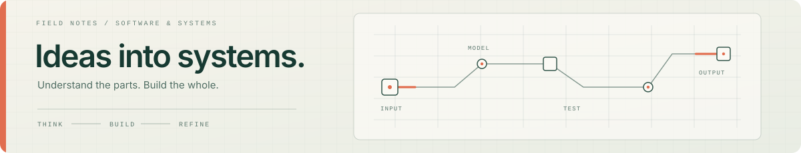
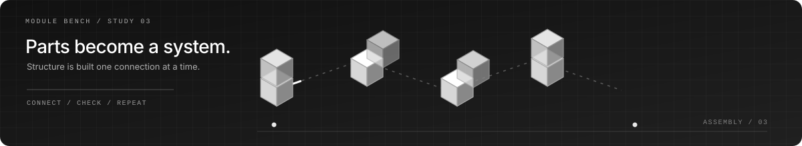

# About Me

  

<table>
  <tr>
    <td width="58%" valign="top">
      <h2>Profile</h2>
      
I&apos;m a developer and computer technology student from Bangladesh. I enjoy building software, creating web experiences, and experimenting with ideas that make technology more useful.

      
I&apos;m interested in how things work at every level—from thoughtful interfaces and animation to the systems underneath them. I learn by building, testing, and improving real projects.

      
This is a small space to share what I&apos;m making, what I&apos;m learning, and where I&apos;m heading next.

    </td>
    <td width="42%" valign="top">
      
    </td>
  </tr>
</table>

  

