# TAMASRAZIM — ANIMATION FIRST

  

  <strong>20 ANIMATED SVG LOOPS · 10,000 SOURCE LINES · 500 LINES PER LOOP</strong> 
  <a href="https://tamasrazim.github.io/#about">LIVE ORIGINAL ID CARD</a>
  &nbsp;·&nbsp;
  <a href="./identity-card/index.html">STANDALONE HTML</a>
  &nbsp;·&nbsp;
  <a href="./identity-card/site.css">CSS</a>
  &nbsp;·&nbsp;
  <a href="./identity-card/motion-core.js">MOTION CORE</a>
  &nbsp;·&nbsp;
  <a href="./identity-card/card-interactions.js">INTERACTIONS</a>

The old 10,000-line checklist was repetitive plain text. That content has been repurposed into **20 actual animated SVG motion studies**. Every loop has its own geometry, animated vector layers, timing tracks, and a reduced-motion fallback. Each source file is exactly **500 lines**; together, the motion files contain **10,000 lines of SVG animation code**.

## Motion gallery

<table>
<tr>
<td width="50%">

<strong>01 / Constellation Bloom</strong> Linked star nodes, flicker, and pulse.
</td>
<td width="50%">

<strong>03 / Scanner Array</strong> Coordinate field with a repeating scan sweep.
</td>
</tr>
<tr>
<td width="50%">

<strong>07 / Geometric Wave</strong> Waveform rails moving out of phase.
</td>
<td width="50%">

<strong>08 / Identity Glitch</strong> Typographic offsets and a scanning light.
</td>
</tr>
<tr>
<td width="50%">

<strong>11 / Radar Sweep</strong> Rotating range sweep and signal returns.
</td>
<td width="50%">

<strong>20 / Chronograph</strong> Precision ticks and rotating hands.
</td>
</tr>
</table>

## All 20 motion loops

| File | Animation | Source |
|---|---|---|
| 01-constellation-bloom.svg | **CONSTELLATION BLOOM** — Pulsing star map and linked nodes. | [view loop](./assets/motion/01-constellation-bloom.svg) |
| 02-orbital-mesh.svg | **ORBITAL MESH** — Nested orbital paths and satellites. | [view loop](./assets/motion/02-orbital-mesh.svg) |
| 03-scanner-array.svg | **SCANNER ARRAY** — A moving scan beam across coordinate lines. | [view loop](./assets/motion/03-scanner-array.svg) |
| 04-signal-rings.svg | **SIGNAL RINGS** — Concentric rings expanding in staggered loops. | [view loop](./assets/motion/04-signal-rings.svg) |
| 05-cursor-ripple.svg | **CURSOR RIPPLE** — Crosshair and repeating interaction ripples. | [view loop](./assets/motion/05-cursor-ripple.svg) |
| 06-particle-tunnel.svg | **PARTICLE TUNNEL** — Nested frames creating moving depth. | [view loop](./assets/motion/06-particle-tunnel.svg) |
| 07-geometric-wave.svg | **GEOMETRIC WAVE** — Layered sine-wave vector rails. | [view loop](./assets/motion/07-geometric-wave.svg) |
| 08-identity-glitch.svg | **IDENTITY GLITCH** — Typography offset and scanning reveal. | [view loop](./assets/motion/08-identity-glitch.svg) |
| 09-vector-orbit.svg | **VECTOR ORBIT** — Mechanical ellipses and orbiting points. | [view loop](./assets/motion/09-vector-orbit.svg) |
| 10-starfield-drift.svg | **STARFIELD DRIFT** — Drifting stars and light trails. | [view loop](./assets/motion/10-starfield-drift.svg) |
| 11-radar-sweep.svg | **RADAR SWEEP** — Range rings and a rotating scan hand. | [view loop](./assets/motion/11-radar-sweep.svg) |
| 12-prism-crossing.svg | **PRISM CROSSING** — Interlocking wireframe polygons. | [view loop](./assets/motion/12-prism-crossing.svg) |
| 13-grid-depth.svg | **GRID DEPTH** — Perspective grid with a bright vanishing point. | [view loop](./assets/motion/13-grid-depth.svg) |
| 14-pulse-constellation.svg | **PULSE CONSTELLATION** — Linked hubs pulse across a star network. | [view loop](./assets/motion/14-pulse-constellation.svg) |
| 15-light-trails.svg | **LIGHT TRAILS** — Dashed curves flow like long-exposure light. | [view loop](./assets/motion/15-light-trails.svg) |
| 16-corner-lock.svg | **CORNER LOCK** — Animated identity-frame registration marks. | [view loop](./assets/motion/16-corner-lock.svg) |
| 17-typographic-scramble.svg | **TYPOGRAPHIC SCRAMBLE** — Identity lettering with timed signal offsets. | [view loop](./assets/motion/17-typographic-scramble.svg) |
| 18-network-build.svg | **NETWORK BUILD** — A nodal network with pulsing endpoints. | [view loop](./assets/motion/18-network-build.svg) |
| 19-spectrum-line.svg | **SPECTRUM LINE** — Oscillating monochrome waveform layers. | [view loop](./assets/motion/19-spectrum-line.svg) |
| 20-chronograph.svg | **CHRONOGRAPH** — Precision ticks and rotating dial hands. | [view loop](./assets/motion/20-chronograph.svg) |

## The original interactive ID card remains separate

The motion gallery is not a replacement for the real card. The standalone card page retains the **original card markup**, the **original stylesheet**, the **original JavaScript motion core**, and a local copy of the original constellation image.

- [Open the live original card](https://tamasrazim.github.io/#about)
- [Standalone HTML source](./identity-card/index.html)
- [Original stylesheet](./identity-card/site.css)
- [Original motion core](./identity-card/motion-core.js)
- [Card-specific interactions](./identity-card/card-interactions.js)
- [Original constellation image](./identity-card/assets/images/tamanna-constellation.jpeg)

GitHub's Markdown viewer doesn't run the card's JavaScript. The embedded SVGs provide looping previews; open each SVG link to view that motion asset directly, or use the standalone HTML for the interactive card.
